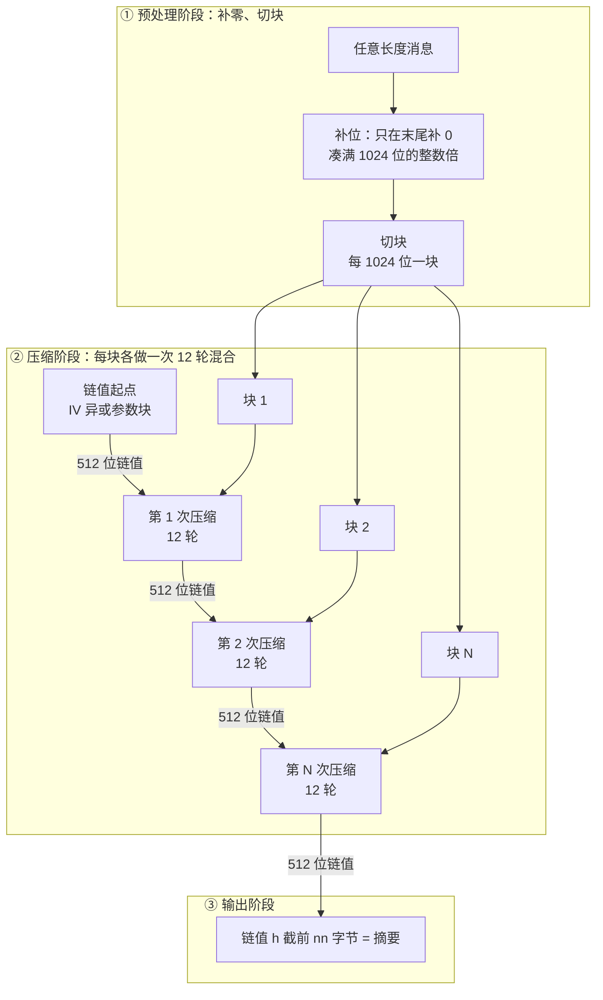

```mermaid
%%{init: {"flowchart": {"wrappingWidth": 2000}}}%%
flowchart TB
    %% 三个子图的标题都要左对齐。mermaid 的子图标题默认按子图宽度居中，会被上边下来的实线压到；
    %% 做法是塞一个固定像素宽的 div 把标题盒子撑到接近子图宽度，再用 text-align:left 把文字顶到左边。
    subgraph S1["<div style='text-align:left;width:560px'>① 预处理阶段：补零、切块</div>"]
        direction LR
        A["任意长度消息"] --> B["补位：只在末尾补 0<br/>凑满 1024 位的整数倍"] --> C["切块<br/>每 1024 位一块"]
    end
    subgraph S2["<div style='text-align:left;width:640px'>② 压缩阶段：每块各做一次 12 轮混合</div>"]
        direction TB
        M1["块 1"]
        M2["块 2"]
        M3["块 N"]
        H0["链值起点<br/>IV 异或参数块"] -->|"512 位链值"| F1["第 1 次压缩<br/>12 轮"] -->|"512 位链值"| F2["第 2 次压缩<br/>12 轮"] -->|"512 位链值"| F3["第 N 次压缩<br/>12 轮"]
    end
    subgraph S3["<div style='text-align:left;width:280px'>③ 输出阶段</div>"]
        Z["链值 h 截前 nn 字节 = 摘要"]
    end
    C --> M1
    C --> M2
    C --> M3
    M1 --> F1
    M2 --> F2
    M3 --> F3
    F3 -->|"512 位链值"| Z
```
