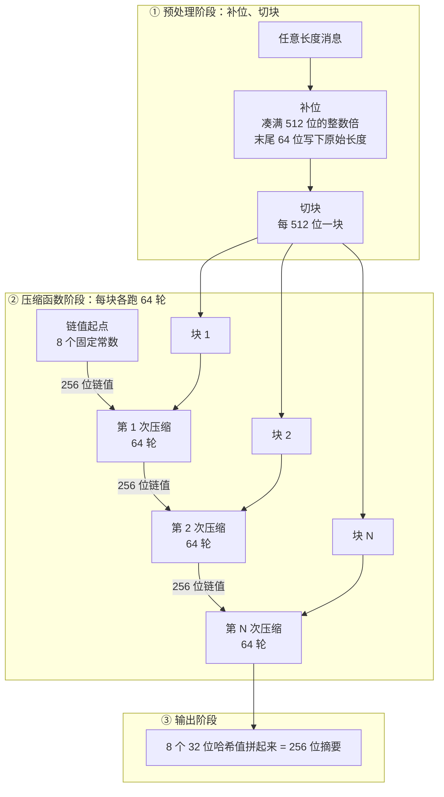

```mermaid
%%{init: {"flowchart": {"wrappingWidth": 2000}}}%%
flowchart TB
    %% 三个子图的标题都要左对齐。mermaid 的子图标题默认按子图宽度居中，会被上边下来的实线压到；
    %% 做法是塞一个固定像素宽的 div 把标题盒子撑到接近子图宽度，再用 text-align:left 把文字顶到左边。
    %% 宽度得≈子图自身宽度，所以三张各自手调，渲染后看差多少再改。
    subgraph S1["<div style='text-align:left;width:390px'>① 预处理阶段：补位、切块</div>"]
        direction LR
        A["任意长度消息"] --> B["补位<br/>凑满 512 位的整数倍<br/>末尾 64 位写下原始长度"] --> C["切块<br/>每 512 位一块"]
    end
    subgraph S2["<div style='text-align:left;width:640px'>② 压缩函数阶段：每块各跑 64 轮</div>"]
        direction TB
        M1["块 1"]
        M2["块 2"]
        M3["块 N"]
        H0["链值起点<br/>8 个固定常数"] -->|"256 位链值"| F1["第 1 次压缩<br/>64 轮"] -->|"256 位链值"| F2["第 2 次压缩<br/>64 轮"] -->|"256 位链值"| F3["第 N 次压缩<br/>64 轮"]
    end
    subgraph S3["<div style='text-align:left;width:280px'>③ 输出阶段</div>"]
        Z["8 个 32 位哈希值拼起来 = 256 位摘要"]
    end
    C --> M1
    C --> M2
    C --> M3
    M1 --> F1
    M2 --> F2
    M3 --> F3
    F3 --> Z
```
