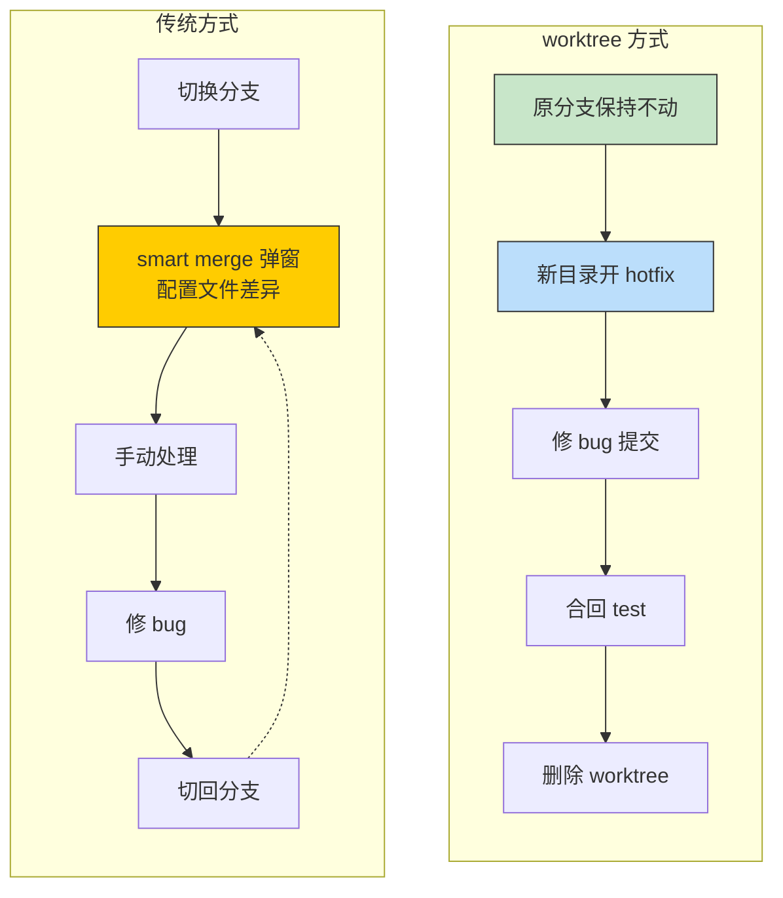

# Git Worktree：同时维护多个分支，告别 stash 和频繁切换

[[toc]]

## 两个每天都在发生的场景

先交代背景：`test` 是测试分支，不在上面直接改代码。日常开发在特性分支（比如 `feature/xxx`）上进行，改完合入 `test` 测试。

下面两个场景，每个都经历过不止一次。

### 场景一：在特性分支开发时被打断

正在 `feature/xxx` 上开发新功能，突然来个紧急 bug 要修。

```bash
# 当前在 feature/xxx，有未提交的代码修改
git stash                         # 暂存代码修改（不含配置文件）
git checkout -b hotfix/yyy main   # 基于 main 创建热修复分支 → smart merge 弹窗 ⚠
# ... 修 bug ...
git add .
git commit -m "fix: 修复紧急问题"
git checkout test                 # 切回 test → smart merge 弹窗 ⚠
git merge hotfix/yyy
# ... 测试通过 ...
git checkout feature/xxx          # 切回 feature/xxx → smart merge 弹窗 ⚠
git stash pop                     # 恢复代码修改
```

全过程 **3 次 smart merge 弹窗**。弹的不是业务代码冲突，是本地配置文件（数据库连接、端口、调试开关）——每个开发者本地版本都不一样，Git 每次切分支都检测到差异，必须手动处理。

<!--
场景一痛点：stash + smart merge 双杀
- stash 本身不痛苦，但 stash 多了之后列表混乱，分不清哪个对应哪个分支
- smart merge 弹窗才是真正的摩擦——切一次弹一次，配置文件差异每次都要手动处理
-->

### 场景二：在 test 分支测试时被打断

正在 `test` 上测试刚合入的功能，紧急 bug 来了。

```bash
# 当前在 test，有本地配置文件的修改
git checkout -b hotfix/yyy main   # 基于 main 创建热修复分支 → smart merge 弹窗 ⚠
# ... 修 bug ...
git add .
git commit -m "fix: 修复紧急问题"
git checkout test                 # 切回 test → smart merge 弹窗 ⚠
git merge hotfix/yyy
# ... 继续测试 ...
```

场景二虽然不用 stash，但**每次切分支都弹 smart merge**。切一次弹一次，切换频繁时非常烦人——全是配置文件差异，每次都要点。

<!--
场景二痛点：纯 smart merge 折磨
- 有本地配置文件修改，每次切分支必弹 smart merge
- 切换越频繁，摩擦越大
-->

两个场景的共同痛点很清楚：**不是业务代码冲突，是本地配置文件在反复触发 smart merge**。场景一还多一层 stash 列表管理的混乱。

有没有一种方式，能让你**同时打开多个分支，每个分支独立工作，互不干扰**？这就是 `git worktree`。

## git worktree 是什么

`git worktree` 允许你在**同一个仓库**的**不同目录**下，同时 checkout 多个分支。每个目录（worktree）有自己独立的工作区文件，但共享同一个 `.git` 仓库数据。

一句话概括：**不用 stash，不用切分支，直接在另一个文件夹里干活。**

## 用 worktree 之后，两个场景变成什么样

### 场景一：特性分支开发中被打断

```bash
# feature/xxx 上代码改了一半——什么都不用动
# 基于 main 分支创建 hotfix 的 worktree
git worktree add ../<repo>-hotfix -b hotfix/yyy main

cd ../<repo>-hotfix
# ... 修 bug ...
git add .
git commit -m "fix: 修复紧急问题"

cd ../<repo>
git merge hotfix/yyy

git worktree remove ../<repo>-hotfix
```

全程 feature/xxx 的代码纹丝不动，**一次 stash 都没有，一次 smart merge 弹窗都没有**。

### 场景二：test 测试中被打断

```bash
# test 上正跑着服务，什么都不用动
# 基于 main 分支创建 hotfix 的 worktree
git worktree add ../<repo>-hotfix -b hotfix/yyy main

cd ../<repo>-hotfix
# ... 修 bug ...
git add .
git commit -m "fix: 修复紧急问题"

cd ../<repo>
git merge hotfix/yyy

git worktree remove ../<repo>-hotfix
```

test 的服务一直跑着，不用停，不用切分支，**smart merge 弹窗直接消失**。



## 基本用法

### 创建新的 worktree

```bash
# 在 ../<repo>-hotfix 目录下创建已有分支的 worktree
git worktree add ../<repo>-hotfix <分支名>

# 创建新分支并同时建立 worktree
git worktree add -b <新分支名> ../<repo>-feature
```

执行后，你会在旁边多出一个目录，里面是目标分支的完整文件。两个目录可以**同时打开、同时修改、同时提交**。

### 查看所有 worktree

```bash
git worktree list
```

输出示例：

```text
/path/to/repo           abc1234 [test]
/path/to/repo-hotfix    def5678 [hotfix/yyy]
/path/to/repo-feature   ghi9012 [feature/zzz]
```

带 `*` 的是你当前所在的 worktree。

### 用完删除

```bash
# 删除 worktree（分支本身还在）
git worktree remove ../<repo>-hotfix

# 清理已手动删除目录的残留记录
git worktree prune
```

## 为什么比传统方式好太多

### 1. smart merge 弹窗直接消失

这是实际体验中最让人惊喜的一点。每个开发者本地都有自己的一套配置：

```text
application.yml         # 数据库连接
.env.local              # 本地调试开关
.vscode/launch.json     # IDE 启动参数
```

这些文件每个开发者本地都会根据自己的环境修改，所以切换分支时 Git 检测到本地修改就会触发 smart merge。

worktree 下，每个 worktree 有自己独立的文件系统。你在 `test` 目录改的配置，hotfix 目录完全不受影响。**配置文件的问题直接消失了。**

### 2. stash 列表不再混乱

用 stash 久了，每个人都经历过这种场景：

```bash
$ git stash list
stash@{0}: WIP on feature/xxx: 开发新功能
stash@{1}: WIP on feature/xxx: 临时修复
stash@{2}: WIP on feature/yyy: 重构中
stash@{3}: WIP on feature/xxx: 改了一半
```

哪个 stash 对应哪个分支？哪个是最新的？哪个可以安全删掉？时间一长完全搞不清。

worktree 下，每个分支的工作进度就在它自己的目录里，**文件系统就是最好的进度记录**。根本不需要 stash 来暂存分支切换的进度。

<!--
stash 的核心问题：stash 列表是全局的，不和分支绑定。不像 worktree 每个分支独立目录，一眼就知道进度在哪。
-->

### 3. 可以同时跑多个服务

不同 worktree 是不同目录，你可以：

```bash
# 主目录：test 分支跑服务
cd /path/to/repo
npm run dev

# 另一个 worktree：hotfix 分支跑另一个实例
cd /path/to/repo-hotfix
npm run dev -- --port 3001  # 换个端口避免冲突
```

这在对比两个分支的行为差异时特别有用——不用反复切分支、重启服务。

## 常见操作速查

| 操作 | 命令 |
|------|------|
| 创建 worktree（已有分支） | `git worktree add <路径> <分支名>` |
| 创建 worktree（新分支） | `git worktree add -b <新分支名> <路径>` |
| 列出所有 worktree | `git worktree list` |
| 删除 worktree | `git worktree remove <路径>` |
| 强制删除（有未提交修改） | `git worktree remove --force <路径>` |
| 移动 worktree 到新路径 | `git worktree move <旧路径> <新路径>` |
| 清理残留记录 | `git worktree prune` |

## 注意事项

::: warning 同一个分支不能同时在两个 worktree 中 checkout
Git 不允许同一个分支在多个 worktree 中同时被 checkout。如果需要，可以基于同一个 commit 创建新分支。
:::

::: tip worktree 共享同一个 `.git`
worktree 不是 clone，所有 worktree 共享主仓库的 `.git` 目录。这意味着：
- 不会重复占用大量磁盘空间
- 在一个 worktree 中 `git fetch` 后，其他 worktree 也能看到新的远程分支
- 删除主仓库会导致所有 worktree 失效
:::
