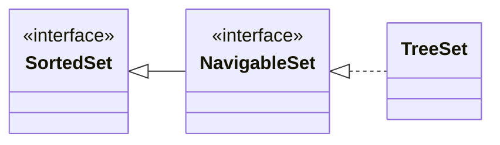
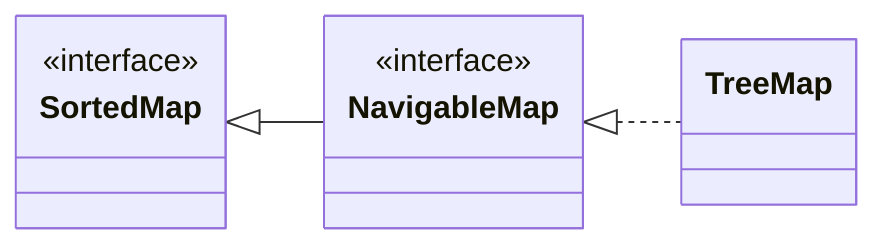

# Java 集合框架：List、Set、Map 与常用实现

[[toc]]

Java 程序很少只处理一个对象。数组是 Java 语言内置的基础数据结构，可以保存一组基本类型或引用类型的元素，适合元素数量固定、追求访问效率和存储紧凑的场景。

但数组创建后长度固定，元素的增删以及查找、去重等操作通常需要自己编写处理逻辑。当程序需要动态调整元素数量，或者需要表达有序列表、不重复集合、队列和键值映射等数据结构时，数组就不够方便。

为了满足这些需求，Java 提供了集合框架。它通过接口描述不同的数据组织语义，再由具体实现类提供存储和操作细节。使用时通常先根据数据语义选择接口，再根据顺序、性能和线程安全等要求选择实现类。

::: tip 阅读范围

本文以 Java 集合框架的基础语义和常用实现为主，同时合并介绍阻塞队列、排序集合和并发集合等实际开发中经常遇到的进阶内容，因此不再单独拆分高级集合文章。

如果当前只需要掌握集合基础，可以先阅读 `List`、`Set`、`Map` 的接口语义和常用实现；`BlockingQueue`、排序接口和并发集合等内容可以暂时跳过，之后按实际需求回看。
:::

## 集合框架的整体结构

Java 集合框架包含 `Collection` 和 `Map` 两条主要分支：`Collection` 表示一组独立元素，`Map` 表示键值映射。`Map` 没有继承 `Collection`，因为它保存的是键和值之间的关联关系，而不是一组独立元素。

下面的类图只列出本文重点介绍的接口、阻塞队列接口和常见实现。颜色用于区分接口、普通实现类和并发相关实现类；实线箭头表示接口继承或类继承，虚线箭头表示类实现接口；存储节点及其依赖关系表示常见底层数据结构：

```mermaid
%%{init: {'themeVariables': {'classText': '#1f2937', 'mainBkg': 'transparent', 'edgeLabelBackground': 'transparent', 'noteBkgColor': '#f3f4f6', 'noteTextColor': '#1f2937', 'noteBorderColor': '#9ca3af'}}}%%
classDiagram
    direction TB

    class Iterable {
        <<interface>>
    }
    class Collection {
        <<interface>>
    }
    class List {
        <<interface>>
    }
    class Deque {
        <<interface>>
    }
    class Queue {
        <<interface>>
    }
    class BlockingQueue {
        <<interface>>
    }
    class Set {
        <<interface>>
    }
    class SortedSet {
        <<interface>>
    }
    class HashSet
    class NavigableSet {
        <<interface>>
    }
    class Map {
        <<interface>>
    }
    note for Map "没有实现 Iterable，不能直接使用增强 for 遍历"
    class SortedMap {
        <<interface>>
    }
    class NavigableMap {
        <<interface>>
    }
    class ConcurrentMap {
        <<interface>>
    }

    class ArrayList
    class LinkedList
    class CopyOnWriteArrayList
    class CopyOnWriteArraySet
    class HashSet
    class LinkedHashSet
    class TreeSet
    class PriorityQueue
    class ArrayBlockingQueue
    class LinkedBlockingQueue
    class PriorityBlockingQueue
    class ArrayDeque
    class ConcurrentLinkedQueue
    class HashMap
    class LinkedHashMap
    class TreeMap
    class ConcurrentHashMap

    class 数组 {
        <<storage>>
    }
    class 链表 {
        <<storage>>
    }
    class 数组堆 {
        <<storage>>
    }
    class 哈希表与链表 {
        <<storage>>
    }
    class 哈希表 {
        <<storage>>
    }
    class 红黑树 {
        <<storage>>
    }

    Iterable <|-- Collection
    Collection <|-- List
    Collection <|-- Queue
    Queue <|-- Deque
    Queue <|-- BlockingQueue
    Collection <|-- Set
    Set <|-- SortedSet
    SortedSet <|-- NavigableSet

    Map <|-- SortedMap
    SortedMap <|-- NavigableMap
    Map <|-- ConcurrentMap

    List <|.. CopyOnWriteArrayList
    List <|.. ArrayList
    List <|.. LinkedList
    Set <|.. CopyOnWriteArraySet
    Deque <|.. LinkedList
    Set <|.. HashSet
    HashSet <|-- LinkedHashSet
    NavigableSet <|.. TreeSet
    Queue <|.. PriorityQueue
    BlockingQueue <|.. ArrayBlockingQueue
    BlockingQueue <|.. LinkedBlockingQueue
    BlockingQueue <|.. PriorityBlockingQueue
    Deque <|.. ArrayDeque
    Queue <|.. ConcurrentLinkedQueue
    Map <|.. HashMap
    HashMap <|-- LinkedHashMap
    NavigableMap <|.. TreeMap
    ConcurrentMap <|.. ConcurrentHashMap

    CopyOnWriteArrayList ..> 数组 : 写时复制数组
    ArrayList ..> 数组 : 可扩容数组
    ArrayDeque ..> 数组 : 循环可扩容数组
    ArrayBlockingQueue ..> 数组 : 固定容量数组
    LinkedList ..> 链表 : 双向链表
    CopyOnWriteArraySet ..> 数组 : 写时复制数组 + Set 语义
    HashSet ..> 哈希表 : 哈希表
    LinkedHashSet ..> 哈希表与链表 : 哈希表 + 链表
    TreeSet ..> 红黑树 : 红黑树
    LinkedBlockingQueue ..> 链表 : 单向链表
    ConcurrentLinkedQueue ..> 链表 : 无锁链表
    PriorityQueue ..> 数组堆
    PriorityBlockingQueue ..> 数组堆
    HashMap ..> 哈希表 : 哈希表
    LinkedHashMap ..> 哈希表与链表 : 哈希表 + 链表
    TreeMap ..> 红黑树 : 红黑树
    ConcurrentHashMap ..> 哈希表 : 并发哈希表

    class Iterable:::interface
    class Collection:::interface
    class List:::interface
    class Set:::interface
    class SortedSet:::interface
    class NavigableSet:::interface
    class Queue:::interface
    class Deque:::interface
    class BlockingQueue:::interface
    class Map:::interface
    class SortedMap:::interface
    class NavigableMap:::interface
    class ConcurrentMap:::interface

    class ArrayList:::implementation
    class LinkedList:::implementation
    class CopyOnWriteArrayList:::copyOnWrite
    class CopyOnWriteArraySet:::copyOnWrite
    class HashSet:::implementation
    class LinkedHashSet:::implementation
    class TreeSet:::implementation
    class PriorityQueue:::implementation
    class ArrayBlockingQueue:::blocking
    class LinkedBlockingQueue:::blocking
    class PriorityBlockingQueue:::blocking
    class ArrayDeque:::implementation
    class ConcurrentLinkedQueue:::concurrent
    class HashMap:::implementation
    class LinkedHashMap:::implementation
    class TreeMap:::implementation
    class ConcurrentHashMap:::concurrent

    class 数组:::storageArray
    class 链表:::storageLinked
    class 数组堆:::storageHeap
    class 哈希表与链表:::storageLinkedHash
    class 哈希表:::storageHash
    class 红黑树:::storageTree

    classDef interface fill:#dbeafe,stroke:#2563eb,stroke-width:2px,color:#1e3a8a
    classDef implementation fill:#dcfce7,stroke:#16a34a,stroke-width:2px,color:#14532d
    classDef copyOnWrite fill:#fed7aa,stroke:#ea580c,stroke-width:2px,color:#9a3412
    classDef concurrent fill:#fdba74,stroke:#c2410c,stroke-width:2px,color:#7c2d12
    classDef blocking fill:#fb923c,stroke:#c2410c,stroke-width:2px,color:#431407
    classDef storageArray fill:#a5f3fc,stroke:#0891b2,stroke-width:2px,color:#164e63
    classDef storageHeap fill:#67e8f9,stroke:#0e7490,stroke-width:2px,color:#155e75
    classDef storageLinked fill:#ddd6fe,stroke:#7c3aed,stroke-width:2px,color:#4c1d95
    classDef storageLinkedHash fill:#f9a8d4,stroke:#be185d,stroke-width:2px,color:#500724
    classDef storageHash fill:#fbcfe8,stroke:#db2777,stroke-width:2px,color:#831843
    classDef storageTree fill:#fecaca,stroke:#dc2626,stroke-width:2px,color:#7f1d1d
```



- <span class="collection-framework-legend interface"></span>接口
- <span class="collection-framework-legend implementation"></span>普通实现类
- <span class="collection-framework-legend copy-on-write"></span>写时复制并发实现
- <span class="collection-framework-legend concurrent"></span>Concurrent 并发实现
- <span class="collection-framework-legend blocking"></span>阻塞并发实现

从类图中还可以看到，`SortedSet`、`NavigableSet` 以及 `SortedMap`、`NavigableMap` 是在基础集合接口上增加排序、相邻查找和范围视图能力的扩展接口；`ConcurrentMap` 则用于表达并发访问语义。本文后续会结合 `TreeSet`、`TreeMap` 以及并发集合介绍这些接口的具体用法。

## List：有序且允许重复

`List` 表示有序的元素序列，具有以下特点：

- 元素按照插入顺序排列，可以通过索引访问。
- 允许出现重复元素。
- 通常允许使用 `null`，但具体行为仍以实现类为准。
- 可以通过 `get`、`set`、`add` 和 `remove` 等方法进行索引操作。

```java
List<String> cities = new ArrayList<>();
cities.add("北京");
cities.add("上海");
cities.add("北京");

System.out.println(cities.get(0)); // 北京
System.out.println(cities.size()); // 3
```

### ArrayList

`ArrayList` 基于可动态扩容的数组实现，是最常用的 `List` 实现。它适合读取多、按索引访问多、主要在尾部追加元素的场景。

```java
List<String> books = new ArrayList<>();
books.add("Java 基础");
books.add(0, "编程思想");
books.set(1, "Java 集合");

books.remove("编程思想");
System.out.println(books); // [Java 集合]
```

`ArrayList` 的容量和当前元素数量不是同一个概念。容量不足时会创建更大的数组并复制元素。如果能够预估数据量，可以在构造时指定初始容量，减少扩容过程：

```java
List<String> users = new ArrayList<>(1000);
```

::: warning `Vector`：遗留同步列表

`Vector` 是早期的动态数组列表，许多方法带有同步机制。它与 `ArrayList` 都基于数组，但 `Vector` 的同步粒度较粗，且保留了较多历史 API，因此新代码通常不优先选择它：

- 单线程场景通常使用 `ArrayList`；
- 需要对已有列表进行同步包装时，可以使用 `Collections.synchronizedList`；
- 读多写少的并发列表可以考虑 `CopyOnWriteArrayList`。
:::

### LinkedList

`LinkedList` 基于双向链表实现，同时实现了 `List` 和 `Deque`。它可以在两端进行插入和删除，也可以作为队列或双端队列使用：

```java
Deque<String> tasks = new LinkedList<>();
tasks.offerLast("任务 A");
tasks.offerLast("任务 B");

tasks.offerFirst("优先任务");
System.out.println(tasks.pollFirst()); // 优先任务
```

`LinkedList` 并不意味着所有插入和删除都比 `ArrayList` 快。通过索引访问时仍然需要从链表的一端寻找目标节点，缓存局部性也通常不如连续数组。普通业务代码中，如果主要需求是列表存储和读取，优先考虑 `ArrayList`；只有确实需要链表或双端队列语义时，再选择 `LinkedList` 或其他 `Deque` 实现。

### ArrayList 与 LinkedList 的典型复杂度

下表是常见实现下的典型复杂度。`ArrayList` 尾部追加的 `O(1)` 是摊销复杂度，扩容时单次操作可能需要复制元素。

| 操作 | `ArrayList` | `LinkedList` |
| --- | --- | --- |
| 按索引读取 | `O(1)` | `O(n)` |
| 按索引修改 | `O(1)` | `O(n)` |
| 尾部追加 | 摊销 `O(1)` | `O(1)` |
| 头部插入或删除 | `O(n)` | `O(1)`，已定位节点时 |
| 按值查找 | `O(n)` | `O(n)` |
| 内存局部性 | 较好 | 节点分散，额外保存链接信息 |

复杂度不能脱离访问模式理解。`LinkedList` 在头部操作上的理论优势，并不自动代表它在真实程序中更快；数据量、对象分配和 CPU 缓存都可能影响实际结果。

### 列表创建方法与视图

#### `List.of`：创建不可修改列表

`List.of`<Tip>Java 9</Tip> 创建的是集合结构不可修改的列表，不允许添加、删除或替换元素，也不接受 `null` 元素。它适合表示创建后列表结构固定的场景；如果元素对象本身可变，元素状态仍可能发生变化：

```java
List<String> names = List.of("A", "B", "C");

System.out.println(names); // [A, B, C]
// names.set(0, "X");    // UnsupportedOperationException
// names.add("D");       // UnsupportedOperationException
```

#### `Arrays.asList`：固定长度列表

`Arrays.asList` 返回一个由数组支持的固定长度列表。可以使用 `set` 替换元素，但不能通过 `add` 或 `remove` 改变列表长度；列表与原数组共享元素数据：

```java
String[] array = {"A", "B", "C"};
List<String> names = Arrays.asList(array);

names.set(0, "X");
System.out.println(array[0]); // X
// names.add("D");           // UnsupportedOperationException
```

#### `subList`：范围视图与独立副本

`subList` 返回的是原列表的一段视图，而不是完全独立的副本。对视图的修改会影响原列表；支撑列表通过视图之外的方式发生结构性修改后，视图语义未定义，不应继续依赖该视图。如果需要独立列表，可以显式复制：

```java
List<String> source = new ArrayList<>(List.of("A", "B", "C"));
List<String> view = source.subList(0, 2);
view.set(0, "X");

System.out.println(source); // [X, B, C]

List<String> copy = new ArrayList<>(view);
```

### List 中容易忽略的行为——`remove` 的重载

对于 `List<Integer>`，`remove(int)` 表示按索引删除，而 `remove(Object)` 表示按值删除。传入字面量时，编译器会优先选择索引版本：

```java
List<Integer> numbers = new ArrayList<>(Arrays.asList(10, 20, 30));

numbers.remove(1);                  // 删除索引 1 的元素，即 20
numbers.remove(Integer.valueOf(30)); // 删除值为 30 的元素
```

## Queue 与 Deque

`Queue` 表示待处理的元素序列，通常按先进先出（FIFO）顺序取出元素，但 `PriorityQueue` 等实现会按照优先级取出。`Deque` 继承自 `Queue`，允许在队首和队尾进行插入、删除和查看操作。

常见的 `Queue` 方法成对提供：

- `offer` / `add`：添加元素；容量受限且无法添加时，`offer` 返回 `false`，`add` 抛出异常。
- `poll` / `remove`：取出并删除队首元素；队列为空时，`poll` 返回 `null`，`remove` 抛出异常。
- `peek` / `element`：查看队首元素但不删除；队列为空时，`peek` 返回 `null`，`element` 抛出异常。

`Deque` 在此基础上提供 `offerFirst`、`offerLast`、`pollFirst`、`pollLast`、`peekFirst` 和 `peekLast` 等两端操作。普通 `Queue` / `Deque` 实现对 `null` 元素的支持取决于具体实现；`BlockingQueue` 针对生产者—消费者场景增加了可能阻塞的 `put` 和 `take` 操作，并且按接口契约不允许插入 `null`。后文会具体介绍。

### ArrayDeque

`ArrayDeque` 基于可扩容数组实现，既可以作为 FIFO 队列，也可以作为双端队列使用。它通常比用 `LinkedList` 模拟队列更适合作为普通的队列实现，并且不允许 `null` 元素：

```java
Queue<String> queue = new ArrayDeque<>();
queue.offer("任务 A");
queue.offer("任务 B");

System.out.println(queue.poll()); // 任务 A

Deque<String> deque = new ArrayDeque<>();
deque.offerFirst("头部");
deque.offerLast("尾部");
```

### LinkedList

`LinkedList` 同时实现了 `List` 和 `Deque`，前文已经介绍了它的双向链表结构和基本操作。作为队列或双端队列使用时，可以使用 `offerFirst`、`offerLast`、`pollFirst`、`pollLast` 等方法。

类似前文对 `ArrayList` 和 `LinkedList` 的比较，`LinkedList` 也不意味着所有插入和删除操作都比其他实现更快。普通队列场景优先考虑 `ArrayDeque`；只有需要同时使用 `List` 和 `Deque` 的语义，或确实需要链表结构时，才考虑 `LinkedList`。

### PriorityQueue

`PriorityQueue` 是优先队列，默认按照元素的自然顺序，或按照构造时传入的 `Comparator` 确定每次取出的优先级。它不保证遍历结果是完整排序的，只有通过 `poll` 等操作取出元素时，才能按优先级得到下一个元素：

```java
Queue<Integer> priorities = new PriorityQueue<>();
priorities.offer(30);
priorities.offer(10);
priorities.offer(20);

System.out.println(priorities.poll()); // 10
System.out.println(priorities.poll()); // 20
```

### BlockingQueue

`BlockingQueue` 为多线程生产者—消费者场景提供阻塞操作。队列为空时，`take` 会等待元素；对于有界实现，队列已满时 `put` 会等待空间。`ArrayBlockingQueue` 有界，`LinkedBlockingQueue` 可以有界或使用默认的近似无界容量，`PriorityBlockingQueue` 是无界队列，通常不会因容量限制阻塞 `put`：

```java
void processTask() throws InterruptedException {
    BlockingQueue<String> tasks = new ArrayBlockingQueue<>(10);
    tasks.put("任务 A");
    String task = tasks.take();
}
```

`Queue` / `Deque` 通常使用 `offer` / `poll`、`add` / `remove` 等方法；`BlockingQueue` 额外提供可能阻塞的 `put` / `take`。选择方法时应根据调用方是否需要阻塞语义决定。

#### `ArrayBlockingQueue`

`ArrayBlockingQueue` 使用数组存储元素，是固定容量的有界 FIFO 队列。构造时必须指定容量，也可以通过第二个参数启用公平策略；公平策略会让等待时间更长的线程优先获得锁，但吞吐量通常会有所下降：

```java
BlockingQueue<String> queue = new ArrayBlockingQueue<>(10, true);
queue.offer("任务 A");
queue.offer("任务 B");

List<String> batch = new ArrayList<>();
int count = queue.drainTo(batch, 2);
System.out.println(count); // 2
System.out.println(queue.remainingCapacity()); // 10
```

`remainingCapacity` 可用于查看当前还可以立即容纳多少元素，`drainTo` 则适合批量取出已有元素。需要明确内存上限和队列容量时，可以选择 `ArrayBlockingQueue`。

#### `LinkedBlockingQueue`

`LinkedBlockingQueue` 使用链表存储元素。无参构造创建的是容量接近无界的队列，显式传入容量后则可以限制队列大小；需要注意，接近无界并不等于真正无限，容量上限仍是 `Integer.MAX_VALUE`：

```java
BlockingQueue<String> queue = new LinkedBlockingQueue<>(100);
queue.offer("任务 A");
queue.offer("任务 B");

List<String> batch = new ArrayList<>();
queue.drainTo(batch);
System.out.println(batch); // [任务 A, 任务 B]
```

与固定数组容量的 `ArrayBlockingQueue` 相比，`LinkedBlockingQueue` 更适合容量需要通过构造参数决定、或希望以链表承载元素的场景。`remainingCapacity` 和 `drainTo` 也可用于容量检查和批量消费。

#### `PriorityBlockingQueue`

`PriorityBlockingQueue` 是无界的线程安全优先队列，按元素的自然顺序或构造时提供的 `Comparator` 确定取出顺序。它没有“队列满后等待空间”的容量语义，`remainingCapacity` 不适合用来表示一个有限的剩余容量：

```java
BlockingQueue<String> priorities =
        new PriorityBlockingQueue<>(11,
                Comparator.comparingInt(String::length)
                        .thenComparing(Comparator.naturalOrder()));
priorities.offer("普通");
priorities.offer("急");
priorities.offer("重要");

System.out.println(priorities.poll()); // 急
System.out.println(priorities.poll()); // 普通
```

与 `PriorityQueue` 相比，`PriorityBlockingQueue` 适合多线程生产者—消费者场景，但仍不保证通过迭代器看到的结果是完整排序；需要按优先级逐个取出时，应使用 `poll` 等取出操作。

## Set：不允许重复

`Set` 用来表示不包含重复元素的集合。重复的判断依赖实现类：哈希集合主要依赖 `equals` 和 `hashCode`，有序集合则依赖自然顺序或传入的 `Comparator`。

```java
Set<String> permissions = new HashSet<>();
permissions.add("read");
permissions.add("write");
permissions.add("read");

System.out.println(permissions.size()); // 2
```

### HashSet

`HashSet` 通常基于 `HashMap` 实现，适合只关心“元素是否存在”和去重、不要求遍历顺序的场景。它的查找、添加和删除在正常哈希分布下通常是平均 `O(1)`，不应依赖它的遍历顺序。

```java
Set<String> tags = new HashSet<>();
tags.add("java");
tags.add("backend");

if (tags.contains("java")) {
    System.out.println("包含 Java 标签");
}
```

### LinkedHashSet

`LinkedHashSet` 在哈希集合的基础上维护插入顺序。它适合既需要去重，又希望按照首次插入顺序遍历的场景：

```java
Set<String> uniqueNames = new LinkedHashSet<>();
uniqueNames.add("张三");
uniqueNames.add("李四");
uniqueNames.add("张三");

System.out.println(uniqueNames); // [张三, 李四]
```

### TreeSet

`TreeSet` 基于树结构维护元素的排序顺序，元素必须能够进行自然排序，或者创建集合时提供 `Comparator`：

```java
Set<String> sortedNames = new TreeSet<>(Comparator.comparingInt(String::length)
        .thenComparing(Comparator.naturalOrder()));
sortedNames.add("Bob");
sortedNames.add("Alice");
sortedNames.add("Tom");

System.out.println(sortedNames); // [Bob, Tom, Alice]
```

`TreeSet` 判断两个元素是否“重复”时，关注的是比较结果是否为 `0`。因此，比较器应当与业务上的相等语义保持一致；否则可能出现 `equals` 不相等但 `TreeSet` 只保留一个元素的情况。

#### SortedSet 与 NavigableSet 操作

`SortedSet` 在 `Set` 的基础上提供有序集合语义，`NavigableSet` 继承自 `SortedSet`，进一步提供查找相邻元素和获取范围视图的操作。`TreeSet` 直接实现 `NavigableSet`，因此也具备 `SortedSet` 的全部能力：



通过 `SortedSet` 类型使用基础的有序集合操作：

```java
SortedSet<Integer> sortedScores =
        new TreeSet<>(List.of(60, 75, 90, 100));

System.out.println(sortedScores.first());          // 60
System.out.println(sortedScores.last());           // 100
System.out.println(sortedScores.comparator());     // null，使用自然顺序
System.out.println(sortedScores.headSet(90));      // [60, 75]
System.out.println(sortedScores.tailSet(75));      // [75, 90, 100]
System.out.println(sortedScores.subSet(75, 100));  // [75, 90]
```

通过 `NavigableSet` 类型使用相邻元素查找、删除首尾元素和带边界选项的范围操作：

```java
NavigableSet<Integer> navigableScores = new TreeSet<>(sortedScores);

System.out.println(navigableScores.lower(75));           // 60，严格小于
System.out.println(navigableScores.floor(75));           // 75，小于或等于
System.out.println(navigableScores.ceiling(80));         // 90，大于或等于
System.out.println(navigableScores.higher(90));          // 100，严格大于
System.out.println(navigableScores.pollFirst());         // 60
System.out.println(navigableScores.pollLast());          // 100
System.out.println(navigableScores.subSet(75, true, 90, false)); // [75]
```

`headSet`、`tailSet` 和 `subSet` 返回的通常是原集合的范围视图，对视图的修改会影响原集合；如果需要独立集合，应显式复制视图。

### EnumSet

`EnumSet` 是专门用于枚举类型的 `Set`，只能保存同一个枚举类型的元素。它通常使用位向量等专用结构表示集合，适合枚举值数量固定、需要高效判断和批量操作的场景，通常比通用的 `HashSet` 更节省空间：

```java
enum Permission {
    READ, WRITE, DELETE
}

Set<Permission> permissions = EnumSet.of(
        Permission.READ,
        Permission.WRITE
);

System.out.println(permissions); // [READ, WRITE]
```

`EnumSet` 仍然遵循 `Set` 的不重复语义；如果集合元素不是枚举类型，应选择其他 `Set` 实现。

### CopyOnWriteArraySet

`CopyOnWriteArraySet` 是基于写时复制数组的线程安全 `Set`，适合读多写少、集合规模不大的场景。遍历时使用创建迭代器时的数组快照，不会因为其他线程的修改抛出 `ConcurrentModificationException`；但每次写入都可能复制底层数组，因此不适合频繁写入。

```java
Set<String> permissions = new CopyOnWriteArraySet<>();
permissions.add("read");
permissions.add("write");
permissions.add("read");

System.out.println(permissions); // [read, write]
```

与 `ConcurrentHashMap.newKeySet()` 相比，`CopyOnWriteArraySet` 适合读多写少并提供快照式遍历；`ConcurrentHashMap.newKeySet()` 更适合需要较高并发写入和哈希查找的场景。两者都不应依赖遍历顺序。

### 五种 Set 的对比

| 实现 | 是否保持顺序 | 是否自动排序 | 查找典型复杂度 | 适用场景 |
| --- | --- | --- | --- | --- |
| `HashSet` | 不保证 | 否 | 平均 `O(1)` | 只需要去重和快速判断存在 |
| `LinkedHashSet` | 插入顺序 | 否 | 平均 `O(1)` | 去重后仍要按插入顺序遍历 |
| `TreeSet` | 排序顺序 | 是 | `O(log n)` | 需要范围查询或有序遍历 |
| `EnumSet` | 枚举声明顺序 | 否 | 通常接近 `O(1)` | 枚举元素集合 |
| `CopyOnWriteArraySet` | 不保证 | 否 | 通常 `O(n)` | 读多写少的并发 Set |

## Map：键值映射

`Map<K, V>` 保存键和值之间的映射关系。一个 `Map` 中同一个键只能对应一个值；再次使用相同键调用 `put` 时，会替换原来的值，但不会增加键的数量。

Map 的常用操作包括 `put`、`get`、`containsKey`、`remove`、`putIfAbsent`、`getOrDefault`、`merge` 和 `computeIfAbsent`。这些方法属于 Map 的通用 API，与具体实现无关：

```java
Map<String, Integer> counts = new HashMap<>();

counts.putIfAbsent("java", 0);
counts.merge("java", 1, Integer::sum);
counts.computeIfAbsent("collection", key -> key.length());

for (Map.Entry<String, Integer> entry : counts.entrySet()) {
    System.out.println(entry.getKey() + " = " + entry.getValue());
}
```

这些方法可以减少“先判断再更新”的样板代码：

- `putIfAbsent`：键不存在，或当前映射值为 `null` 时才写入值。
- `getOrDefault`：键没有映射时提供默认值，但不会把默认值写回集合；如果键存在但映射值为 `null`，仍返回 `null`。
- `merge`：已有非 `null` 值时按照合并函数计算，新键或当前值为 `null` 时直接使用给定值；合并函数返回 `null` 时会移除映射。
- `computeIfAbsent`：键没有映射或映射值为 `null` 时计算一个值；计算结果为 `null` 时不会建立映射。
- `entrySet`：同时遍历键和值，通常比先遍历 `keySet` 再调用 `get` 更直接。

```java
Map<String, Integer> wordCounts = new HashMap<>();
wordCounts.put("java", 1);
wordCounts.put("collection", 2);
wordCounts.put("java", 3); // 替换 java 对应的值

System.out.println(wordCounts.get("java")); // 3
System.out.println(wordCounts.size());      // 2
```

### HashMap

`HashMap` 是最常用的通用映射实现。它不保证遍历顺序，允许一个 `null` 键和多个 `null` 值。键的哈希值和相等性决定了查找结果，因此作为键的类型必须正确实现 `equals` 和 `hashCode`。调用 `get` 返回 `null` 时，无法单独判断键不存在还是键存在但值为 `null`；需要区分这两种情况时，应配合 `containsKey`：

```java
Map<Long, String> userNames = new HashMap<>();
userNames.put(1001L, "张三");
userNames.put(1002L, "李四");

String userName = userNames.getOrDefault(1003L, "未知用户");
System.out.println(userName); // 未知用户
```

如果能够预估键的数量，可以设置初始容量。容量并不是越大越好，过大的容量会浪费内存；设置容量时还要考虑负载因子和扩容规则。

### LinkedHashMap

`LinkedHashMap` 维护键值对的链接关系，可以按插入顺序遍历，也可以配置为访问顺序。它常用于需要稳定输出顺序或作为简单 LRU 结构的基础：

```java
Map<String, Integer> scores = new LinkedHashMap<>();
scores.put("语文", 90);
scores.put("数学", 95);
scores.put("英语", 88);

scores.forEach((subject, score) ->
        System.out.println(subject + ": " + score));
```

### TreeMap

`TreeMap` 根据键的自然顺序或 `Comparator` 排序，查找、插入和删除的典型复杂度为 `O(log n)`。它适合需要按键排序、范围查询或找到最大/最小键的场景。

```java
NavigableMap<Integer, String> levels = new TreeMap<>();
levels.put(1, "低");
levels.put(3, "高");
levels.put(2, "中");

System.out.println(levels.firstEntry()); // 1=低
System.out.println(levels.floorEntry(2)); // 2=中
```

`TreeMap` 的键也要遵守比较规则。若比较器把两个不同的键比较为 `0`，后放入的值会替换先前的值。

#### SortedMap 与 NavigableMap 操作

`SortedMap` 按键维护映射顺序，`NavigableMap` 继承自 `SortedMap`，进一步提供查找相邻键值对、删除首尾键值对和获取范围视图的操作。`TreeMap` 直接实现 `NavigableMap`，因此也具备 `SortedMap` 的全部能力：



可以先通过 `SortedMap` 类型使用基础的有序映射操作：

```java
SortedMap<Integer, String> sortedLevels = new TreeMap<>();
sortedLevels.put(1, "低");
sortedLevels.put(3, "高");
sortedLevels.put(2, "中");

System.out.println(sortedLevels.comparator());          // null，使用自然顺序
System.out.println(sortedLevels.firstKey());            // 1
System.out.println(sortedLevels.lastKey());             // 3
System.out.println(sortedLevels.headMap(3));            // {1=低, 2=中}
System.out.println(sortedLevels.tailMap(2));             // {2=中, 3=高}
System.out.println(sortedLevels.subMap(1, 3));            // {1=低, 2=中}
```

再通过 `NavigableMap` 类型使用相邻键值对查找、删除首尾键值对和带边界选项的范围操作：

```java
NavigableMap<Integer, String> navigableLevels = new TreeMap<>(sortedLevels);

System.out.println(navigableLevels.lowerEntry(2));               // 1=低，键严格小于 2
System.out.println(navigableLevels.floorEntry(2));               // 2=中，键小于或等于 2
System.out.println(navigableLevels.ceilingEntry(2));             // 2=中，键大于或等于 2
System.out.println(navigableLevels.higherEntry(2));              // 3=高，键严格大于 2
System.out.println(navigableLevels.firstEntry());                // 1=低
System.out.println(navigableLevels.lastEntry());                 // 3=高
System.out.println(navigableLevels.subMap(1, true, 3, false));   // {1=低, 2=中}
```

`headMap`、`tailMap` 和 `subMap` 返回的通常是原映射的范围视图，对视图的修改会影响原映射；如果需要独立结果，应显式复制视图。

### EnumMap

`EnumMap` 是专门用于枚举键的 `Map`，键必须来自同一个枚举类型。它根据枚举常量的声明顺序进行组织，内部使用适合枚举键的数组式结构，通常比通用的 `HashMap` 更高效；如果键不是枚举类型，则不能使用 `EnumMap`：

```java
enum Level {
    LOW, MEDIUM, HIGH
}

Map<Level, String> labels = new EnumMap<>(Level.class);
labels.put(Level.LOW, "低");
labels.put(Level.HIGH, "高");

System.out.println(labels); // {LOW=低, HIGH=高}
```

在枚举键值映射场景中，优先考虑 `EnumMap`；普通键类型仍使用 `HashMap`、`LinkedHashMap` 或其他适合的实现。

### ConcurrentHashMap

`ConcurrentHashMap` 是面向并发访问设计的哈希映射，不允许 `null` 键和值，遍历顺序也不固定。与 `Collections.synchronizedMap` 对已有映射进行整体同步包装不同，`ConcurrentHashMap` 提供了更细粒度的并发访问和复合操作语义。

```java
ConcurrentHashMap<String, Integer> counts = new ConcurrentHashMap<>();

counts.computeIfAbsent("java", key -> 0);
counts.merge("java", 1, Integer::sum);
counts.putIfAbsent("collection", 1);

System.out.println(counts.get("java")); // 1
```

`computeIfAbsent`、`merge` 和 `putIfAbsent` 可以把初始化或更新操作作为一个并发语义明确的整体，避免把“先判断再写入”拆成两个存在竞态的方法调用。`ConcurrentHashMap` 的迭代器是弱一致的：遍历期间允许其他线程修改，不保证固定快照，也不应依赖遍历顺序。

::: warning `Hashtable`：遗留同步映射

`Hashtable` 是早期的同步哈希表，不允许 `null` 键和值，具有历史兼容价值。它与 `HashMap` 都提供哈希映射，但 `Hashtable` 的同步设计和 API 更偏向历史兼容，通常不是新代码的首选：

- 单线程场景通常使用 `HashMap`；
- 多线程共享映射通常使用 `ConcurrentHashMap`；
- 需要同步包装已有映射时，可以使用 `Collections.synchronizedMap`。
:::

### 五种 Map 的对比

| 实现 | 遍历顺序 | 是否排序 | 线程安全 | 典型查找复杂度 | 适用场景 |
| --- | --- | --- | --- | --- | --- |
| `EnumMap` | 枚举声明顺序 | 是 | 否 | 通常接近 `O(1)` | 枚举键专用映射 |
| `HashMap` | 不保证 | 否 | 否 | 平均 `O(1)` | 通用键值映射 |
| `LinkedHashMap` | 插入顺序或访问顺序 | 否 | 否 | 平均 `O(1)` | 稳定顺序、简单缓存 |
| `TreeMap` | 键的排序顺序 | 是 | 否 | `O(log n)` | 范围查询、有序键 |
| `ConcurrentHashMap` | 不保证固定顺序 | 否 | 支持并发访问 | 平均 `O(1)` | 多线程共享映射 |

## Comparable 与 Comparator

集合中的排序通常有两种来源：`Comparable` 由元素类型自身定义自然顺序，`Comparator` 则由调用方在集合外部提供比较规则。`PriorityQueue`、`TreeSet` 和 `TreeMap` 都可以使用这两种排序方式。

```java
List<String> names = new ArrayList<>(List.of("Bob", "Alice", "Tom"));
names.sort(Comparator.comparingInt(String::length)
        .thenComparing(Comparator.naturalOrder()));

System.out.println(names); // [Bob, Tom, Alice]
```

如果一个类实现了 `Comparable<T>`，可以在 `compareTo` 中定义自然顺序；当排序规则只在某个使用场景中成立，或者同一类型需要多种排序方式时，优先使用 `Comparator`。对于 `TreeSet` 和 `TreeMap`，比较结果为 `0` 会被视为元素或键相同，因此比较规则应与业务上的相等语义保持一致。

## Collections 工具类

`Collections` 提供了针对集合的常用算法和包装方法。它不会创建新的集合类型，适合对已有集合执行排序、反转、洗牌、查找和线程安全包装等操作：

```java
List<Integer> numbers = new ArrayList<>(List.of(3, 1, 2));

Collections.sort(numbers);
int position = Collections.binarySearch(numbers, 2); // 按自然顺序排好序的列表
Collections.reverse(numbers);
Collections.shuffle(numbers);

List<Integer> readOnly = Collections.unmodifiableList(numbers);
List<Integer> synchronizedList = Collections.synchronizedList(new ArrayList<>());
```

常见方法包括：

- `sort`：按自然顺序或指定比较器排序。
- `reverse`：反转列表顺序。
- `shuffle`：随机打乱列表。
- `binarySearch`：在按自然顺序或相同 `Comparator` 排序的列表中进行二分查找。
- `min`、`max`：查找最小或最大元素。
- `frequency`：统计元素出现次数。
- `unmodifiableList`、`synchronizedList` 等：创建只读视图或同步包装器。

集合也可以通过 `stream()` 作为 Stream 的数据源，进行过滤、映射、排序和收集；Stream 本身的用法不属于集合框架，本文不展开。

## equals 与 hashCode

`HashSet` 判断元素是否重复，`HashMap` 定位键，都依赖对象的 `equals` 和 `hashCode`。必须遵守以下约定：

- 如果两个对象 `equals` 返回 `true`，它们的 `hashCode` 必须相同。
- `hashCode` 相同不代表两个对象一定相等，哈希冲突是允许的。
- 参与相等性判断的字段在对象放入哈希集合后，不应再发生变化。

下面的 `User` 使用用户编号作为身份字段：

```java
public final class User {
    private final long id;
    private final String name;

    public User(long id, String name) {
        this.id = id;
        this.name = name;
    }

    @Override
    public boolean equals(Object object) {
        if (this == object) {
            return true;
        }
        if (!(object instanceof User)) {
            return false;
        }
        User other = (User) object;
        return id == other.id;
    }

    @Override
    public int hashCode() {
        return Long.hashCode(id);
    }
}
```

```java
Set<User> users = new HashSet<>();
users.add(new User(1L, "张三"));
users.add(new User(1L, "张三（更新名称）"));

System.out.println(users.size()); // 1
```

如果只重写 `equals` 而不重写 `hashCode`，两个逻辑上相等的对象可能被分到不同的哈希桶中，集合就无法正确去重或查找。使用 `record`<Tip>Java 16</Tip> 表示由全部组件决定相等性的值对象时，编译器会自动生成 `equals` 和 `hashCode`，但仍然要确认它符合业务语义。

::: warning
不要使用可变字段作为 `HashMap` 的键，或作为 `HashSet` 判断相等性的依据。对象放入集合后，如果这些字段发生变化，集合可能仍把对象留在旧的哈希桶中，导致 `contains` 或 `get` 找不到它。
:::

## 遍历、迭代器与修改

常见的遍历方式包括增强 `for`、`forEach` 和迭代器。

### Map 的遍历

`Map` 没有实现 `Iterable`，不能直接使用增强 `for` 遍历。可以通过 `keySet()`、`values()` 和 `entrySet()` 获取键、值或键值对视图，再使用增强 `for`、`forEach` 或迭代器进行遍历。只需要键或值时，分别使用 `keySet()` 和 `values()`；需要同时使用键和值时，优先使用 `entrySet()`。也可以直接调用 `Map.forEach((key, value) -> ...)`。

```java
Map<String, Integer> prices = new HashMap<>();
prices.put("book", 30);
prices.put("pen", 5);

// entrySet() 获取键值对视图，增强 for 才是实际遍历方式
for (Map.Entry<String, Integer> entry : prices.entrySet()) {
    System.out.println(entry.getKey() + ": " + entry.getValue());
}

// Map 自己提供的键值对遍历方法
prices.forEach((key, value) ->
        System.out.println(key + ": " + value));
```

### 使用迭代器删除元素

在遍历集合时直接调用集合的 `remove` 进行结构性修改，通常会触发 `ConcurrentModificationException`。如果确实需要边遍历边删除，可以在当前迭代器支持 `remove` 时使用它；不可修改集合或快照迭代器可能不支持该操作：

```java
List<String> names = new ArrayList<>(Arrays.asList("张三", "李四", "王五"));
Iterator<String> iterator = names.iterator();

while (iterator.hasNext()) {
    if (iterator.next().startsWith("李")) {
        iterator.remove();
    }
}

System.out.println(names); // [张三, 王五]
```

也可以先筛选要删除的元素，再在遍历结束后统一删除：

```java
names.removeIf(name -> name.startsWith("王"));
```

部分集合迭代器具有 fail-fast 行为，但 fail-fast 只是尽早发现问题的实现策略，不是并发安全机制，也不能依赖它来保证程序逻辑。例如，`CopyOnWriteArrayList` 使用快照迭代器，部分并发集合使用弱一致迭代器。多线程共享集合时，需要使用合适的并发集合或在外部正确加锁。

## 不可修改集合

### 工厂方法创建的不可修改集合

Java 9 引入的 `List.of`<Tip>Java 9</Tip>、`Set.of`<Tip>Java 9</Tip> 和 `Map.of`<Tip>Java 9</Tip> 等工厂方法创建的是集合结构不可修改的集合，不能通过集合 API 修改，并且不接受 `null`；`Set.of` 不接受重复元素，`Map.of` 不接受重复键。集合结构不可修改不等于元素对象深度不可变：如果元素对象本身可变，其状态仍可能发生变化。

```java
Set<String> fixedRoles = Set.of("admin", "viewer");
Map<String, Integer> fixedLevels = Map.of("admin", 1, "viewer", 2);
```

Java 10 引入了 `List.copyOf`<Tip>Java 10</Tip>、`Set.copyOf`<Tip>Java 10</Tip> 和 `Map.copyOf`<Tip>Java 10</Tip>。如果需要基于已有集合创建一个不允许修改的副本，可以使用这些方法。它们不会跟踪源集合后续的结构变化，但不会递归复制元素，属于浅层语义；同时不接受 `null` 元素、键或值：

- `List.copyOf`：接收已有 `Collection`，保留源集合的迭代顺序和重复元素。
- `Set.copyOf`：接收已有 `Collection`，按照集合语义去除重复元素；遍历顺序不保证，重复元素中保留哪一个代表也不保证。只有输入本身已经是不可修改的 `Set`（如 `Set.of` 的产物）时，`copyOf` 通常直接返回原实例。
- `Map.copyOf`：接收已有 `Map`，保留源映射中的键值关联。

```java
List<String> sourceNames = new ArrayList<>(List.of("张三", "李四"));
List<String> sourceRoles = List.of("admin", "viewer", "admin");
Map<String, Integer> sourceLevels = new HashMap<>(Map.of("admin", 1, "viewer", 2));

List<String> fixedNames = List.copyOf(sourceNames);
Set<String> fixedRoles = Set.copyOf(sourceRoles);
Map<String, Integer> fixedLevels = Map.copyOf(sourceLevels);

// Set.of("admin", "viewer", "admin"); // IllegalArgumentException
// sourceNames.add("王五");              // 不影响 fixedNames
// fixedNames.add("王五");                // UnsupportedOperationException
// fixedRoles.remove("admin");           // UnsupportedOperationException
// fixedLevels.put("guest", 3);           // UnsupportedOperationException

System.out.println(sourceRoles.size()); // 3
System.out.println(fixedRoles.size());  // 2
```

| 类型 | 直接创建 | 从已有集合创建 | 重复元素或键 | 顺序或结果特征 |
| --- | --- | --- | --- | --- |
| `List` | `List.of`：直接传入元素 | `List.copyOf`：传入已有集合 | 两者都保留重复元素 | `List.of` 按参数顺序<br>`List.copyOf` 按源集合的迭代顺序 |
| `Set` | `Set.of`：直接传入元素 | `Set.copyOf`：传入已有集合 | `Set.of` 遇到重复元素抛出 `IllegalArgumentException`<br>`Set.copyOf` 按集合语义去重 | 两者都不保证遍历顺序 |
| `Map` | `Map.of`：直接传入键值对 | `Map.copyOf`：传入已有映射 | `Map.of` 遇到重复键抛出 `IllegalArgumentException`<br>源 `Map` 本身不能有重复键 | 都保留键值关联，不保证遍历顺序 |

### `unmodifiable` 包装器

`Collections.unmodifiableList` 等方法返回的是一个只读视图，不是原集合的独立副本。通过视图不能修改集合，但原集合发生变化时，视图仍可能看到这些变化：

```java
List<String> source = new ArrayList<>();
source.add("A");

List<String> view = Collections.unmodifiableList(source);
source.add("B");

System.out.println(view); // [A, B]
// view.add("C") 会抛出 UnsupportedOperationException
```

如果需要不受源集合后续结构变化影响的不可修改结果，可以先复制，再暴露不可修改视图，或直接使用 `List.copyOf`。这些方式不会递归复制元素；如果元素对象可变，源集合与结果仍可能共享同一元素对象：

```java
List<String> snapshot = List.copyOf(source);
```

## 并发集合

普通的 `ArrayList`、`HashSet` 和 `HashMap` 不是线程安全的。根据访问模式，可以选择不同方案：

- `Collections.synchronizedList`、`synchronizedMap`：对单个方法调用提供同步，遍历时仍需按照文档对包装对象加锁。
- `CopyOnWriteArrayList`：读多写少，写操作会复制底层数组，不适合频繁写入或列表很大的场景。
- `ConcurrentHashMap`：支持多线程并发访问，适合共享映射；它不允许 `null` 键和 `null` 值。
- `ConcurrentLinkedQueue`：适合多线程环境下的非阻塞队列操作。

线程安全集合并不会自动让一组操作成为原子操作。例如，“先判断不存在，再写入”应优先使用 `putIfAbsent` 等提供明确并发语义的方法，而不是把两个独立调用简单拼在一起。

::: tip
`Collections.synchronizedList` 和 `ConcurrentHashMap` 解决的问题不同。前者是对已有集合进行同步包装，后者针对并发哈希映射设计了更细粒度的并发访问策略。选择时应先明确读写模式和需要的原子操作。
:::

## 常见选择建议

| 需求 | 推荐类型 | 原因 |
| --- | --- | --- |
| 有序、可重复、按索引读取 | `ArrayList` | 随机访问快，通用性好 |
| 需要双端队列 | `ArrayDeque` | 专门为队列和双端操作设计 |
| 只需要去重 | `HashSet` | 平均查找和插入效率较好 |
| 去重并保持插入顺序 | `LinkedHashSet` | 维护稳定的插入顺序 |
| 去重并保持排序 | `TreeSet` | 按自然顺序或比较器组织元素 |
| 通用键值映射 | `HashMap` | 适用范围广，平均查找效率较好 |
| 映射需要稳定顺序 | `LinkedHashMap` | 可保持插入顺序或访问顺序 |
| 映射需要按键排序 | `TreeMap` | 支持排序和范围操作 |
| 多线程共享键值映射 | `ConcurrentHashMap` | 提供并发访问和原子复合操作 API |

实践中可以遵循以下原则：

- 先写接口类型，再根据实际约束选择实现类，例如 `List` 而不是把 `ArrayList` 暴露给所有调用方。
- 默认使用 `ArrayList`、`HashSet` 和 `HashMap`，只有顺序、排序、并发等需求明确时才替换实现。
- 不要仅因为“插入和删除快”就默认使用 `LinkedList`，先确认操作位置和访问模式。
- 需要排序时明确排序依据，优先传入清晰的 `Comparator`，不要依赖不明显的自然排序。
- 将集合暴露给外部代码时，明确它是可变对象、只读视图，还是不可变副本。
- 作为哈希键或集合元素的对象，应保证相等性字段稳定，并同时正确实现 `equals` 和 `hashCode`。
- 根据实际数据量设置初始容量，但不要为了“避免扩容”盲目分配过大的容器。

## 总结

| 接口或实现 | 核心语义 | 是否允许重复 | 是否保证顺序 |
| --- | --- | --- | --- |
| `List` | 有序序列，可按索引访问 | 是 | 是，按列表定义 |
| `Set` | 不重复的元素集合 | 否 | 由具体实现决定 |
| `Map` | 键到值的映射 | 键不能重复，值可以重复 | 由具体实现决定 |
| `ArrayList` | 数组型列表 | 是 | 插入顺序 |
| `HashSet` | 哈希去重集合 | 否 | 不保证 |
| `HashMap` | 哈希键值映射 | 键不能重复 | 不保证 |
| `TreeSet` / `TreeMap` | 有序集合或映射 | 按比较规则判断 | 排序顺序 |
| `LinkedHashSet` / `LinkedHashMap` | 带链接顺序的哈希容器 | 按各自接口语义 | `LinkedHashSet` 为插入顺序；`LinkedHashMap` 取决于构造配置，可为插入顺序或访问顺序 |

集合类型的选择不应从“哪个实现类最强”开始，而应从数据的语义开始：是否允许重复，是否需要稳定顺序，是否需要排序，是否按索引访问，以及是否存在并发读写。先确定这些约束，再选择合适的接口和实现，代码通常会更容易理解，也更容易在需求变化时调整。
