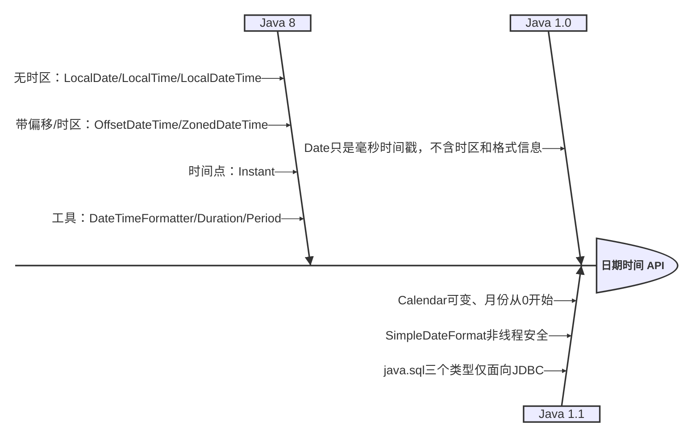

# Java日期和时间处理
[[toc]]

Java 的日期和时间处理并不是简单地用一个新类替换旧类，而是经历了从时间戳、日历字段，到类型化日期时间模型的演进。需要注意的是，`SimpleDateFormat` 是格式化工具，并不是独立的日期时间数据模型；`java.sql.Date`、`java.sql.Time` 和 `java.sql.Timestamp` 则主要是 JDBC 兼容类型，也没有成为通用日期时间 API 的最终方向。



## 日期时间 API 的演进

### Date：以毫秒时间戳表示时间点

Java 1.0 引入的 `java.util.Date` 实际上表示一个时间点，内部保存的是从 Unix 纪元（1970-01-01T00:00:00Z）开始计算的毫秒数。它的名称容易让人误以为它只表示“日期”，但它本身不包含时区和格式信息。早期 `Date` 中的一些日期字段操作方法后来被废弃，日期计算逐渐转由 `Calendar` 承担。

### Calendar：支持日历字段和日期计算

Java 1.1 引入的 `Calendar` 在 `Date` 的基础上提供了日期字段的访问、日期计算、地区和日历系统支持，解决了 `Date` 功能过于有限的问题。但它的 API 较为复杂，对象是可变的，月份从 `0` 开始等设计也容易造成误用。

### SimpleDateFormat：补充格式化和解析能力

Java 1.1 同时提供了 `SimpleDateFormat`，用于在日期对象与字符串之间进行格式化和解析。它不是新的日期时间数据模型，而且实例不是线程安全的，不能在多个线程之间直接共享。

```java
Date date = new Date();
Calendar calendar = Calendar.getInstance();
SimpleDateFormat formatter = new SimpleDateFormat("yyyy-MM-dd HH:mm:ss");
formatter.setTimeZone(TimeZone.getTimeZone("UTC"));
String text = formatter.format(date);
```

`Date` 本身不携带时区；如果不显式设置，`SimpleDateFormat` 会使用 JVM 默认时区，同一个时间点在不同环境中可能格式化出不同结果。上例固定使用 UTC，适合生成需要跨环境一致的文本。

### java.sql：JDBC 兼容类型

JDBC 在 `java.util.Date` 的基础上派生出三个子类，分别对应 SQL 中的 `DATE`、`TIME` 和 `TIMESTAMP`：

- `java.sql.Date`：只关心年月日，时分秒会被归零。
- `java.sql.Time`：只关心时分秒，日期部分没有意义。
- `java.sql.Timestamp`：日期加时间，并额外保留纳秒精度。

```java
java.sql.Date sqlDate = java.sql.Date.valueOf("2026-09-10");
java.sql.Time sqlTime = java.sql.Time.valueOf("14:30:00");
java.sql.Timestamp sqlTimestamp = java.sql.Timestamp.valueOf("2026-09-10 14:30:45");
```

它们的职责是和 `PreparedStatement`、`ResultSet` 打交道，而不是充当业务模型。虽然三者都继承自 `java.util.Date`，但使用时有两个容易踩的坑：

- `java.sql.Date` 和 `java.sql.Time` 重写了 `toInstant()`，直接调用会抛出 `UnsupportedOperationException`；它们描述的是没有时区的日历字段，只能通过 `toLocalDate()`、`toLocalTime()` 或毫秒时间戳取值。`Timestamp` 则可以正常调用 `toInstant()`。
- 向上转型为 `java.util.Date`、或调用 `getTime()` 时，`Timestamp` 保留的纳秒部分会丢失，只剩毫秒。

JDBC 4.2 起，`ResultSet.getObject` 和 `PreparedStatement.setObject` 支持直接映射到 `java.time` 类型，新代码通常让驱动完成转换，只在必须使用旧接口时才接触这三个类型。

### java.time：Java 8 引入的现代 API

Java 8 通过 JSR-310 引入 `java.time`，这是 JDK 面向新代码的现代日期时间 API，设计受到 Joda-Time 等实践的影响。它不再让一个类型承担所有语义，而是用不同类型分别表示日期、时间、本地日期时间、时间线上的瞬时点、固定偏移量和时区规则。

`java.time` 主要解决了旧 API 的几个问题：

- 类型名称能表达值的语义，例如 `LocalDate` 表示不带时间的日期，`Instant` 表示时间线上的瞬时点。
- 日期时间类是不可变且线程安全的，修改操作会返回新对象，不会改变原对象。
- `DateTimeFormatter` 是线程安全的，可以作为常量复用。
- 对时区、偏移量、时间间隔等概念提供了更清晰的类型区分。

旧 API 仍然会出现在存量项目、JDBC 接口和第三方库中，但新代码通常优先使用 `java.time`，只在系统边界处完成新旧类型转换。

## java.time 中的核心类型

### LocalDate

`LocalDate` 只表示日期，不包含时分秒和时区，适合生日、账期、节假日等业务概念。

```java
LocalDate releaseDate = LocalDate.of(2026, 9, 10);
LocalDate today = LocalDate.of(2026, 9, 10);

System.out.println(releaseDate.getYear());       // 2026
System.out.println(releaseDate.getMonthValue()); // 9
System.out.println(releaseDate.getDayOfMonth()); // 10
System.out.println(releaseDate.isEqual(today));  // true
```

### LocalTime

`LocalTime` 只表示一天中的时间，不包含日期和时区，适合营业时间、定时任务的日内时间等场景。真正执行定时任务时，还需要将它与业务 `ZoneId` 组合，并明确处理夏令时导致的本地时间缺口或重复。

```java
LocalTime openingTime = LocalTime.of(9, 30);
LocalTime closingTime = LocalTime.of(18, 0, 0);

System.out.println(openingTime.isBefore(closingTime)); // true
```

### LocalDateTime

`LocalDateTime` 是日期和时间的组合，但仍然不包含时区。它适合表示“会议室预约时间”这类不需要跨时区解释的本地业务时间。

```java
LocalDateTime meetingTime = LocalDateTime.of(2026, 9, 10, 14, 30);
System.out.println(meetingTime); // 2026-09-10T14:30
```

`LocalDateTime` 不能单独表示一个全球唯一的时刻。同一个 `LocalDateTime` 在北京和纽约可能对应完全不同的时间点；需要跨系统传输或比较绝对先后时，应补充时区或偏移量。

### Instant

`Instant` 表示 UTC 时间线上的一个瞬时点，适合记录创建时间、更新时间、日志时间、消息时间等需要跨时区保持一致的值。

```java
Instant eventTime = Instant.parse("2026-09-10T06:30:00Z");
System.out.println(eventTime);
```

### OffsetDateTime 和 ZonedDateTime

- `OffsetDateTime` = 日期时间 + 固定 UTC 偏移量，例如 `+08:00`。
- `ZonedDateTime` = 日期时间 + 时区规则，例如 `Asia/Shanghai`、`America/New_York`。

固定偏移量适合已经明确携带偏移量的接口数据；需要处理夏令时或地区时区规则时，应使用 `ZoneId` 和 `ZonedDateTime`。

```java
OffsetDateTime offsetTime = OffsetDateTime.of(
        2026, 9, 10, 14, 30, 0, 0,
        ZoneOffset.ofHours(8)
);

ZonedDateTime shanghaiTime = ZonedDateTime.of(
        2026, 9, 10, 14, 30, 0, 0,
        ZoneId.of("Asia/Shanghai")
);

System.out.println(offsetTime);  // 2026-09-10T14:30+08:00
System.out.println(shanghaiTime); // 2026-09-10T14:30+08:00[Asia/Shanghai]
```

## 创建日期时间

除了使用 `of` 方法，也可以使用 `now` 获取当前时间。测试和示例如果直接调用 `now`，结果会随执行时间变化；需要稳定结果时，使用固定值或注入 `Clock`。

```java
LocalDate date = LocalDate.of(2026, 9, 10);
LocalTime time = LocalTime.of(14, 30, 15);
LocalDateTime dateTime = LocalDateTime.of(date, time);

LocalDate currentDate = LocalDate.now();
LocalDateTime currentDateTime = LocalDateTime.now();
Instant currentInstant = Instant.now();

LocalDate fixedDate = LocalDate.now(Clock.fixed(
        Instant.parse("2026-09-10T06:30:00Z"),
        ZoneId.of("Asia/Shanghai")
));
System.out.println(fixedDate); // 2026-09-10
```

无参的 `LocalDate.now()`、`LocalDateTime.now()` 等本地化类型会使用系统默认时区，部署到不同机器后可能得到不同的日期或本地时间；`Instant.now()` 则只表示时间线上的当前瞬时点，不包含时区，也不受默认时区影响。需要明确业务时区时，直接传入 `ZoneId`：

```java
ZoneId businessZone = ZoneId.of("Asia/Shanghai");
LocalDate businessDate = LocalDate.now(businessZone);
ZonedDateTime businessTime = ZonedDateTime.now(businessZone);
```

## 解析与格式化

### 使用默认格式

部分 `java.time` 类型支持 ISO-8601 格式的 `parse` 和 `toString`：

```java
LocalDate date = LocalDate.parse("2026-09-10");
LocalDateTime dateTime = LocalDateTime.parse("2026-09-10T14:30:15");
Instant instant = Instant.parse("2026-09-10T06:30:15Z");

System.out.println(date);     // 2026-09-10
System.out.println(dateTime); // 2026-09-10T14:30:15
```

### 使用 DateTimeFormatter

业务输入和输出通常有自己的格式，此时应显式创建 `DateTimeFormatter`：

```java
DateTimeFormatter formatter = DateTimeFormatter.ofPattern("uuuu-MM-dd HH:mm:ss")
        .withResolverStyle(ResolverStyle.STRICT);

LocalDateTime dateTime = LocalDateTime.parse(
        "2026-09-10 14:30:15",
        formatter
);
String text = dateTime.format(formatter);

System.out.println(text); // 2026-09-10 14:30:15
```

格式化器可以声明为 `static final` 常量并在多个线程之间复用：

```java
private static final DateTimeFormatter DATE_FORMATTER =
        DateTimeFormatter.ofPattern("uuuu-MM-dd");
```

常见格式符包括：

| 格式符 | 含义 | 示例 |
| --- | --- | --- |
| `u` | 年（year） | `2026` |
| `y` | 年份中的年（year-of-era） | `2026` |
| `M` | 月 | `9`、`09` |
| `d` | 日 | `10` |
| `H` | 24 小时制的小时 | `14` |
| `m` | 分钟 | `30` |
| `s` | 秒 | `15` |
| `S` | 秒的小数部分 | `123` |
| `X` | UTC 偏移量 | `Z`、`+08` |
| `z` | 本地化时区名称或缩写，可能有歧义 | `CST` |
| `VV` | 区域时区 ID | `Asia/Shanghai` |

日期格式的 `M` 和时间格式的 `m` 含义不同，不能混用。新代码通常使用 `uuuu` 表示完整的年份，避免公元前日期等边界场景下 `yyyy` 的语义歧义。

`z` 输出的是本地化名称或缩写，例如 `CST`，可能对应不同地区的时区，不适合用作跨系统传输的唯一标识。需要传输地区时区时使用 `VV`，只需传输固定偏移量时可使用 `XXX`。

## 日期时间的计算

日期时间类是不可变的，`plus`、`minus`、`with` 等方法都会返回新对象。下面的代码不会改变 `date` 本身：

```java
LocalDate date = LocalDate.of(2026, 1, 31);
LocalDate nextMonth = date.plusMonths(1);
LocalDate adjustedDate = date.withDayOfMonth(15);

System.out.println(date);          // 2026-01-31
System.out.println(nextMonth);     // 2026-02-28
System.out.println(adjustedDate);  // 2026-01-15
```

月份天数不同，日期计算会按照目标月份的最大有效日期进行调整。例如 1 月 31 日加一个月得到 2 月的最后一天，而不是得到一个不存在的 2 月 31 日。

```java
LocalDateTime start = LocalDateTime.of(2026, 9, 10, 9, 0);
LocalDateTime end = start.plusHours(2).plusMinutes(30);

System.out.println(end); // 2026-09-10T11:30
```

## Period 与 Duration

### Period：日期单位的间隔

`Period` 以年、月、日为单位，适合计算两个日期之间的日历间隔：

```java
LocalDate startDate = LocalDate.of(2020, 9, 10);
LocalDate endDate = LocalDate.of(2026, 9, 10);

Period period = Period.between(startDate, endDate);
System.out.println(period.getYears()); // 6
```

### Duration：时间单位的间隔

`Duration` 以秒和纳秒为基础，适合计算基于时间线的经过时长，通常使用 `Instant` 或带偏移量/时区的时间点作为起止值：

```java
Instant startInstant = Instant.parse("2026-09-10T06:30:00Z");
Instant endInstant = Instant.parse("2026-09-10T08:00:00Z");

Duration duration = Duration.between(startInstant, endInstant);
System.out.println(duration.toMinutes()); // 90
```

直接对 `LocalDateTime` 调用 `Duration.between` 只比较本地字段，不知道时区规则；跨越夏令时切换时，它可能与真实经过时长不同。需要计算实际经过时间时，应先转换为 `Instant` 或使用带时区/偏移量的时间点。

可以简单地按以下规则选择：

- 生日、账期、合同期限等按日历计算的间隔，使用 `Period`。
- 请求耗时、缓存有效期、重试间隔等按秒计算的时长，使用 `Duration`。
- `Period` 和 `Duration` 不要随意互换。尤其是“一个月”并不是固定的天数。

## 比较日期时间

日期时间对象可以使用 `isBefore`、`isAfter` 和 `isEqual` 比较。对于 `LocalDateTime`，比较的是本地字段；对于 `Instant`，比较的是 UTC 时间线上的位置。

```java
LocalDate first = LocalDate.of(2026, 9, 10);
LocalDate second = LocalDate.of(2026, 9, 11);

System.out.println(first.isBefore(second)); // true
System.out.println(first.isAfter(second));  // false
System.out.println(first.isEqual(second));  // false
```

`equals` 还会比较类型和完整的对象信息。例如两个表示同一瞬间、但偏移量不同的 `OffsetDateTime`，使用 `equals` 时不一定相等；需要比较它们是否代表同一时间点时，可以先转换为 `Instant`。

```java
OffsetDateTime firstTime = OffsetDateTime.parse("2026-09-10T14:30+08:00");
OffsetDateTime secondTime = OffsetDateTime.parse("2026-09-10T06:30Z");

System.out.println(firstTime.toInstant().equals(secondTime.toInstant())); // true
```

## 时区处理

### LocalDateTime 与 ZonedDateTime 的转换

将一个本地日期时间放入某个时区，使用 `atZone`：

```java
LocalDateTime localDateTime = LocalDateTime.of(2026, 9, 10, 14, 30);
ZonedDateTime zonedDateTime = localDateTime.atZone(ZoneId.of("Asia/Shanghai"));
Instant instant = zonedDateTime.toInstant();

System.out.println(zonedDateTime); // 2026-09-10T14:30+08:00[Asia/Shanghai]
System.out.println(instant);       // 2026-09-10T06:30:00Z
```

目标时区存在 DST 缺口时，`atZone` 可能自动将本地时间向后调整；存在重叠时则会选择一个默认偏移量。业务若不能接受这种默认处理，应先用 `ZoneRules.getValidOffsets(localDateTime)` 检查有效偏移量。

同一个 `Instant` 显示在不同时区，日期和时钟时间可能不同：

```java
ZonedDateTime shanghai = instant.atZone(ZoneId.of("Asia/Shanghai"));
ZonedDateTime newYork = instant.atZone(ZoneId.of("America/New_York"));

System.out.println(shanghai);
System.out.println(newYork);
```

时区转换时要区分两种意图：

- `withZoneSameInstant`：保持同一个时间点，只改变显示时区，跨地区展示通常使用它。
- `withZoneSameLocal`：尝试保持本地日期和时间，只替换时区，业务含义不同，使用前需要确认。目标时区遇到 DST 缺口时可能自动调整本地时间，遇到重叠时可能选择一个默认偏移量。

```java
ZonedDateTime shanghaiTime = ZonedDateTime.of(
        2026, 9, 10, 14, 30, 0, 0,
        ZoneId.of("Asia/Shanghai")
);

System.out.println(shanghaiTime.withZoneSameInstant(ZoneId.of("America/New_York")));
System.out.println(shanghaiTime.withZoneSameLocal(ZoneId.of("America/New_York")));
```

### Offset 与 ZoneId 的选择

| 类型 | 包含的信息 | 适用场景 |
| --- | --- | --- |
| `LocalDateTime` | 日期和时间 | 不需要跨时区解释的本地业务时间 |
| `OffsetDateTime` | 日期、时间、固定偏移量 | 接口传输、日志或已带偏移量的数据 |
| `ZonedDateTime` | 日期、时间、时区规则 | 跨地区业务、夏令时、时区转换 |
| `Instant` | UTC 时间线上的时间点 | 事件时间、持久化时间 |

不要把服务器默认时区当成业务时区。部署环境、容器和开发机的默认时区可能不同，跨时区业务应显式指定 `ZoneId`。

## 与旧日期时间 API 互转

### Date 与 Instant

`Date` 和 `Instant` 都可以表示时间线上的一个点，二者可以直接转换。需要注意，`Date` 只有毫秒精度；如果 `Instant` 包含纳秒，转换为 `Date` 时超出毫秒的部分会被截断：

```java
Date oldDate = Date.from(Instant.parse("2026-09-10T06:30:00Z"));
Instant instant = oldDate.toInstant();

System.out.println(oldDate);
System.out.println(instant);
```

### Calendar 与 ZonedDateTime

Calendar 可以先转换为 `Instant`，再放入目标时区：

```java
Calendar calendar = Calendar.getInstance();
ZonedDateTime dateTime = calendar.toInstant()
        .atZone(calendar.getTimeZone().toZoneId());

Calendar restored = GregorianCalendar.from(dateTime);
```

这种转换只保留时间线上的瞬时点和目标时区；如果原对象使用佛历、日本历等非 Gregorian 日历体系，`GregorianCalendar.from` 不会保留原来的 chronology、era 和字段语义。

如果旧 API 只需要提供给兼容接口，可以在边界处完成转换，内部逻辑统一使用 `java.time`，避免新旧类型在业务代码中混杂。

## 常见实践建议

### 持久化与接口传输

- 事件发生时间、创建时间、更新时间等绝对时间，优先保存为 UTC 时间线上的值，代码中可使用 `Instant`。数据库列类型以及 JDBC/ORM 映射也必须保留这种瞬时点语义；仅仅把 UTC 字符串写入无时区的 `TIMESTAMP`，不能保证读取时仍表示同一个瞬时点。
- 只有日期没有时间的字段使用 `LocalDate`，不要为了“方便”存成带有无意义时区的时间戳。
- 接口传输绝对时间时带上 `Z` 或明确的 UTC 偏移量，例如 `2026-09-10T06:30:00Z`。
- 需要按地区规则执行的时间，保存业务时区或 `ZoneId`，不要只保存一个模糊的本地时间。

### 线程安全

`java.time` 类型不可变且线程安全，格式化器可以复用；旧的 `SimpleDateFormat` 可通过每次创建、线程隔离或迁移到 `DateTimeFormatter` 避免并发问题。

### 空值与异常

`parse` 在严格解析模式下遇到格式或日期值不合法的输入会抛出 `DateTimeParseException`；默认的 `SMART` 模式可能对部分日期值进行调整。外部输入应在边界处完成严格校验，并明确处理空值和非法日期，而不是在业务深处隐式修正。

```java
try {
    LocalDate date = LocalDate.parse(
            "2026-02-30",
            DateTimeFormatter.ISO_LOCAL_DATE
    );
} catch (DateTimeParseException exception) {
    System.out.println("日期格式或日期值不合法");
}
```

## 总结

| 需求 | 推荐类型 |
| --- | --- |
| 只需要年月日 | `LocalDate` |
| 只需要一天中的时间 | `LocalTime` |
| 不涉及时区的日期时间 | `LocalDateTime` |
| 表示全球统一的时间点 | `Instant` |
| 日期时间带固定偏移量 | `OffsetDateTime` |
| 需要时区规则或夏令时 | `ZonedDateTime` |
| 计算日历上的年、月、日间隔 | `Period` |
| 计算秒、纳秒级的经过时长 | `Duration` |

在 Java 8 及以上版本中，优先使用 `java.time` 包。先判断业务值是“日期”“本地日期时间”还是“时间线上的瞬时点”，再选择类型；不要因为类型转换方便，就用 `LocalDateTime` 代替所有日期时间对象。
