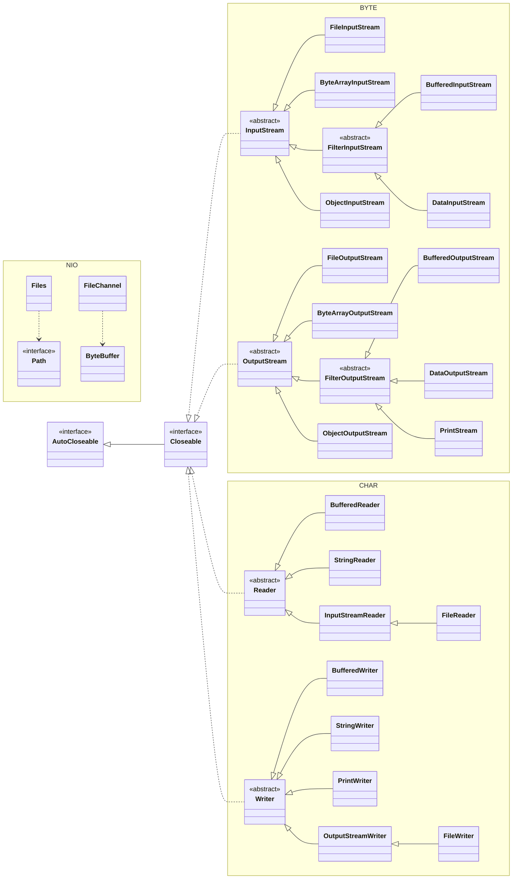

下面的类图只列出 Java I/O 中重点介绍的接口和实现。颜色用于区分接口与抽象基类、节点流、处理流和 NIO 抽象；空心三角表示继承（实线）与接口实现（虚线），开口箭头表示依赖关系：

```mermaid
classDiagram
    direction LR

    class AutoCloseable {
        <<interface>>
    }
    class Closeable {
        <<interface>>
    }

    namespace BYTE {
        class InputStream {
            <<abstract>>
        }
        class FileInputStream
        class ByteArrayInputStream
        class FilterInputStream {
            <<abstract>>
        }
        class ObjectInputStream
        class BufferedInputStream
        class DataInputStream
        class OutputStream {
            <<abstract>>
        }
        class FileOutputStream
        class ByteArrayOutputStream
        class FilterOutputStream {
            <<abstract>>
        }
        class ObjectOutputStream
        class BufferedOutputStream
        class DataOutputStream
        class PrintStream
    }

    namespace CHAR {
        class Reader {
            <<abstract>>
        }
        class BufferedReader
        class StringReader
        class InputStreamReader
        class FileReader
        class Writer {
            <<abstract>>
        }
        class BufferedWriter
        class StringWriter
        class PrintWriter
        class OutputStreamWriter
        class FileWriter
    }

    namespace NIO {
        class Path {
            <<interface>>
        }
        class Files
        class FileChannel
        class ByteBuffer
    }

    AutoCloseable <|-- Closeable
    Closeable <|.. InputStream
    Closeable <|.. OutputStream
    Closeable <|.. Reader
    Closeable <|.. Writer

    InputStream <|-- FileInputStream
    InputStream <|-- ByteArrayInputStream
    InputStream <|-- FilterInputStream
    InputStream <|-- ObjectInputStream
    FilterInputStream <|-- BufferedInputStream
    FilterInputStream <|-- DataInputStream

    OutputStream <|-- FileOutputStream
    OutputStream <|-- ByteArrayOutputStream
    OutputStream <|-- FilterOutputStream
    OutputStream <|-- ObjectOutputStream
    FilterOutputStream <|-- BufferedOutputStream
    FilterOutputStream <|-- DataOutputStream
    FilterOutputStream <|-- PrintStream

    Reader <|-- BufferedReader
    Reader <|-- StringReader
    Reader <|-- InputStreamReader
    InputStreamReader <|-- FileReader

    Writer <|-- BufferedWriter
    Writer <|-- StringWriter
    Writer <|-- PrintWriter
    Writer <|-- OutputStreamWriter
    OutputStreamWriter <|-- FileWriter

    Files ..> Path
    FileChannel ..> ByteBuffer

    classDef contract fill:#dbeafe,stroke:#2563eb,stroke-width:2px,color:#1e3a8a
    classDef node fill:#dcfce7,stroke:#16a34a,stroke-width:2px,color:#14532d
    classDef processing fill:#fed7aa,stroke:#ea580c,stroke-width:2px,color:#9a3412
    classDef nio fill:#ede9fe,stroke:#7c3aed,stroke-width:2px,color:#4c1d95

    class AutoCloseable:::contract
    class Closeable:::contract
    class InputStream:::contract
    class OutputStream:::contract
    class Reader:::contract
    class Writer:::contract
    class FilterInputStream:::contract
    class FilterOutputStream:::contract
    class FileInputStream:::node
    class ByteArrayInputStream:::node
    class FileOutputStream:::node
    class ByteArrayOutputStream:::node
    class StringReader:::node
    class FileReader:::node
    class StringWriter:::node
    class FileWriter:::node
    class ObjectInputStream:::processing
    class BufferedInputStream:::processing
    class DataInputStream:::processing
    class ObjectOutputStream:::processing
    class BufferedOutputStream:::processing
    class DataOutputStream:::processing
    class PrintStream:::processing
    class BufferedReader:::processing
    class InputStreamReader:::processing
    class BufferedWriter:::processing
    class PrintWriter:::processing
    class OutputStreamWriter:::processing
    class Path:::nio
    class Files:::nio
    class FileChannel:::nio
    class ByteBuffer:::nio
```

- 接口与抽象基类
- 节点流，直接连接数据源
- 处理流，包装其他流
- NIO 路径、通道与缓冲区
