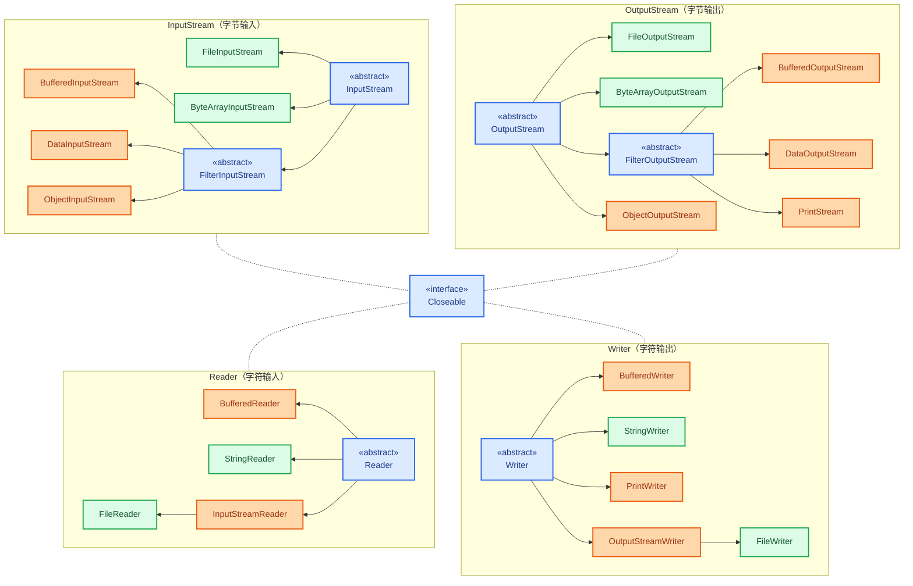

下面的类图只列出 Java I/O 中重点介绍的接口和实现，按字节输入 / 字节输出 / 字符输入 / 字符输出分成四块：四个抽象基类排在中间一列，各自的实现向两侧展开；`Closeable` 画在正中，四块都实现它。颜色用于区分接口与抽象基类、节点流和处理流：

```mermaid
flowchart TB
    CLOSE["«interface»<br>Closeable"]

    subgraph OB["OutputStream（字节输出）"]
        direction LR
        OB_abs["«abstract»<br>OutputStream"]
        OB_fos["FileOutputStream"]
        OB_baos["ByteArrayOutputStream"]
        OB_fof["«abstract»<br>FilterOutputStream"]
        OB_oos["ObjectOutputStream"]
        OB_bos["BufferedOutputStream"]
        OB_dos["DataOutputStream"]
        OB_ps["PrintStream"]
        OB_abs --> OB_fos
        OB_abs --> OB_baos
        OB_abs --> OB_fof
        OB_abs --> OB_oos
        OB_fof --> OB_bos
        OB_fof --> OB_dos
        OB_fof --> OB_ps
    end

    subgraph IB["InputStream（字节输入）"]
        direction RL
        IB_abs["«abstract»<br>InputStream"]
        IB_fis["FileInputStream"]
        IB_bais["ByteArrayInputStream"]
        IB_fif["«abstract»<br>FilterInputStream"]
        IB_bis["BufferedInputStream"]
        IB_dis["DataInputStream"]
        IB_ois["ObjectInputStream"]
        IB_abs --> IB_fis
        IB_abs --> IB_bais
        IB_abs --> IB_fif
        IB_fif --> IB_bis
        IB_fif --> IB_dis
        IB_fif --> IB_ois
    end

    subgraph OR["Writer（字符输出）"]
        direction LR
        OR_abs["«abstract»<br>Writer"]
        OR_bw["BufferedWriter"]
        OR_sw["StringWriter"]
        OR_pw["PrintWriter"]
        OR_osw["OutputStreamWriter"]
        OR_fw["FileWriter"]
        OR_abs --> OR_bw
        OR_abs --> OR_sw
        OR_abs --> OR_pw
        OR_abs --> OR_osw
        OR_osw --> OR_fw
    end

    subgraph IR["Reader（字符输入）"]
        direction RL
        IR_abs["«abstract»<br>Reader"]
        IR_br["BufferedReader"]
        IR_sr["StringReader"]
        IR_isr["InputStreamReader"]
        IR_fr["FileReader"]
        IR_abs --> IR_br
        IR_abs --> IR_sr
        IR_abs --> IR_isr
        IR_isr --> IR_fr
    end

    %% Closeable 要落在两排之间的中线上：让上排连进去、下排连出来，把它夹在中间 rank。
    %% 两边方向不一致，所以用无箭头的 -.-，不表达指向。
    IB -.- CLOSE
    OB -.- CLOSE
    CLOSE -.- IR
    CLOSE -.- OR

    classDef contract fill:#dbeafe,stroke:#2563eb,stroke-width:2px,color:#1e3a8a
    classDef node fill:#dcfce7,stroke:#16a34a,stroke-width:2px,color:#14532d
    classDef processing fill:#fed7aa,stroke:#ea580c,stroke-width:2px,color:#9a3412

    class CLOSE,IB_abs,IB_fif,OB_abs,OB_fof,IR_abs,OR_abs contract
    class IB_fis,IB_bais,OB_fos,OB_baos,IR_sr,IR_fr,OR_sw,OR_fw node
    class IB_bis,IB_dis,IB_ois,OB_oos,OB_bos,OB_dos,OB_ps,IR_br,IR_isr,OR_bw,OR_pw,OR_osw processing
```

- 接口与抽象基类
- 节点流，直接连接数据源
- 处理流，包装其他流
