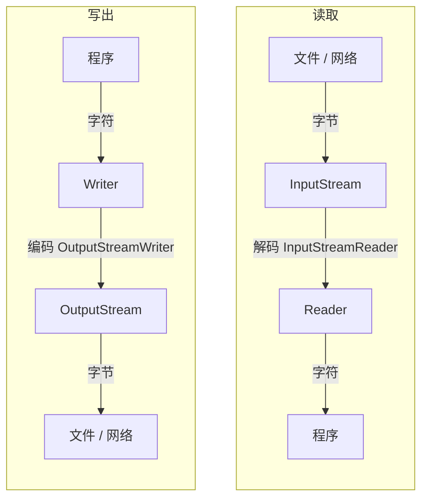

# Java 输入输出流（I/O）

[[toc]]

Java 的 I/O（Input/Output）用于在程序与外部数据源之间传输数据。外部数据源可以是文件、网络连接、内存缓冲区或其他设备。

本文重点介绍文件读写中最常用的流、缓冲、字符编码、资源管理以及 NIO 文件 API。

## I/O 类体系总览

<!-- @include: io-class-diagram.md -->

## 先分清字节流和字符流

Java I/O 的类名很多，但选哪一个基本只取决于一个问题，你要处理的是「人能读的文字」，还是「二进制数据」。

| 你面对的东西 | 该用的流 | 为什么 |
| --- | --- | --- |
| txt、json、csv、日志、网页 | 字符流 `Reader` / `Writer` | 内容由字符组成，需要按字符集解读 |
| jpg、mp3、mp4、zip、class 文件、序列化对象 | 字节流 `InputStream` / `OutputStream` | 内容没有「字符」的概念，只按字节搬运 |

两者并不是并列的两套体系，而是一层套一层的关系：

**字符流 = 字节流 + 编码 / 解码**

字符流并没有另一套读写磁盘的机制，它最终仍然落在字节流上。区别在于字符流多了一层转换，写出时把字符「编码」为字节，读取时把字节「解码」为字符。所以文本能不能正确读出来，关键不是用了字符流，而是编码和解码用的是同一个字符集。

转换流正是这层编码 / 解码的落地实现，也是字节流与字符流之间唯一的通道：

- `InputStreamReader`：把字节输入流解码为字符输入流
- `OutputStreamWriter`：把字符输出流编码为字节输出流



判断口诀：

- 处理人能读的文字，用字符流。
- 处理二进制数据，用字节流。
- 手上只有字节流、但要按文本处理，用转换流包一层。

## 版本基线

Java I/O 的 API 跨越多个版本，下表按首次引入的版本整理，正文中每个 API 首次出现处也会标出版本。

| 起始版本 | API | 说明 |
| --- | --- | --- |
| Java 1.0 | `InputStream`、`FileInputStream`、`BufferedInputStream`、`DataInputStream`<br>`OutputStream`、`FileOutputStream`、`BufferedOutputStream`、`DataOutputStream`、`PrintStream`<br>`File` | 基础字节流与 `File` |
| Java 1.1 | `Reader`、`FileReader`、`BufferedReader`、`InputStreamReader`、`ObjectInputStream`<br>`Writer`、`FileWriter`、`BufferedWriter`、`OutputStreamWriter`、`ObjectOutputStream`、`PrintWriter`<br>`Serializable` | 字符流与对象流 |
| Java 1.4 | `ByteBuffer`、`FileChannel`<br>`InputStreamReader(InputStream, Charset)`<br>`OutputStreamWriter(OutputStream, Charset)` | 缓冲区、通道，以及可以显式指定字符集的转换流构造方法 |
| Java 7 | `Path`、`Paths`、`Files`、`StandardCharsets`、`FileChannel.open`、`FileVisitor`、`AutoCloseable`、`try-with-resources`、`Throwable.getSuppressed()` | NIO 文件 API 与自动资源管理 |
| Java 8 | `Files.lines`、`Files.walk`、`Files.readAllLines(Path)`、`BufferedReader.lines` | 基于流的文件读取 |
| Java 9 | `ObjectInputFilter` | 反序列化过滤器 |
| Java 11 | `Path.of`、`Files.readString`、`Files.writeString` | 现代便捷文件读写 |
| Java 14 | `@Serial` | 序列化成员的编译期校验注解 |
| Java 16 | `record` | 按组件序列化，兼容性规则与普通类不同 |

本文可直接运行的示例以 **Java 11+** 为基线。需要 Java 8 运行环境的项目，可以把 `Path.of(x)` 换成 `Paths.get(x)`，把 `Files.readString`、`Files.writeString` 换成 `Files.readAllBytes`、`Files.write` 或 `Files.newBufferedReader`、`Files.newBufferedWriter`。序列化章节以普通类演示 `serialVersionUID`，`record` 只在文字说明中提及。本文不涉及网络 I/O、非阻塞 I/O 和异步 I/O。

## I/O 基本概念

### 输入与输出

以程序为参照：

- **输入（Input）**：数据从外部进入程序，例如从文件读取内容。
- **输出（Output）**：数据从程序写入外部，例如把内容保存到文件。

流表示一条连续的数据通道。流本身不决定数据的最终来源或去向，具体实现类负责连接文件、内存或网络等数据源。

### Java I/O 的分类

Java I/O 通常从以下几个维度进行分类：

| 分类方式 | 类型 | 说明 |
| --- | --- | --- |
| 数据单位 | 字节流、字符流 | 字节流按字节搬运二进制数据，字符流在字节流之上多一层编码与解码，用于处理文本 |
| 数据方向 | 输入流、输出流 | 输入流读取数据，输出流写出数据 |
| 处理方式 | 节点流、处理流 | 节点流直接连接数据源，处理流包装其他流并提供额外能力 |
| API 体系 | 传统 I/O、NIO | NIO 提供 `Path`<Tip>Java 7</Tip>、`Files`<Tip>Java 7</Tip>、Channel、Buffer 等抽象 |

### 主要抽象类

- `InputStream`<Tip>Java 1.0</Tip>：所有字节输入流的父类。
- `OutputStream`<Tip>Java 1.0</Tip>：所有字节输出流的父类。
- `Reader`<Tip>Java 1.1</Tip>：所有字符输入流的父类。
- `Writer`<Tip>Java 1.1</Tip>：所有字符输出流的父类。
- `Path`<Tip>Java 7</Tip>：NIO 中表示文件或目录路径的接口。
- `Files`<Tip>Java 7</Tip>：NIO 中操作文件和目录的工具类。

文件和目录本身的操作还包括 `File`<Tip>Java 1.0</Tip>、`Path`、`Paths`<Tip>Java 7</Tip> 与 `Files`，可参考[Java 文件目录操作](./file-operations.md)。

## 字节流

### InputStream

`InputStream`<Tip>Java 1.0</Tip> 以字节为单位读取数据，核心方法是 `read()`：

```java
import java.io.FileInputStream;
import java.io.IOException;
import java.io.InputStream;

try (InputStream input = new FileInputStream("input.bin")) {
    int value;
    while ((value = input.read()) != -1) {
        // value 的范围是 0 到 255，-1 表示已经读到流末尾
        System.out.println(value);
    }
}
```

`read()` 返回 `int` 而不是 `byte`，是因为它需要用 `-1` 表示流末尾。返回的有效字节值范围为 `0` 到 `255`。上面这段代码需要放在会抛出 `IOException` 的方法中，或者自行捕获该异常。

常用方法包括：

- `read()`：读取一个字节。
- `read(byte[])`：读取多个字节并存入数组。
- `read(byte[], int, int)`：从数组指定位置开始写入读取到的字节。
- `skip(long)`：跳过指定数量的字节。一次调用不保证跳过请求的全部数量，实际跳过量以返回值为准，需要精确跳过时应循环调用。
- `available()`：估计当前可以无阻塞读取的字节数，不能用来判断文件剩余长度。
- `close()`：关闭流并释放相关资源。

### OutputStream

`OutputStream`<Tip>Java 1.0</Tip> 以字节为单位写出数据：

```java
import java.io.FileOutputStream;
import java.io.IOException;
import java.io.OutputStream;

byte[] content = {10, 20, 30};

try (OutputStream output = new FileOutputStream("output.bin")) {
    output.write(content);
}
```

常用方法包括：

- `write(int)`：写出一个字节，只使用参数的低 8 位。
- `write(byte[])`：写出整个字节数组。
- `write(byte[], int, int)`：写出数组的一部分。
- `flush()`：将缓冲数据写入底层目标。`flush()` 只负责把数据从上层缓冲区交给下一层，不代表数据已经持久化到物理介质。
- `close()`：关闭流并释放相关资源；带缓冲的具体实现通常会在关闭时刷新缓冲区。

### 文件字节流

`FileInputStream`<Tip>Java 1.0</Tip> 和 `FileOutputStream`<Tip>Java 1.0</Tip> 分别用于读取和写入文件。二进制文件复制可以使用固定大小的缓冲数组：

```java
import java.io.FileInputStream;
import java.io.FileOutputStream;
import java.io.IOException;

public class FileCopy {
    public static void copy(String source, String target) throws IOException {
        byte[] buffer = new byte[8192];

        try (FileInputStream input = new FileInputStream(source);
             FileOutputStream output = new FileOutputStream(target)) {
            int count;
            while ((count = input.read(buffer)) != -1) {
                output.write(buffer, 0, count);
            }
        }
    }
}
```

调用 `write(buffer)` 会写出整个数组；末次读取可能只填充数组的一部分，因此应使用 `write(buffer, 0, count)`，避免把上一次读取残留的数据一并写出。

字节流适合处理图片、音频、视频、压缩包以及其他二进制文件，也可以作为字符流的底层数据源。

## 字符流

### Reader 与 Writer

字符流以字符为单位处理文本，主要抽象类是 `Reader`<Tip>Java 1.1</Tip> 和 `Writer`<Tip>Java 1.1</Tip>。字符流负责把字节转换为字符，但文本编码仍然需要明确指定。

```java
import java.io.BufferedReader;
import java.io.BufferedWriter;
import java.io.FileReader;
import java.io.FileWriter;
import java.io.IOException;

public class TextCopy {
    public static void copy(String source, String target) throws IOException {
        try (BufferedReader reader = new BufferedReader(new FileReader(source));
             BufferedWriter writer = new BufferedWriter(new FileWriter(target))) {
            String line;
            while ((line = reader.readLine()) != null) {
                writer.write(line);
                writer.newLine();
            }
        }
    }
}
```

`FileReader`<Tip>Java 1.1</Tip> 和 `FileWriter`<Tip>Java 1.1</Tip> 使用平台默认字符集。在需要跨平台运行或处理外部文件时，推荐使用 `newBufferedReader`、`newBufferedWriter` 等可以指定 `Charset` 的 NIO API，避免因为默认编码不同产生乱码。

上面的例子按行写回时调用 `writer.newLine()`，写入的是当前平台的换行符。同样的代码在 Windows 和 Linux 上生成的换行并不相同，需要固定的行结束符时应显式写入 `\n` 或 `\r\n`。

### 字符编码

文本在磁盘上保存为字节，程序读取时需要按照正确的字符集将字节解码为字符；写出时则需要把字符编码为字节。

常见问题包括：

- 写入和读取使用了不同的字符集。
- 使用了平台默认字符集，程序在另一台机器上运行后出现乱码。
- 误把字节数组直接转换成字符串，忽略了编码参数。

```java
import java.nio.charset.StandardCharsets;
import java.nio.file.Files;
import java.nio.file.Path;

Path path = Path.of("message.txt");
Files.writeString(path, "你好，Java", StandardCharsets.UTF_8);
String text = Files.readString(path, StandardCharsets.UTF_8);
```

上面的例子用到了 `StandardCharsets`<Tip>Java 7</Tip>、`Path.of`<Tip>Java 11</Tip> 以及 `Files.writeString` 和 `Files.readString`<Tip>Java 11</Tip>。除非确实需要兼容某个旧系统，否则文本交换通常优先使用 UTF-8，并在接口边界明确字符集。

## 缓冲流

### 缓冲流的作用

`BufferedInputStream`<Tip>Java 1.0</Tip>、`BufferedOutputStream`<Tip>Java 1.0</Tip>、`BufferedReader`<Tip>Java 1.1</Tip> 和 `BufferedWriter`<Tip>Java 1.1</Tip> 都属于处理流。它们在内存中维护缓冲区，减少对底层文件或设备的访问次数，通常可以提升大量小块读写的性能。

```java
import java.io.BufferedInputStream;
import java.io.BufferedOutputStream;
import java.io.FileInputStream;
import java.io.FileOutputStream;
import java.io.IOException;

try (BufferedInputStream input = new BufferedInputStream(
         new FileInputStream("input.bin"));
     BufferedOutputStream output = new BufferedOutputStream(
         new FileOutputStream("output.bin"))) {
    byte[] buffer = new byte[8192];
    int count;
    while ((count = input.read(buffer)) != -1) {
        output.write(buffer, 0, count);
    }
}
```

缓冲流不会改变数据格式，只是改变访问底层流的方式。对已经具备缓冲能力的组件重复包装，通常没有必要。

### BufferedReader 按行读取

`BufferedReader.readLine()` 读取一行文本，但返回的字符串不包含换行符。写回文件时调用 `newLine()`，是按当前平台重新生成行分隔符，不能保留原文件的 CRLF / LF 格式，也不能保留原文件末尾是否有换行。需要原样复制时，应使用字节流或 `Files.copy()`<Tip>Java 7</Tip>。

`BufferedReader` 还有 `lines()`<Tip>Java 8</Tip> 方法，可以把内容直接转成 `Stream<String>`。`BufferedWriter` 的 `newLine()` 写的是系统属性 `line.separator` 定义的换行符，不一定是单个 `\n`。

## 转换流

### InputStreamReader 与 OutputStreamWriter

转换流连接字节流和字符流，是开头「字符流 = 字节流 + 编码 / 解码」这层关系唯一的具体实现：

- `InputStreamReader`<Tip>Java 1.1</Tip>：将字节输入流解码为字符。
- `OutputStreamWriter`<Tip>Java 1.1</Tip>：将字符编码为字节并写入输出流。

两者的 `Charset` 构造方法 `InputStreamReader(InputStream, Charset)` 和 `OutputStreamWriter(OutputStream, Charset)` 是 Java 1.4 加入的，这也是 `StandardCharsets`<Tip>Java 7</Tip> 能够直接传入的前提。

```java
import java.io.BufferedReader;
import java.io.BufferedWriter;
import java.io.IOException;
import java.io.InputStream;
import java.io.InputStreamReader;
import java.io.OutputStream;
import java.io.OutputStreamWriter;
import java.nio.charset.StandardCharsets;

public class StreamCopy {
    public static void copy(InputStream inputStream, OutputStream outputStream)
            throws IOException {
        try (BufferedReader reader = new BufferedReader(
                 new InputStreamReader(inputStream, StandardCharsets.UTF_8));
             BufferedWriter writer = new BufferedWriter(
                 new OutputStreamWriter(outputStream, StandardCharsets.UTF_8))) {
            String line;
            while ((line = reader.readLine()) != null) {
                writer.write(line);
                writer.newLine();
            }
        }
    }
}
```

网络连接、标准输入输出等数据源通常只提供字节流。需要按文本处理时，可以通过转换流指定字符集，再包装为缓冲字符流。

## 数据流

`DataInputStream`<Tip>Java 1.0</Tip> 和 `DataOutputStream`<Tip>Java 1.0</Tip> 用于按 Java 基本数据类型读写数据：

```java
import java.io.DataInputStream;
import java.io.DataOutputStream;
import java.io.FileInputStream;
import java.io.FileOutputStream;
import java.io.IOException;

public class DataFile {
    public static void write(String path) throws IOException {
        try (DataOutputStream output = new DataOutputStream(
                 new FileOutputStream(path))) {
            output.writeInt(2026);
            output.writeDouble(3.14);
            output.writeBoolean(true);
        }
    }

    public static void read(String path) throws IOException {
        try (DataInputStream input = new DataInputStream(
                 new FileInputStream(path))) {
            int year = input.readInt();
            double value = input.readDouble();
            boolean enabled = input.readBoolean();
        }
    }
}
```

写入和读取必须遵循相同的顺序及类型，否则会读取到错误的数据，甚至抛出异常。数据流适合简单的二进制协议，不适合作为通用对象持久化格式。

## 对象流与序列化

### 基本用法

实现 `Serializable`<Tip>Java 1.1</Tip> 的对象可以通过 `ObjectOutputStream`<Tip>Java 1.1</Tip> 写入，并使用 `ObjectInputStream`<Tip>Java 1.1</Tip> 读取：

```java
import java.io.Serializable;

public final class User implements Serializable {
    private static final long serialVersionUID = 1L;

    private final String name;
    private final int age;

    public User(String name, int age) {
        this.name = name;
        this.age = age;
    }

    public String name() {
        return name;
    }

    public int age() {
        return age;
    }
}
```

```java
import java.io.FileInputStream;
import java.io.FileOutputStream;
import java.io.IOException;
import java.io.ObjectInputStream;
import java.io.ObjectOutputStream;

public class UserFile {
    public static void write(String path) throws IOException {
        try (ObjectOutputStream output = new ObjectOutputStream(
                 new FileOutputStream(path))) {
            output.writeObject(new User("Alice", 18));
        }
    }

    public static User read(String path) throws IOException, ClassNotFoundException {
        try (ObjectInputStream input = new ObjectInputStream(
                 new FileInputStream(path))) {
            return (User) input.readObject();
        }
    }
}
```

`serialVersionUID` 通常显式声明为固定的 `long` 值，避免编译器根据类的结构自动推导。Java 14 起可以加上 `@Serial`<Tip>Java 14</Tip> 注解（`java.io.Serial`），让编译器校验序列化成员的签名，不写也不影响运行。

### 注意事项

- `serialVersionUID` 用于判断序列化数据与当前类定义是否兼容，普通类应显式声明。
- `transient` 修饰的字段不会参与默认序列化。
- 序列化结果与类的实现细节耦合，类结构调整后可能无法兼容旧数据。
- `record`<Tip>Java 16</Tip> 也可以实现 `Serializable`，但它不需要 `serialVersionUID`，序列化按组件处理，兼容性规则与普通类不同。

::: danger 反序列化不可信数据

Java 原生反序列化在读取数据时就会执行类加载和对象构造逻辑，攻击者可以构造恶意字节流触发任意代码执行。历史上多个严重漏洞都来自这条路径。

- 如果数据来源不完全可信，不要使用 `ObjectInputStream`。跨系统的数据交换应改用 JSON、Protobuf 等只描述数据的格式。
- 如果必须保留原生反序列化，应当用 `ObjectInputFilter`<Tip>Java 9</Tip> 限制允许反序列化的类，并对数据大小和对象数量设置上限。

```java
import java.io.ObjectInputFilter;
import java.io.ObjectInputStream;

ObjectInputFilter filter = ObjectInputFilter.Config.createFilter(
        "com.example.dto.*;java.lang.String;java.lang.Integer;!*");

input.setObjectInputFilter(filter);
```

过滤器表达式中，`类名或包名`表示放行，`!*` 表示拒绝其余所有类。更细的场景还可以通过 `ObjectInputFilter` 接口自行实现 `checkInput`。
:::

## 打印流

`PrintStream`<Tip>Java 1.0</Tip> 和 `PrintWriter`<Tip>Java 1.1</Tip> 提供面向文本的便捷输出方法：

```java
import java.io.BufferedWriter;
import java.io.IOException;
import java.nio.charset.StandardCharsets;
import java.nio.file.Files;
import java.nio.file.Path;

public class PrintDemo {
    public static void write(Path path) throws IOException {
        try (BufferedWriter writer = Files.newBufferedWriter(
                 path, StandardCharsets.UTF_8)) {
            writer.write("第一行");
            writer.newLine();
            writer.write("数量：" + 3);
            writer.newLine();
        }
    }
}
```

`System.out` 和 `System.err` 也是打印流。`PrintStream` 和 `PrintWriter` 通常不会把 `IOException` 直接抛给调用方，而是记录错误状态，所以在需要可靠处理失败的文件写入场景中，要么直接使用普通 `Writer`，让异常正常抛出，要么在关闭前调用 `checkError()` 检查状态。`checkError()` 会先刷新流，再返回自上次调用以来是否发生过错误：

```java
import java.io.IOException;
import java.io.PrintWriter;
import java.nio.charset.StandardCharsets;
import java.nio.file.Files;
import java.nio.file.Path;

public class PrintCheck {
    public static void write(Path path) throws IOException {
        try (PrintWriter writer = new PrintWriter(
                 Files.newBufferedWriter(path, StandardCharsets.UTF_8))) {
            writer.println("第一行");
            writer.printf("数量：%d%n", 3);

            if (writer.checkError()) {
                throw new IOException("写入 " + path + " 失败");
            }
        }
    }
}
```

## try-with-resources

### 为什么需要自动关闭资源

文件流、网络连接等资源使用操作系统句柄。使用完毕后如果没有关闭，可能造成资源泄漏、文件锁未释放或句柄耗尽。

传统写法需要在 `finally` 中关闭资源，容易遗漏异常处理：

```java
import java.io.FileInputStream;
import java.io.IOException;
import java.io.InputStream;

InputStream input = null;
try {
    input = new FileInputStream("input.txt");
    // 读取数据
} finally {
    if (input != null) {
        input.close();
    }
}
```

Java 7 引入的 try-with-resources<Tip>Java 7</Tip> 可以自动关闭实现 `AutoCloseable`<Tip>Java 7</Tip> 的资源：

```java
import java.io.FileInputStream;
import java.io.IOException;
import java.io.InputStream;

try (InputStream input = new FileInputStream("input.txt")) {
    // 读取数据
}
```

上面两段代码都需要放在会抛出 `IOException` 的方法中，或者自行捕获该异常。

多个资源按照声明的逆序关闭。关闭过程中产生的异常会作为被抑制异常附加到主要异常上，可以通过 `Throwable.getSuppressed()`<Tip>Java 7</Tip> 查看。

除非资源确实需要在代码块之外继续使用，否则文件和网络流都应优先使用 try-with-resources。

## Java NIO 文件 I/O

### Path 与 Files

Java 7 引入的 NIO 文件 API 以 `Path`<Tip>Java 7</Tip> 表示路径，以 `Files`<Tip>Java 7</Tip> 执行文件操作。相比 `File`，它提供了更完整的异常信息、文件属性、符号链接和目录遍历能力。

```java
import java.nio.charset.StandardCharsets;
import java.nio.file.Files;
import java.nio.file.Path;

Path directory = Path.of("data");                   // Java 11
Files.createDirectories(directory);                 // Java 7
Path file = directory.resolve("message.txt");       // Java 7
Files.writeString(file, "Hello, Java", StandardCharsets.UTF_8);   // Java 11
String content = Files.readString(file, StandardCharsets.UTF_8);  // Java 11
```

常用方法包括：

| 操作 | 方法 |
| --- | --- |
| 创建目录 | `createDirectory`<Tip>Java 7</Tip>、`createDirectories`<Tip>Java 7</Tip> |
| 创建文件 | `createFile`<Tip>Java 7</Tip> |
| 判断存在 | `exists`<Tip>Java 7</Tip>、`notExists`<Tip>Java 7</Tip> |
| 复制 | `copy`<Tip>Java 7</Tip> |
| 移动或重命名 | `move`<Tip>Java 7</Tip> |
| 删除 | `delete`<Tip>Java 7</Tip>、`deleteIfExists`<Tip>Java 7</Tip> |
| 读取文本 | `readAllLines`<Tip>Java 7</Tip>、`readString`<Tip>Java 11</Tip>、`lines`<Tip>Java 8</Tip> |
| 写入文本 | `write`<Tip>Java 7</Tip>、`writeString`<Tip>Java 11</Tip> |
| 获取流 | `newInputStream`<Tip>Java 7</Tip>、`newOutputStream`<Tip>Java 7</Tip>、`newBufferedReader`<Tip>Java 7</Tip>、`newBufferedWriter`<Tip>Java 8</Tip> |

### 一次性读取与流式读取

`readString()`<Tip>Java 11</Tip>、`readAllBytes()`<Tip>Java 7</Tip> 和 `readAllLines()`<Tip>Java 7</Tip> 会把内容整体加载到内存，适合内容规模可控的小文件。处理大文件时应使用缓冲流、`Files.lines()`<Tip>Java 8</Tip> 或 `Files.newBufferedReader()`<Tip>Java 7</Tip>：

```java
import java.io.IOException;
import java.nio.charset.StandardCharsets;
import java.nio.file.Files;
import java.nio.file.Path;
import java.util.stream.Stream;

public class LogFilter {
    public static void filter(Path path) throws IOException {
        try (Stream<String> lines = Files.lines(path, StandardCharsets.UTF_8)) {
            lines.filter(line -> line.contains("ERROR"))
                 .forEach(System.out::println);
        }
    }
}
```

`Files.lines()`<Tip>Java 8</Tip> 返回的 `Stream` 也持有文件资源，因此必须关闭，最简单的方式是将它放入 try-with-resources。

### 目录遍历

遍历目录树可以使用 `Files.walk()`<Tip>Java 8</Tip>：

```java
import java.io.IOException;
import java.nio.file.Files;
import java.nio.file.Path;
import java.util.stream.Stream;

public class TreeList {
    public static void list(Path root) throws IOException {
        try (Stream<Path> paths = Files.walk(root)) {
            paths.filter(Files::isRegularFile)
                 .forEach(System.out::println);
        }
    }
}
```

如果需要在进入目录前后执行操作，或处理访问失败，可以使用 `Files.walkFileTree()`<Tip>Java 7</Tip> 和 `FileVisitor`<Tip>Java 7</Tip>。删除非空目录时，通常需要先遍历并删除文件，再删除目录本身。

## Channel 与 Buffer

### FileChannel

Channel 是 NIO 中面向数据传输的抽象，`FileChannel`<Tip>Java 1.4</Tip> 可以对文件进行读取、写入、定位和映射，`FileChannel.open(Path, OpenOption...)`<Tip>Java 7</Tip> 是它接受 `Path` 的入口：

```java
import java.io.IOException;
import java.nio.ByteBuffer;
import java.nio.channels.FileChannel;
import java.nio.file.Path;
import java.nio.file.StandardOpenOption;

public class ChannelRead {
    public static void read(Path path) throws IOException {
        try (FileChannel channel = FileChannel.open(
                 path, StandardOpenOption.READ)) {
            ByteBuffer buffer = ByteBuffer.allocate(8192);
            int count;
            while ((count = channel.read(buffer)) != -1) {
                if (count == 0) {
                    continue;
                }
                buffer.flip();
                while (buffer.hasRemaining()) {
                    byte value = buffer.get();
                    // 处理 value
                }
                buffer.clear();
            }
        }
    }
}
```

`read()` 的返回值有三种情况：正数表示本次读取到的字节数，`-1` 表示已经到达文件末尾，`0` 表示本次没有读到数据。普通文件通常不会持续返回 `0`，但在其他 Channel 实现下可能出现，因此不应把 `!= -1` 当成所有 Channel 都适用的通用模板。

`ByteBuffer`<Tip>Java 1.4</Tip> 在写入模式和读取模式之间切换时需要调用 `flip()`<Tip>Java 1.4</Tip>：

1. `put` 数据时，当前位置不断向后移动。
2. `flip()` 将当前位置设为读取上限，并把位置重置为 0。
3. 读取完毕后调用 `clear()`，准备再次写入。

`FileChannel` 适合需要随机访问、文件定位、文件锁或更精细控制的场景。普通的小文件读写使用 `Files` 通常更简单。

## 常见 I/O 场景

### 文本文件读取

下面的例子用到 `Files.newBufferedReader`<Tip>Java 7</Tip> 和 `StandardCharsets`<Tip>Java 7</Tip>：

```java
import java.io.BufferedReader;
import java.io.IOException;
import java.nio.charset.StandardCharsets;
import java.nio.file.Files;
import java.nio.file.Path;

public class TextReader {
    public static void read(Path path) throws IOException {
        try (BufferedReader reader = Files.newBufferedReader(
                 path, StandardCharsets.UTF_8)) {
            String line;
            while ((line = reader.readLine()) != null) {
                System.out.println(line);
            }
        }
    }
}
```

### 文本文件写入

```java
import java.io.BufferedWriter;
import java.io.IOException;
import java.nio.charset.StandardCharsets;
import java.nio.file.Files;
import java.nio.file.Path;
import java.nio.file.StandardOpenOption;

public class TextWriter {
    public static void write(Path path) throws IOException {
        Path parent = path.toAbsolutePath().getParent();
        if (parent != null) {
            Files.createDirectories(parent);                    // Java 7
        }

        try (BufferedWriter writer = Files.newBufferedWriter(   // Java 7
                 path, StandardCharsets.UTF_8,
                 StandardOpenOption.CREATE,                      // Java 7
                 StandardOpenOption.TRUNCATE_EXISTING)) {        // Java 7
            writer.write("第一行");
            writer.newLine();
            writer.write("第二行");
        }
    }
}
```

`TRUNCATE_EXISTING` 会在写入前清空原内容。`CREATE` 只负责创建目标文件本身，不会创建上级目录，所以写入前需要先确认父目录存在。

`Files.newBufferedWriter(Path, Charset, OpenOption...)` 是 Java 7 的重载；只传 `OpenOption` 的 `newBufferedWriter(Path, OpenOption...)`<Tip>Java 8</Tip> 是后来补充的。

如果希望保留原内容并追加，应改用 `APPEND`：

```java
import java.io.IOException;
import java.nio.charset.StandardCharsets;
import java.nio.file.Files;
import java.nio.file.Path;
import java.nio.file.StandardOpenOption;

public class TextAppender {
    public static void append(Path path, String line) throws IOException {
        Files.writeString(                                // Java 11
            path,
            line + "\n",
            StandardCharsets.UTF_8,
            StandardOpenOption.CREATE,                    // Java 7
            StandardOpenOption.APPEND                     // Java 7
        );
    }
}
```

这里的 `\n` 固定为 LF，不受当前平台影响。如果追加的内容需要跟已有文件保持同一种换行风格，应显式写入对应的 `\n` 或 `\r\n`，而不要依赖平台默认换行。

### 二进制文件复制

对普通文件可以直接使用：

```java
import java.io.IOException;
import java.nio.file.Files;
import java.nio.file.Path;
import java.nio.file.StandardCopyOption;

public class BinaryCopy {
    public static void copy(Path source, Path target) throws IOException {
        Files.copy(source, target, StandardCopyOption.REPLACE_EXISTING);
    }
}
```

需要在复制过程中统计进度、转换内容或限制内存占用时，再使用缓冲流或 Channel 自行处理。

## 性能与实践建议

- 避免逐字节访问大文件，使用缓冲数组或缓冲流。
- 大文件不要调用 `readAllBytes()` 或 `readString()` 一次性加载到内存。
- 文本读写显式指定 `Charset`，不要依赖平台默认编码或平台默认换行。
- 复制数组中的有效数据时，使用实际读取长度，而不是整个数组长度。
- 使用 `StandardOpenOption` 明确表达覆盖、追加或仅创建等写入意图。
- 处理外部输入时校验路径、文件大小和文件类型，避免路径穿越或无界资源消耗。

## 常见问题

### 为什么 `FileOutputStream` 会覆盖原文件

默认构造方式会以覆盖模式打开文件。如果要追加内容，需要使用带 `append` 参数的构造方法，或使用 `StandardOpenOption.APPEND`。

### 为什么读取中文文件会乱码

读取时使用的字符集与文件实际编码不一致。写入和读取应使用相同的字符集，并优先显式指定 `StandardCharsets.UTF_8`。

### 为什么删除文件失败

文件可能不存在、目录非空、资源仍被占用，或者当前用户没有足够权限。使用 `Files.delete()` 时应根据异常类型判断具体原因；不要求文件必须存在时可以使用 `deleteIfExists()`。

### `read()` 返回 `-1` 是什么意思

`-1` 表示已经到达流的末尾。不要把 `read()` 的返回值直接强制转换为 `byte` 后再判断，否则可能丢失这个结束标记。

### `available()` 能否表示文件剩余长度

不能。它表示当前可以在不阻塞的情况下读取的字节数，是一个估计值，不等于文件剩余长度。

## 传统 I/O 与 NIO 对比

| 对比项 | 传统 I/O | NIO 文件 API |
| --- | --- | --- |
| 路径表示 | `File`<Tip>Java 1.0</Tip> | `Path`<Tip>Java 7</Tip> |
| 文件操作 | 分布在多个实例方法中 | 集中在 `Files`<Tip>Java 7</Tip> 工具类 |
| 数据抽象 | Stream | Stream、Channel、Buffer |
| 字符集控制 | 部分 API 依赖默认字符集 | 常用 API 支持显式指定 `Charset` |
| 目录遍历 | 通过 `listFiles()` 等方法 | `walk()`<Tip>Java 8</Tip>、`walkFileTree()`<Tip>Java 7</Tip> |
| 适用场景 | 简单读写、遗留代码 | 现代文件操作和更复杂的 I/O 控制 |

在 Java 7 及以上版本中，普通文件和目录操作优先使用 `Path`、`Files` 与显式字符集；`Files.readString()` 与 `Files.writeString()` 需要 Java 11+。只有在需要兼容旧代码或使用特定流式 API 时，才直接使用传统 `File` 与 `FileInputStream` 等类。

## 总结

- 字符流 = 字节流 + 编码 / 解码。处理人能读的文字用字符流，处理二进制数据用字节流。
- 手上只有字节流但要按文本处理时，用 `InputStreamReader`<Tip>Java 1.1</Tip> 和 `OutputStreamWriter`<Tip>Java 1.1</Tip> 包一层；文本乱码的根因几乎都是编码和解码用了不同的字符集。
- 缓冲流通过减少底层访问次数提升读写效率，`BufferedInputStream`、`BufferedWriter` 等包装本身不改变数据格式。
- `try-with-resources`<Tip>Java 7</Tip> 是管理 I/O 资源的首选方式。`flush()` 只把数据交给下一层，不保证已经落盘。
- 小文件可以使用 `Files.readString()`<Tip>Java 11</Tip> 等便捷方法，大文件应采用缓冲或流式读取。
- 简单文件操作优先使用 `Files`<Tip>Java 7</Tip>；需要随机访问、文件锁或映射文件时再使用 `FileChannel`<Tip>Java 1.4</Tip>。
- 不要从不可信来源反序列化 Java 原生对象，必要时用 `ObjectInputFilter`<Tip>Java 9</Tip> 限制可反序列化的类。
