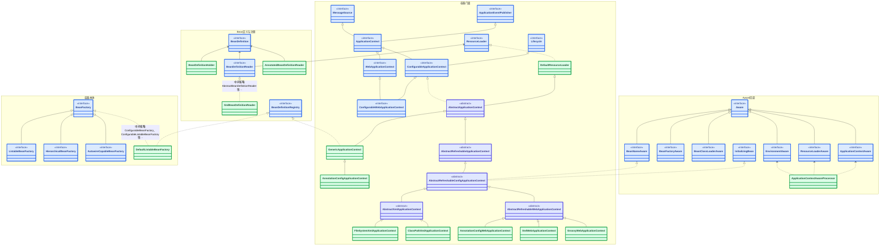

```mermaid
classDiagram
    direction TB

    namespace 容器本体 {
        class BeanFactory {
            <<interface>>
        }
        class ListableBeanFactory {
            <<interface>>
        }
        class HierarchicalBeanFactory {
            <<interface>>
        }
        class AutowireCapableBeanFactory {
            <<interface>>
        }
        class DefaultListableBeanFactory
    }

    namespace Bean定义与注册 {
        class BeanDefinition {
            <<interface>>
        }
        class BeanDefinitionHolder
        class BeanDefinitionReader {
            <<interface>>
        }
        class XmlBeanDefinitionReader
        class AnnotatedBeanDefinitionReader
        class BeanDefinitionRegistry {
            <<interface>>
        }
    }

    namespace 容器门面 {
        class MessageSource {
            <<interface>>
        }
        class ApplicationEventPublisher {
            <<interface>>
        }
        class ResourceLoader {
            <<interface>>
        }
        class Lifecycle {
            <<interface>>
        }
        class DefaultResourceLoader
        class ApplicationContext {
            <<interface>>
        }
        class WebApplicationContext {
            <<interface>>
        }
        class ConfigurableApplicationContext {
            <<interface>>
        }
        class ConfigurableWebApplicationContext {
            <<interface>>
        }
        class AbstractApplicationContext {
            <<abstract>>
        }
        class GenericApplicationContext
        class AnnotationConfigApplicationContext
        class AbstractRefreshableApplicationContext {
            <<abstract>>
        }
        class AbstractRefreshableConfigApplicationContext {
            <<abstract>>
        }
        class AbstractXmlApplicationContext {
            <<abstract>>
        }
        class FileSystemXmlApplicationContext
        class ClassPathXmlApplicationContext
        class AbstractRefreshableWebApplicationContext {
            <<abstract>>
        }
        class AnnotationConfigWebApplicationContext
        class XmlWebApplicationContext
        class GroovyWebApplicationContext
    }

    namespace Aware回调 {
        class Aware {
            <<interface>>
        }
        class BeanNameAware {
            <<interface>>
        }
        class BeanFactoryAware {
            <<interface>>
        }
        class BeanClassLoaderAware {
            <<interface>>
        }
        class EnvironmentAware {
            <<interface>>
        }
        class ApplicationContextAware {
            <<interface>>
        }
        class ResourceLoaderAware {
            <<interface>>
        }
        class InitializingBean {
            <<interface>>
        }
        class ApplicationContextAwareProcessor
    }

    %% 容器本体：BeanFactory 一族
    BeanFactory <|-- ListableBeanFactory
    BeanFactory <|-- HierarchicalBeanFactory
    BeanFactory <|-- AutowireCapableBeanFactory
    BeanFactory <|.. DefaultListableBeanFactory : 中间省略 ConfigurableBeanFactory、ConfigurableListableBeanFactory 等 ⋯

    %% Bean 定义与注册
    BeanDefinition <-- BeanDefinitionHolder
    BeanDefinition <-- BeanDefinitionReader
    BeanDefinition <-- AnnotatedBeanDefinitionReader
    ResourceLoader <-- BeanDefinitionReader
    BeanDefinitionReader <|.. XmlBeanDefinitionReader : 中间省略 AbstractBeanDefinitionReader 等 ⋯
    BeanDefinitionRegistry <|.. DefaultListableBeanFactory
    BeanDefinitionRegistry <|.. GenericApplicationContext

    %% 容器门面：ApplicationContext 一族
    %% 这些关系的声明顺序会影响 dagre 的排布（顺序本身没有语义）；实测按下面这个顺序写，
    %% 门面那几条长连线既不穿过别的类框、也基本是直的
    MessageSource <|-- ApplicationContext
    ApplicationEventPublisher <|-- ApplicationContext
    ApplicationContext <|-- WebApplicationContext
    ApplicationContext <|-- ConfigurableApplicationContext
    Lifecycle <|-- ConfigurableApplicationContext
    WebApplicationContext <|-- ConfigurableWebApplicationContext
    ConfigurableApplicationContext <|-- ConfigurableWebApplicationContext
    ConfigurableApplicationContext <|.. AbstractApplicationContext
    AbstractApplicationContext <|-- AbstractRefreshableApplicationContext
    GenericApplicationContext <|-- AnnotationConfigApplicationContext
    AbstractApplicationContext <|-- GenericApplicationContext
    AbstractRefreshableApplicationContext <|-- AbstractRefreshableConfigApplicationContext
    AbstractRefreshableConfigApplicationContext <|-- AbstractXmlApplicationContext
    AbstractXmlApplicationContext <|-- FileSystemXmlApplicationContext
    AbstractXmlApplicationContext <|-- ClassPathXmlApplicationContext
    AbstractRefreshableConfigApplicationContext <|-- AbstractRefreshableWebApplicationContext
    AbstractRefreshableWebApplicationContext <|-- AnnotationConfigWebApplicationContext
    AbstractRefreshableWebApplicationContext <|-- XmlWebApplicationContext
    AbstractRefreshableWebApplicationContext <|-- GroovyWebApplicationContext
    DefaultResourceLoader <|-- AbstractApplicationContext
    ResourceLoader <|.. DefaultResourceLoader

    %% Aware 回调
    Aware <|-- BeanNameAware
    Aware <|-- BeanFactoryAware
    Aware <|-- BeanClassLoaderAware
    Aware <|-- EnvironmentAware
    Aware <|-- ApplicationContextAware
    Aware <|-- ResourceLoaderAware
    BeanNameAware <|.. AbstractRefreshableConfigApplicationContext
    InitializingBean <|.. AbstractRefreshableConfigApplicationContext
    EnvironmentAware <.. ApplicationContextAwareProcessor
    ResourceLoaderAware <.. ApplicationContextAwareProcessor
    ApplicationContextAware <.. ApplicationContextAwareProcessor

    class BeanFactory:::interface
    class ListableBeanFactory:::interface
    class HierarchicalBeanFactory:::interface
    class AutowireCapableBeanFactory:::interface
    class DefaultListableBeanFactory:::implementation
    class BeanDefinition:::interface
    class BeanDefinitionHolder:::implementation
    class BeanDefinitionReader:::interface
    class XmlBeanDefinitionReader:::implementation
    class AnnotatedBeanDefinitionReader:::implementation
    class BeanDefinitionRegistry:::interface
    class MessageSource:::interface
    class ApplicationEventPublisher:::interface
    class Lifecycle:::interface
    class ResourceLoader:::interface
    class DefaultResourceLoader:::implementation
    class ApplicationContext:::interface
    class WebApplicationContext:::interface
    class ConfigurableApplicationContext:::interface
    class ConfigurableWebApplicationContext:::interface
    class AbstractApplicationContext:::abstract
    class GenericApplicationContext:::implementation
    class AnnotationConfigApplicationContext:::implementation
    class AbstractRefreshableApplicationContext:::abstract
    class AbstractRefreshableConfigApplicationContext:::abstract
    class AbstractXmlApplicationContext:::abstract
    class FileSystemXmlApplicationContext:::implementation
    class ClassPathXmlApplicationContext:::implementation
    class AbstractRefreshableWebApplicationContext:::abstract
    class AnnotationConfigWebApplicationContext:::implementation
    class XmlWebApplicationContext:::implementation
    class GroovyWebApplicationContext:::implementation
    class Aware:::interface
    class BeanNameAware:::interface
    class BeanFactoryAware:::interface
    class BeanClassLoaderAware:::interface
    class ApplicationContextAware:::interface
    class EnvironmentAware:::interface
    class ResourceLoaderAware:::interface
    class InitializingBean:::interface
    class ApplicationContextAwareProcessor:::implementation

    classDef interface fill:#dbeafe,stroke:#2563eb,stroke-width:2px,color:#1e3a8a
    classDef abstract fill:#e0e7ff,stroke:#4f46e5,stroke-width:2px,color:#312e81
    classDef implementation fill:#dcfce7,stroke:#16a34a,stroke-width:2px,color:#14532d
```

接口 抽象类 具体类

继承（父类 → 子类） 接口实现（接口 ⇢ 实现类） 依赖 / 持有（无三角箭头）
