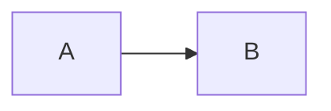
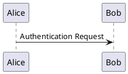

# Markdown 语法与扩展
[[toc]]

::: tip
本文介绍 VuePress 的 Markdown 写法；其中部分扩展需要安装插件，其安装与配置见《VuePress 常用插件》。
:::

## 标准语法
```markdown
**粗体**
*斜体*
***加粗斜体***
<u>下划线</u>
[^footnote]: 脚注内容
# 标题1
## 标题2
### 标题3
#### 标题4
##### 标题5
###### 标题6

> 引用

- 列表1
* 列表2
+ 列表3

1. 列表1
2. 列表2
3. 列表3

- [x] 任务1
- [ ] 任务2

[链接描述](https://vuejs.press/)


---
分割线
***
```

## VuePress 内置支持语法扩展

以下扩展由 `@vuepress/markdown` 内部集成，无需额外安装。

| 语法扩展 | 语法 | 内置插件 | 配置 |
| --- | --- | --- | --- |
| 删除线 | `~~删除线~~` | `markdown-it` | - |
| 表格 | 见下方「表格」小节 | `markdown-it` | - |
| 标题描点 | `# 标题1 {#custom-id}` | `markdown-it-anchor` | `markdown.anchor` |
| 链接 | `[首页](../README.md)` | `linksPlugin` | `markdown.links` |
| Emoji | `:smile: :100: :fire:` | `markdown-it-emoji` | `markdown.emoji` |
| 目录 | `[[toc]]` | `@mdit-vue/plugin-toc` | `markdown.toc` |
| 导入代码块 | `@[code](../foo.js)` | `importCodePlugin` | `markdown.importCode` |

::: tip
删除线、表格不是 CommonMark 标准语法，但 markdown-it 默认开启，VuePress 开箱即用。
:::

### 表格
```markdown
| 左对齐 | 居中 | 右对齐 |
| :--- | :---: | ---: |
| 内容 | 内容 | 内容 |
```
效果：
| 左对齐 | 居中 | 右对齐 |
| :--- | :---: | ---: |
| 内容 | 内容 | 内容 |

### 标题描点
```markdown
# 标题1 {#custom-id}
```
指向标题的链接：
```markdown
[标题1](#custom-id)
```
如果没有设置自定义ID，则会自动生成一个ID，大写字母会被替换成小写字母，空格会被替换成`-`：
```markdown
按需初始化 Bean 实例（放在[下一节](#bean-实例化)介绍）
## Bean 实例化
```

效果：为标题设置 `{#id}` 后，渲染出的标题前会出现锚点（悬停可见 `🔗`），点击即可跳转或复制链接地址。

例如本页 [`### 标题描点`](#标题描点) 的自动锚点为 `#标题描点`，可用 `[回到标题描点](#标题描点)` 跳转：

[回到标题描点](#标题描点)

### 链接
```markdown
[链接描述](https://vuejs.press/ "可选的标题")
```

效果：[链接描述](https://vuejs.press/ "可选的标题")

### Emoji

| 代码 | 效果 |
| --- | --- |
| `:smile:` | :smile: |
| `:100:` | :100: |
| `:fire:` | :fire: |
| `:+1:` | :+1: |
| `:tada:` | :tada: |
| `:heart:` | :heart: |

更多 Emoji 参考 [Emoji 编码合集](https://www.webfx.com/tools/emoji-cheat-sheet/)。

### 目录
```markdown
[[toc]]
```

### 导入代码块
输入：
```markdown
@[code](../foo.js)
```
可以指定行范围：
```markdown
@[code{1-3}](../foo.js)
```

效果：

@[code](./common_markdown.md)

## 需要额外安装的扩展

以下扩展需要手动安装插件并配置。

| 语法扩展 | 语法 | 插件 | 说明 |
| --- | --- | --- | --- |
| 代码块 | 语法高亮、行高亮、行号 | `@vuepress/plugin-prismjs` | 官方插件，也可用 `@vuepress/plugin-shiki` |
| 容器 | `::: tip` / `::: warning` / `::: danger` | `@vuepress/plugin-markdown-hint` | 官方插件 |
| 选项卡 | `::: tabs` / `::: code-tabs` | `@vuepress/plugin-markdown-tab` | 官方插件 |
| 导入文件 | `<!-- @include: ./xx.md -->` | `@vuepress/plugin-markdown-include` | 官方插件 |
| 脚注 | `[^note]` | `@vuepress/plugin-markdown-ext` | 官方插件，从 md-enhance 拆分 |
| 上下标 | `H~2~O`、`19^th^` | `@vuepress/plugin-markdown-stylize` | 官方插件，从 md-enhance 拆分 |
| 标记高亮 | `==标记==` | `@vuepress/plugin-markdown-stylize` | 官方插件，从 md-enhance 拆分 |
| 自定义对齐 | `::: center` / `::: right` | `@vuepress/plugin-markdown-stylize` | 官方插件，从 md-enhance 拆分 |
| 图表 | Mermaid、Chart.js、ECharts 等 | `vuepress-plugin-md-enhance`（Markdown 增强） | 社区插件 |

### 代码块
#### 行高亮
输入：
````markdown
```ts{1,7-9}
import { defaultTheme } from '@vuepress/theme-default'
import { defineUserConfig } from 'vuepress'
export default defineUserConfig({
  title: '你好， VuePress',

  theme: defaultTheme({
    logo: 'https://vuejs.org/images/logo.png',
  }),
})
```
````
效果：
```ts{1,7-9}
import { defaultTheme } from '@vuepress/theme-default'
import { defineUserConfig } from 'vuepress'
export default defineUserConfig({
  title: '你好， VuePress',

  theme: defaultTheme({
    logo: 'https://vuejs.org/images/logo.png',
  }),
})
```

#### 行号
输入：
````markdown
```ts:no-line-numbers
// 行号被禁用
const line2 = 'This is line 2'
const line3 = 'This is line 3'
```
````
效果：
```ts:no-line-numbers
// 行号被禁用
const line2 = 'This is line 2'
const line3 = 'This is line 3'
```

### 容器
输入：
```markdown
::: tip
提示
:::

::: warning
警告
:::

::: danger
危险
:::
```
效果：
::: tip
提示
:::

::: warning
警告
:::

::: danger
危险
:::

### 选项卡和代码选项卡
选项卡输入：
````markdown
::: tabs

@tab 选项卡1

选项卡1内容

@tab 选项卡2

选项卡2内容

:::
````
效果：
::: tabs

@tab 选项卡1

选项卡1内容

@tab 选项卡2

选项卡2内容

:::

代码选项卡输入：
````markdown
::: code-tabs

@tab pnpm

```bash
pnpm add -D vuepress
```

@tab npm

```bash
npm i -D vuepress
```

:::
````
效果：
::: code-tabs

@tab pnpm

```bash
pnpm add -D vuepress
```

@tab npm

```bash
npm i -D vuepress
```

:::

### 导入文件
被导入的 Markdown 文件会完整渲染（包括其中的 Markdown 语法、Vue 组件等），适合文档模块化。输入：
```markdown
<!-- @include: ./common_markdown.md -->
```
效果：
<!-- @include: ./common_markdown.md -->

### 脚注
输入：
```markdown
这是一段文字[^1]

[^1]: 这是脚注内容
```
效果：这是一段文字[^1]

[^1]: 这是脚注内容

### 上下标
输入：
```markdown
H~2~O
19^th^
```
效果：H~2~O 19^th^

### 标记高亮
输入：
```markdown
==高亮文字==
```
效果：==高亮文字==

### 自定义对齐
输入：
```markdown
::: center
居中内容
:::

::: right
右对齐内容
:::
```
效果：
::: center
居中内容
:::

::: right
右对齐内容
:::

### 图表
支持 Mermaid、Chart.js、ECharts 等图表。Mermaid 输入：
````markdown

````
效果：


更多功能参考 [Markdown增强](https://plugin-md-enhance.vuejs.press/zh/)。

<!--
### ~~markdown-it-plantuml配置无效~~
1. 安装 markdown-it-plantuml
```bash
npm install -D markdown-it-plantuml 
```
2. 修改 `.vuepress/config.js` 文件，添加以下内容：
```javascript
extendsMarkdown: (md) => {md.use(markdownItPlantuml);}
```
3. 在 Markdown 文件中使用 `plantuml` 语法：
````markdown

````
注意：以上为vuepress 2.x版本的配置，与vuepress 1.x版本的配置不同。

### ~~vuepress-plugin-plantuml插件~~
安装失败
```bash
npm install -D @akebifiky/vuepress-plugin-plantuml
```
-->

更多 Markdown 相关插件（选项卡、导入、高亮器等）的安装与配置，见 [VuePress 常用插件](./plugin.md)。