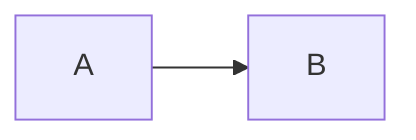

# VuePress 常用插件
[[toc]]
::: tip
[VuePress 市场](https://marketplace.vuejs.press/zh/)和[VuePress 生态系统](https://ecosystem.vuejs.press/zh/)提供了很多常用的插件，本文介绍了这些常用插件的安装和使用方法。
 <!-- @include:./common_markdown.md -->
:::

## Markdown 相关
### 代码高亮 @vuepress/plugin-prismjs
为代码块提供语法高亮、行高亮、行号等功能。

安装：
```bash
npm i -D @vuepress/plugin-prismjs@next
```

配置：
```javascript
import { prismjsPlugin } from '@vuepress/plugin-prismjs'

export default {
  plugins: [
    prismjsPlugin(),
  ],
}
```

### 容器 @vuepress/plugin-markdown-hint
提供 `::: tip` / `::: warning` / `::: danger` 等提示容器。

安装：
```bash
npm i -D @vuepress/plugin-markdown-hint@next
```

配置：
```javascript
import { markdownHintPlugin } from '@vuepress/plugin-markdown-hint'

export default {
  plugins: [
    markdownHintPlugin(),
  ],
}
```

### 选项卡和代码选项卡 @vuepress/plugin-markdown-tab
安装依赖：
```bash
npm i -D @vuepress/plugin-markdown-tab@next
```

在 `.vuepress/config.js` 文件中，添加以下内容，启用功能：
```javascript
import { markdownTabPlugin } from '@vuepress/plugin-markdown-tab'

export default {
    plugins: [
        markdownTabPlugin({
            // 启用代码选项卡
            codeTabs: true,
            // 启用选项卡
            tabs: true,
        }),
    ],
}
```

在 Markdown 文件中的写法（输入与效果）见《Markdown 语法与扩展》的[选项卡和代码选项卡](./markdown.md#选项卡和代码选项卡)。

### 导入文件 @vuepress/plugin-markdown-include
@vuepress/plugin-markdown-include 是一个可以导入其他 Markdown 文件的插件，被包含的文件会完整渲染，包括 Frontmatter、Markdown 语法、Vue 组件等。
::: tip
和官方自带的markdown-it-import-code插件有何不同？
- markdown-it-import-code 插件主要用于嵌入代码文件的特定部分，常见于展示代码片段。
- @vuepress/plugin-markdown-include 插件用于嵌入完整的 Markdown 文件内容，适合用于文档模块化。

|特性|markdown-it-import-code|@vuepress/plugin-markdown-include|
| --- | --- | --- |
| 目标内容 |完整Markdown文件  |代码文件 |
| 渲染方式 | 渲染为 Markdown/Vue 组件 | 渲染为代码块（语法高亮）|
| 插件类型 | VuePress 官方插件 | markdown-it 通用插件 |
| 语法 | `@include: ./file.md` 或 `<!-- @include: ./file.md -->` |`@[code](file.js)` |
:::

安装依赖：
```bash
npm i -D @vuepress/plugin-markdown-include@next
```

在 `.vuepress/config.js` 文件中，添加以下内容，启用功能：
```javascript
import { markdownIncludePlugin } from '@vuepress/plugin-markdown-include'

export default {
    plugins: [
        markdownIncludePlugin({
            // 选项
        }),
    ],
}
```

在 Markdown 文件中的写法（输入与效果）见《Markdown 语法与扩展》的[导入文件](./markdown.md#导入文件)。
注：不支持嵌套导入，导入效果参考[总结](#总结)

### 脚注 @vuepress/plugin-markdown-ext
提供脚注（`[^1]`）支持。

安装依赖：
```bash
npm i -D @vuepress/plugin-markdown-ext@2.0.0-rc.104
```

在 `.vuepress/config.js` 文件中，添加以下内容，启用功能：
```javascript
import { markdownExtPlugin } from "@vuepress/plugin-markdown-ext";

export default {
  plugins: [
    markdownExtPlugin({
      footnote: true,
    }),
  ],
}
```

### 上下标、标记高亮、自定义对齐 @vuepress/plugin-markdown-stylize
提供上下标（`H~2~O`、`19^th^`）、标记高亮（`==标记==`）、自定义对齐（`::: center` / `::: right` 等）。

安装依赖：
```bash
npm i -D @vuepress/plugin-markdown-stylize@2.0.0-rc.104
```

在 `.vuepress/config.js` 文件中，添加以下内容，启用功能：
```javascript
import { markdownStylizePlugin } from "@vuepress/plugin-markdown-stylize";

export default {
  plugins: [
    markdownStylizePlugin({
      align: true,
      sup: true,
      sub: true,
      mark: true,
    }),
  ],
}
```

### Markdown增强 vuepress-plugin-md-enhance
::: warning
`vuepress-plugin-md-enhance` 从 2.0.0-rc.88 起，已将脚注、上下标、标记高亮、自定义对齐拆分为独立插件，原选项不再生效，需单独安装配置，见上文。
:::

为 VuePress2 提供更多 [Markdown增强](https://plugin-md-enhance.vuejs.press/zh/)功能。包括：
  - 图表：Chart.js、ECharts、Markmap、Mermaid、Plantuml、流程图等
  - 代码：提供了Kotlin、Sandpack、Vue等交互演示支持
注：Plantuml配置无效，待解决。目前可使用Mermaid语法。

图表等子功能的 Markdown 写法见《Markdown 语法与扩展》。

安装依赖：
安装vuepress-plugin-md-enhance插件，根据需要安装其他依赖。
```bash
npm i -D vuepress-plugin-md-enhance@2.0.0-rc.88
npm i -D chart.js
npm i -D echarts
npm i -D markmap-lib markmap-toolbar markmap-view
npm i -D mermaid
npm i -D flowchart.ts
```

注：
1. 若安装插件时提示`npm error peer vuepress@"2.0.0-rc.23" from vuepress-plugin-md-enhance@2.0.0-rc.88
   `，可添加`--legacy-peer-deps`参数强制安装，但不推荐(执行npm install时会报警告)。
2. RC 版本（即 Release Candidate，发布候选版）是正式版（Stable）发布前的测试版本，生产环境建议使用 latest 稳定版。VuePress 2.x 目前仍处于 Beta/RC 阶段（如 2.0.0-rc.23），若需稳定版本，只能使用 1.x 的 v1.9.10。因为涉及API的变动，还是选择使用2.x的最新版本，手动解决依赖问题。
4. `vuepress-plugin-md-enhance`当前最新版本为 `^2.0.0-rc.88`，与之兼容的版本如下：
```json
"devDependencies": {
    "@vuepress/bundler-vite": "2.0.0-rc.23",
    "@vuepress/plugin-blog": "^2.0.0-rc.104",
    "@vuepress/theme-default": "2.0.0-rc.104",
    "vuepress": "^2.0.0-rc.23",
    "vuepress-plugin-md-enhance": "^2.0.0-rc.88"
  }
```

启用插件：
在 `.vuepress/config.js` 文件中，添加以下内容，启用功能：
```javascript
import { mdEnhancePlugin } from "vuepress-plugin-md-enhance";

export default {
    plugins: [
        mdEnhancePlugin({
            chartjs: true,
            echarts: true,
            flowchart: true,
            markmap: true,
            mermaid: true,
            plantuml: true,
        }),
    ],
};
```

::: warning
按需启用，否则站点启动会很慢
:::

效果如下（Mermaid 渲染）：


各功能的 Markdown 写法（输入与效果）见《Markdown 语法与扩展》。

<!--
## 侧边栏插件
设置都无效
### ~~vuepress-plugin-anchor-right~~
此插件不再维护，建议使用主题，主题是基于官方的，除了加个导航，没有任何多余代码！  
安装：
```bash
npm install -d vuepress-plugin-anchor-right
```

### ~~vuepress-plugin-right-anchor~~
报错`Failed to resolve import "ts-debounce" from "node_modules/vuepress-plugin-right-anchor/lib/client/components/RightAnchor.js?v=1ee1cae6". Does the file exist?`
安装：
```bash
npm i vuepress-plugin-right-anchor@next -D
```

### ~~vuepress-plugin-right-anchor-plus~~
安装依赖失败，怀疑是deepSeek虚构的插件。

### ~~vuepress-plugin-side-anchor~~
配置无效，猜测是vuepress版本问题(`module.exports`是vuepress1.x的写法)，暂时不使用。
安装：
```bash
npm i vuepress-plugin-side-anchor -D
```
在`.vuepress/config.js `中添加以下配置：
```js
module.exports = {
    plugins: [
        ['vuepress-plugin-right-anchor']
    ]
}
```

### ~~vuepress-plugin-auto-sidebar~~
安装：
```bash
npm i vuepress-plugin-auto-sidebar@alpha -D
```
-->

## 页面增强
### back-to-top
```bash
npm i -D @vuepress/plugin-back-to-top@next
```

### 隐藏侧边栏
```bash
npm install vuepress-plugin-hide-sidebar
npm install vuepress-plugin-sidebar-toggle
```

## 参考资源
[VuePress官方文档](https://vuepress.vuejs.org/zh/)
[VuePress 生态系统](https://ecosystem.vuejs.press/zh/)：VuePress 官方主题和插件
[Markdown 增强](https://plugin-md-enhance.vuejs.press/zh/)：为 VuePress2 提供更多 Markdown 增强功能

<!-- @include: ./common_summary.md -->