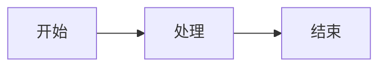
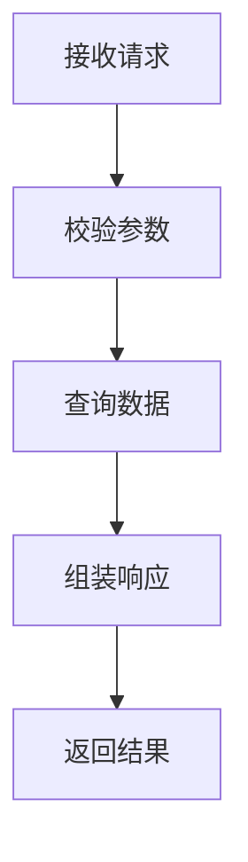
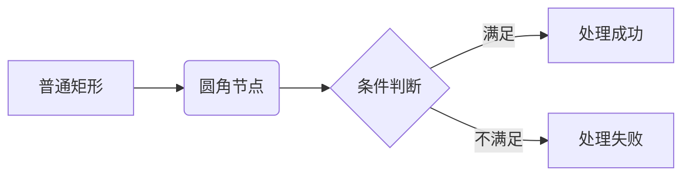
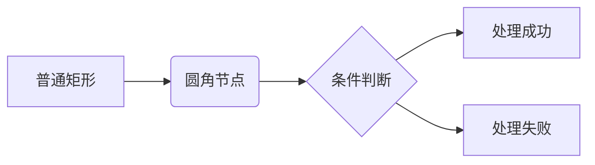
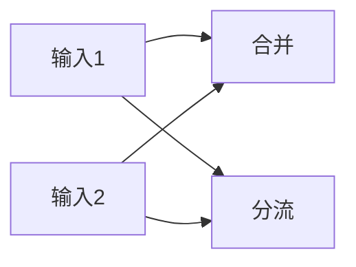
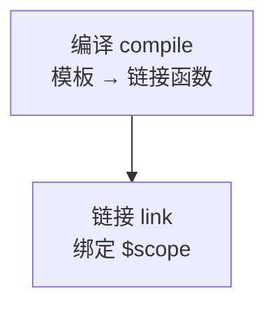
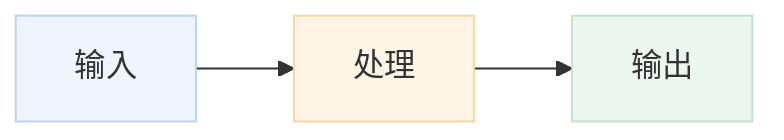
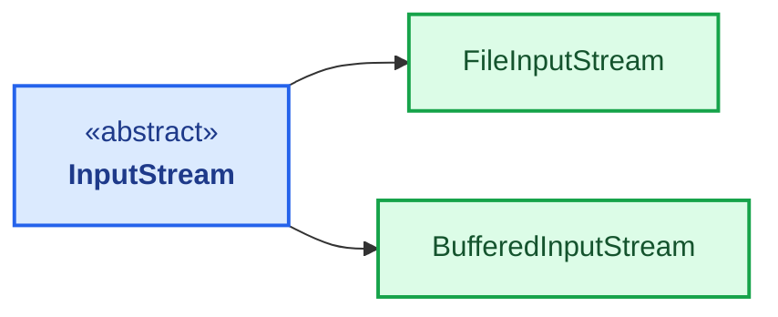
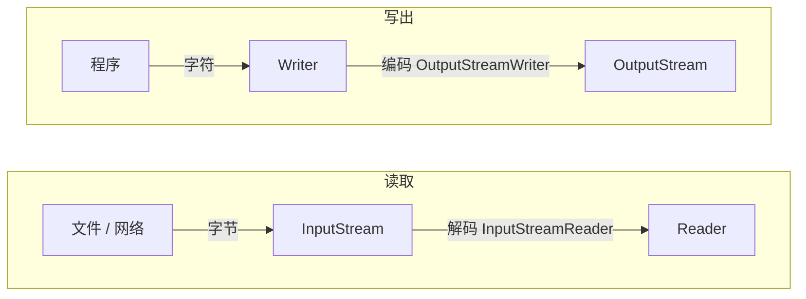
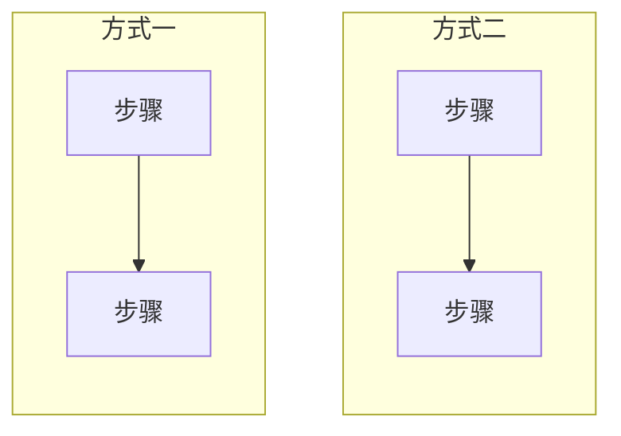

# Mermaid 图表

[[toc]]

Mermaid 可以用类似 Markdown 的文本描述流程图、时序图、类图和时间线，再由浏览器渲染为图表。本项目通过 `vuepress-plugin-md-enhance` 使用 Mermaid，文章中的架构流程、生命周期、类关系图和选型对比都采用这种方式维护。

## 在 VuePress 中启用 Mermaid

项目依赖 Mermaid 和 `vuepress-plugin-md-enhance`：

```json
{
  "mermaid": "^11.13.0",
  "vuepress-plugin-md-enhance": "^2.0.0-rc.88"
}
```

在 `docs/.vuepress/config.js` 中启用 Mermaid：

```javascript
import { mdEnhancePlugin } from 'vuepress-plugin-md-enhance'

export default {
  plugins: [
    mdEnhancePlugin({
      mermaid: true,
    }),
  ],
}
```

在 Markdown 中使用 `mermaid` 代码块：

````markdown

````

渲染结果：


::: warning
只修改 Markdown 图表内容时，开发服务通常可以热更新；修改 `docs/.vuepress/config.js` 后必须重启开发服务才能生效。
:::

## 流程图：flowchart

流程图适合表示步骤、分支和状态之间的关系。

````markdown

````


### 方向

常用方向如下：

| 方向 | 含义 | 使用场景 |
| --- | --- | --- |
| `TD` | 从上到下 | 生命周期、步骤流程 |
| `LR` | 从左到右 | 横向流程、简短链路 |
| `TB` | 从上到下 | 与 `TD` 等价 |
| `RL` | 从右到左 | 需要反向展示时使用 |

### 节点和连线

````markdown

````


::: tip
当前项目的 Mermaid 样式会给节点矩形统一增加圆角，因此 `[]` 和 `()` 虽然表示不同的节点语义，最终视觉上可能都显示为圆角矩形。
:::

### 合并连线

同一个节点连出多条边时，用 `&` 可以把它们合并成一行。`A --> B & C` 等价于 `A --> B` 和 `A --> C` 两条边：

````markdown

````


`&` 也能用在箭头的左侧（扇入）或两侧同时使用：

````markdown

````


::: warning `&` 不能给每条边配不同的标签
连线上带文字标签时，标签属于整条语句，`&` 展开出的每条边都会得到同一个标签。上面「节点和连线」里 `C -->|满足| D[处理成功]` 与 `C -->|不满足| E[处理失败]` 那种分支，必须拆成两条语句分别写标签，不能用 `&` 合并。
:::

### 长文本节点

节点文字较长时，可以使用引号和 HTML 换行。

````markdown

````


### 节点颜色

节点颜色可以通过 `style` 指定。样式应放在节点定义之后，便于将颜色和节点对应起来。

````markdown

````


节点较多时，用 `classDef` 定义一组样式，再让节点通过 `:::样式名` 引用，比逐个 `style` 更好维护。

````markdown

````


`classDef` 的样式也可以整体套到一个子图上，让子图内的节点继承边框和底色。

### 子图

`subgraph` 把若干节点圈成一个分组，分组本身也可以带标题。子图内的 `direction` 只作用于该子图，可以在同一个图里让不同分组走不同方向。

````markdown

````


::: tip 名称与标题
`subgraph 名称["显示标题"]` 中，方括号外的 `名称` 是内部标识，方括号内才是图上显示的标题；不写方括号时，名称直接作为标题显示。
:::

::: warning 两个子图的排列方向
两个子图都没有连到对方时，Mermaid 把它们排在**与主方向垂直**的方向：外层 `flowchart LR` 时两图上下堆叠，外层 `flowchart TB` 时两图左右并排。

如果想让它们上下排列，最直接的做法是**把外层方向改成 `LR`**——本文示例就是外层 `LR`，读取在上、写出在下。子图内部仍保留自己的 `direction LR`，两层方向互不影响。

也可以反过来：外层保持 `TB`，在子图之间补一条连线（可见连线或隐藏连线 `~~~`），它们才会沿 `TB` 方向上下排列，见下一节。
:::

### 隐形连线

`~~~` 表示一条不渲染的连线，只用于调整两个元素之间的布局关系。下面在 `flowchart LR` 下用它把两个子图并排摆放：

````markdown

````


`LR` 下两个子图本来就会上下堆叠（见上一节的提示框），补上 `A ~~~ B` 后改为左右并排。也就是说，`~~~` 的作用是让它们**沿主方向**排列；`TB` 下这个方向是上下，`LR` 下是左右。

### 调整布局参数

`%%{init: ...}%%` 指令可以覆盖这一次渲染的配置。写成一行时放在图表类型声明之前；写在多行时则放在图表最后，两种写法都可以：

````markdown
```mermaid
%%{init: {'flowchart': {'nodeSpacing': 25, 'rankSpacing': 60, 'curve': 'basis'}}}%%
flowchart LR
    A[输入] --> B[处理] --> C[输出]
```
````

```mermaid
%%{init: {'flowchart': {'nodeSpacing': 25, 'rankSpacing': 60, 'curve': 'basis'}}}%%
flowchart LR
    A[输入] --> B[处理] --> C[输出]
```

参数较多时换成多行书写，放在图表末尾。下面在 `timeline` 中这样覆盖主题色：

````markdown
```mermaid
timeline
    title 架构演进
    section 单体架构
      2000-2014 : Java + Spring MVC
    %%{
      init: {
        'theme': 'base',
        'themeVariables': {
          'primaryColor': '#FFF4E6'
        }
      }
    }%%
```
````

```mermaid
timeline
    title 架构演进
    section 单体架构
      2000-2014 : Java + Spring MVC
    %%{
      init: {
        'theme': 'base',
        'themeVariables': {
          'primaryColor': '#FFF4E6'
        }
      }
    }%%
```

常用的两类参数：

| 指令 | 作用 | 适用场景 |
| --- | --- | --- |
| `%%{init: {'flowchart': {'nodeSpacing': 25, 'rankSpacing': 60, 'curve': 'basis'}}}%%` | 收紧节点间距、指定连线为曲线 | 节点排布过密、折线生硬 |
| `%%{init: {'themeVariables': {...}}}%%` | 覆盖主题变量，如 `classText`、`mainBkg`、`noteBkgColor` | 需要让图的配色贴合文章 |

::: warning 指令内容是 JSON
`%%{init: ...}%%` 的内容按 JSON 解析，键和字符串都需要引号。Mermaid 在解析前会把单引号统一替换成双引号，所以单引号写法可以正常工作，两种引号风格都能用。内容不合法时整段指令被跳过，页面上不会报错，只是参数不生效。
:::

## 时序图：sequenceDiagram

时序图适合表示多个对象之间按时间发生的调用关系。

````markdown
```mermaid
sequenceDiagram
    participant Caller
    participant Service
    participant Store

    Caller->>Service: start()
    Service->>Store: query(key)
    Store-->>Service: 返回当前数据
    Service->>Caller: 初始化完成

    loop 监听循环
        Store->>Service: 数据变更通知
        Service->>Store: 重新注册监听
        Store-->>Service: 返回新数据
        Service->>Caller: 触发回调
    end
```
````

```mermaid
sequenceDiagram
    participant Caller
    participant Service
    participant Store

    Caller->>Service: start()
    Service->>Store: query(key)
    Store-->>Service: 返回当前数据
    Service->>Caller: 初始化完成

    loop 监听循环
        Store->>Service: 数据变更通知
        Service->>Store: 重新注册监听
        Store-->>Service: 返回新数据
        Service->>Caller: 触发回调
    end
```

- `participant A`：声明参与者；
- `A->>B`：表示 A 向 B 发送调用或消息；
- `B-->>A`：表示返回消息；
- `A->>A`：表示对象调用自身；
- `loop 名称`：表示循环过程，使用 `end` 结束循环块。

参与者名称较长时，可以使用 `as` 设置显示别名。

````markdown
```mermaid
sequenceDiagram
    participant App as 应用
    participant DB as 数据库

    App->>DB: 查询数据
    DB-->>App: 返回结果
```
````

```mermaid
sequenceDiagram
    participant App as 应用
    participant DB as 数据库

    App->>DB: 查询数据
    DB-->>App: 返回结果
```

### 分支与并行块

调用过程不是一条直线时，用块语法表达分支和并行。四种块都用 `end` 结束，可以互相嵌套。

| 块 | 作用 |
| --- | --- |
| `alt 标签` / `else 标签` | 分支，等价于 `if / else` |
| `opt 标签` | 可选分支，条件不满足时整块略过 |
| `par 标签` / `and 标签` | 并行，多个分支同时发生 |
| `loop 标签` | 循环 |

标签会被方括号包裹后显示在块左上角，写在标签里的中括号也一样会显示出来，因此 `par 解析配置` 和 `par [解析配置]` 都不要再加外层括号。

下面用 `par` 表示「解析配置」与「创建代理」两件并行的事，其中创建代理又用 `alt / else` 分成两条路径：

````markdown
```mermaid
sequenceDiagram
    participant Container as Spring容器
    participant Processor as 后置处理器

    par 1. 解析配置
        Container->>Container: refresh()
    and 2. 代理创建
        Container->>Processor: postProcessAfterInitialization
        alt 需要代理
            Processor-->>Container: 返回代理对象
        else 不需要代理
            Processor-->>Container: 返回原始Bean
        end
    end
```
````

```mermaid
sequenceDiagram
    participant Container as Spring容器
    participant Processor as 后置处理器

    par 1. 解析配置
        Container->>Container: refresh()
    and 2. 代理创建
        Container->>Processor: postProcessAfterInitialization
        alt 需要代理
            Processor-->>Container: 返回代理对象
        else 不需要代理
            Processor-->>Container: 返回原始Bean
        end
    end
```

### actor

参与者默认渲染为矩形，用 `actor` 代替 `participant` 会渲染成人形图标，适合表示外部使用者。下面用它区分调用方和框架内部对象：

````markdown
```mermaid
sequenceDiagram
    actor user
    participant context as ApplicationContext

    user ->> context: run()
    context -->> user: 启动完成
```
````

```mermaid
sequenceDiagram
    actor user
    participant context as ApplicationContext

    user ->> context: run()
    context -->> user: 启动完成
```

## 时间线：timeline

`timeline` 适合表示技术或架构按时间发生的演进：

````markdown
```mermaid
timeline
    title 架构演进
    section 单体架构
      2000-2014 : Java + Spring MVC
    section 微服务架构
      2014年后成熟 : Spring Cloud 生态
```
````

```mermaid
timeline
    title 架构演进
    section 单体架构
      2000-2014 : Java + Spring MVC
    section 微服务架构
      2014年后成熟 : Spring Cloud 生态
```

- `title`：设置时间线标题；
- `section`：划分时间线中的分类；
- `时间 : 事件说明`：在指定时间添加事件；
- `<br>`：在事件说明中换行。

事件说明可以使用 `<br>` 换行。

## 甘特图：gantt

`gantt` 适合表示一组任务或技术的生命周期。本项目以「首次公开日期」作为起点，以「官方停止维护日期」作为终点：

````markdown
```mermaid
gantt
    title 技术生命周期
    dateFormat YYYY
    axisFormat %Y
    section 应用框架
    AngularJS 1.x :active, angularjs, 2010, 2022
    React :react, 2013, 2026
    React 公开 :milestone, react-release, 2013, 0d
```
````

```mermaid
gantt
    title 技术生命周期
    dateFormat YYYY
    axisFormat %Y
    section 应用框架
    AngularJS 1.x :active, angularjs, 2010, 2022
    React :react, 2013, 2026
    React 公开 :milestone, react-release, 2013, 0d
```

- `title`：设置甘特图标题；
- `dateFormat`：指定输入日期的格式，本项目使用 `YYYY` 表示年份；
- `axisFormat`：指定时间轴显示格式，本项目使用 `%Y` 显示年份；
- `section`：划分任务分类；
- `任务 : id, 起点, 终点`：定义任务的时间范围；
- `:active`、`:done`、`:crit`：使用 Mermaid 内置状态设置任务状态；
- `:milestone, id, 时间, 0d`：添加持续时间为 0 天的里程碑。

::: warning gantt 的配色限制
`gantt` 不支持 `classDef` 和 `class`。在甘特图中使用这两个关键字会导致解析错误，不能照搬 `flowchart` 或 `classDiagram` 的自定义样式写法。甘特图配色使用 Mermaid 内置的 `:active`、`:done`、`:crit` 状态；默认颜色循环也可能导致不同任务颜色不同。
:::

## 类图：classDiagram

类图适合表示接口、类以及它们之间的继承和实现关系。这类图只保留接口层级、继承关系和有代表性的实现类，具体 API 仍放在正文代码示例中：

### 类声明与关系

````markdown
```mermaid
classDiagram
    class Collection {
        <<interface>>
    }
    class List {
        <<interface>>
    }
    class ArrayList

    Collection <|-- List
    List <|.. ArrayList
```
````

```mermaid
classDiagram
    class Collection {
        <<interface>>
    }
    class List {
        <<interface>>
    }
    class ArrayList

    Collection <|-- List
    List <|.. ArrayList
```

- `class Node`：声明类；
- `<<interface>>`：在类节点中标记接口；
- `<|--`：表示继承关系；
- `<|..`：表示接口实现关系。

### 备注与方向

类图可以用 `note for 类名 "内容"` 给某个类挂一条备注，用 `direction` 指定整体排布方向：

````markdown
```mermaid
classDiagram
    direction LR

    class Collection {
        <<interface>>
    }
    class List {
        <<interface>>
    }
    class Map {
        <<interface>>
    }
    note for Map "没有实现 Iterable，不能直接使用增强 for 遍历"

    Collection <|-- List
```
````

```mermaid
classDiagram
    direction LR

    class Collection {
        <<interface>>
    }
    class List {
        <<interface>>
    }
    class Map {
        <<interface>>
    }
    note for Map "没有实现 Iterable，不能直接使用增强 for 遍历"

    Collection <|-- List
```

`direction` 取值与 `flowchart` 一致（`TB`、`LR` 等），写在图表类型声明之后。

### 用 classDef 区分节点类型

类图可以使用 `classDef` 定义节点样式，再将样式绑定到节点。

````markdown
```mermaid
classDiagram
    class List {
        <<interface>>
    }
    class ArrayList
    class ConcurrentHashMap

    List <|.. ArrayList

    class List:::interface
    class ArrayList:::implementation
    class ConcurrentHashMap:::concurrent

    classDef interface fill:#dbeafe,stroke:#2563eb,stroke-width:2px,color:#1e3a8a
    classDef implementation fill:#dcfce7,stroke:#16a34a,stroke-width:2px,color:#14532d
    classDef concurrent fill:#ffedd5,stroke:#ea580c,stroke-width:2px,color:#9a3412
```
````

```mermaid
classDiagram
    class List {
        <<interface>>
    }
    class ArrayList
    class ConcurrentHashMap

    List <|.. ArrayList

    class List:::interface
    class ArrayList:::implementation
    class ConcurrentHashMap:::concurrent

    classDef interface fill:#dbeafe,stroke:#2563eb,stroke-width:2px,color:#1e3a8a
    classDef implementation fill:#dcfce7,stroke:#16a34a,stroke-width:2px,color:#14532d
    classDef concurrent fill:#ffedd5,stroke:#ea580c,stroke-width:2px,color:#9a3412
```

- `classDef styleName ...`：定义节点样式；
- `class Node:::styleName`：将样式绑定到节点。

类图适合表达结构关系，不适合承载每个类的全部方法。更完整的 I/O 类体系见 [Java I/O 类体系](../../java/basic/io-class-diagram.md)。

### 图例

图上用颜色区分类别时，颜色本身不携带语义，需要在图下补一行图例。图例用 `span` 加样式类实现，样式类写在 `docs/.vuepress/styles/index.scss`，色值与 `classDef` 保持一致：

````markdown
- <span class="collection-framework-legend interface"></span>接口
- <span class="collection-framework-legend implementation"></span>普通实现类
- <span class="collection-framework-legend concurrent"></span>并发实现类
````

渲染结果：

- <span class="collection-framework-legend interface"></span>接口
- <span class="collection-framework-legend implementation"></span>普通实现类
- <span class="collection-framework-legend concurrent"></span>并发实现类

每张图的图例样式类单独命名（如 `io-class-diagram-legend`、`collection-framework-legend`），不要复用同一个类名，否则改一张图的配色会连带影响另一张。

## 因果图：ishikawa

`ishikawa`（鱼骨图）用来把一个问题按原因分类展开，每根鱼骨是一条归因分支，分支下可以再挂具体原因。它适合梳理「某类问题由哪些因素造成」，不适合表达步骤顺序或调用关系：

````markdown
```mermaid
ishikawa
    接口响应变慢
    数据库
        慢查询缺索引
        连接池太小
    应用
        线程池被占满
        缓存命中率低
    网络
        带宽不足
        跨机房调用
```
````

```mermaid
ishikawa
    接口响应变慢
    数据库
        慢查询缺索引
        连接池太小
    应用
        线程池被占满
        缓存命中率低
    网络
        带宽不足
        跨机房调用
```

- 第一行：鱼头，写要分析的问题或主题；
- 顶层缩进：一条归因分支，等价于一根鱼骨；
- 再深一层缩进：该分支下的具体原因。

::: tip 缩进即层级
`ishikawa` 用缩进表达层级，不写箭头也不写括号。分支名称直接顶格书写，不需要引号。
:::

## 象限图：quadrantChart

`quadrantChart` 用两个相互独立的维度把若干对象放进四个象限，适合做选型对比：当「候选对象」和「两个判断维度」都想同时表达时，它比表格更直观：

````markdown
```mermaid
quadrantChart
    title 测试工具定位
    x-axis "低代码" --> "高代码"
    y-axis "集成/端到端" --> "单元/组件"
    "n8n": [0.2, 0.8]
    "Postman": [0.4, 0.7]
    "JUnit": [0.9, 0.2]
```
````

```mermaid
quadrantChart
    title 测试工具定位
    x-axis "低代码" --> "高代码"
    y-axis "集成/端到端" --> "单元/组件"
    "n8n": [0.2, 0.8]
    "Postman": [0.4, 0.7]
    "JUnit": [0.9, 0.2]
```

- `title`：图表标题；
- `x-axis "左端" --> "右端"`、`y-axis "下端" --> "上端"`：两个维度的两端标签；
- `"对象": [x, y]`：对象名称和坐标，取值均为 `0` 到 `1` 之间的小数，`0.5` 为中位线。

::: tip 坐标是相对位置
`[x, y]` 表示对象在两个维度上的相对位置，不是绝对值。坐标只用于定位，不参与计算，也不必刻意对齐刻度。
:::

::: warning 对象名建议加引号
对象名包含空格或标点时，必须用双引号包裹；中文名称加引号同样可以正常渲染。
:::

## 用 frontmatter 设置图表标题

在图表类型声明之前写一段 YAML frontmatter，可以给图表加标题：

````markdown
```mermaid
---
title: Bean 的生命周期流程图
---
flowchart TB
    I[Constructor] --> S[Setter]
```
````

```mermaid
---
title: Bean 的生命周期流程图
---
flowchart TB
    I[Constructor] --> S[Setter]
```

frontmatter 块和 `%%{init: ...}%%` 指令可以同时存在，但不要让两者都出现在图表类型声明之前，以免解析顺序变得难以判断。

## 总结

本项目当前使用 Mermaid 的重点可以概括为：

- `flowchart`：步骤、分支和生命周期流程，配合 `subgraph` 分组、`classDef` 批量上色；
- `sequenceDiagram`：对象之间的调用和监听过程，用 `par` / `alt` / `loop` 表达并行、分支和循环；
- `timeline`：架构和技术演进；
- `gantt`：技术生命周期和任务区间；
- `classDiagram`：接口、继承、实现和常见实现类；
- `ishikawa`：把问题按原因分类展开；
- `quadrantChart`：选型对象的双维度定位。

各图类型的关键限制：

| 图类型 | 限制 |
| --- | --- |
| `gantt` | 不支持 `classDef` / `class`，配色只能用内置的 `:active`、`:done`、`:crit` |
| `flowchart` | 站点样式会给节点统一加圆角，`[]` 和 `()` 视觉上差异不明显 |
| `%%{init}%%` | 内容按 JSON 解析，写法不合法时整段指令被跳过，不报错也不生效 |
