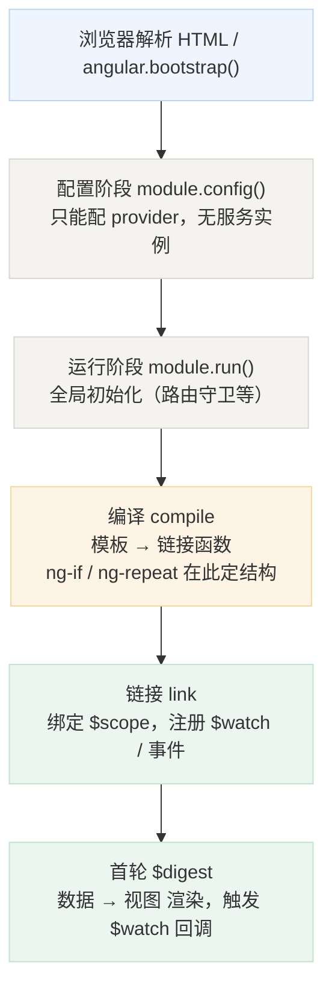
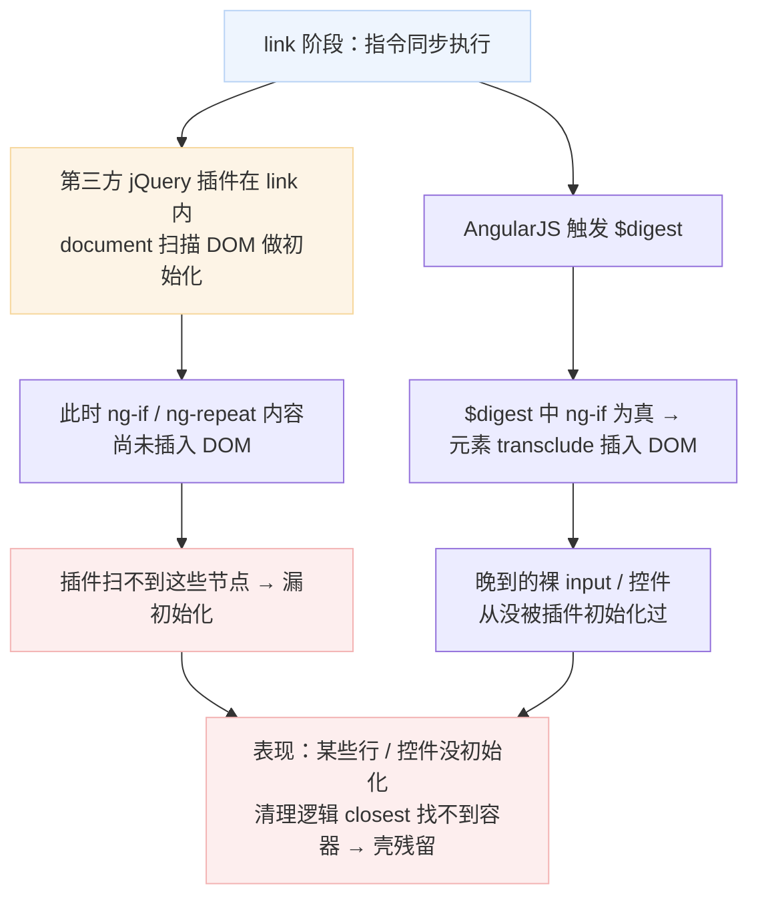

[[toc]]

::: tip 为什么需要理解生命周期
AngularJS（1.x）是声明式框架，但底层仍靠"编译模板 → 链接作用域 → 脏检查"运转。很多诡异现象——控件没初始化、数据变了视图没更新、第三方 jQuery 插件漏掉元素——根子都在**代码执行的时序**上。本文把启动流程、指令的 compile/link，以及 `$digest`/`$watch` 这套核心机制讲清楚，并点出最容易踩的两个时序坑。
:::

## AngularJS 是什么

AngularJS 是 Google 在 2010 年发布的**前端 MVC 框架**（版本号 1.x），用"双向绑定 + 依赖注入 + 指令"把当时 jQuery 命令式操作 DOM 的方式，升级成声明式开发。注意：

- **AngularJS（1.x）** 与 **Angular（2+）** 是完全不同的两代产品，架构、API 都不兼容。
- 本文先聚焦 1.x，是因为它和本站《Ace Admin 文件上传组件「壳」残留踩坑》里的 `ng-if` 漏初始化问题直接相关——`compile`/`link`/`$digest` 正是那类坑的底层机制。但现代项目用的是 Angular（2+），两代机制差异巨大，因此**本文第七节补全了现代 Angular 的生命周期与两代对照**，方便维护老系统时对照、学新框架时对号入座。
- AngularJS 已于 2021 年结束官方支持，目前只存在于大量存量企业系统中（金融、政府、传统后台尤为常见），所以维护老系统时仍绕不开它；新项目则直接用现代 Angular。

## 应用启动流程（整体生命周期）

一个 AngularJS 应用从加载到可交互，经历如下阶段：

1. **加载模块**：浏览器解析 HTML，遇到 `ng-app` 或手动 `angular.bootstrap()`，框架开始引导。
2. **配置阶段（config 块）**：`module.config()` 里的 provider 配置先于一切执行，此时**不能注入 `$scope`、服务实例**——只能配置 provider。
3. **运行阶段（run 块）**：`module.run()` 在所有服务可用后执行，适合做全局初始化（路由守卫、全局监听）。
4. **编译（compile）**：框架把带指令的 DOM 模板"编译"成**链接函数（link function）**。`ng-repeat`、`ng-if` 这类会克隆/生成 DOM 的指令，在这一步确定结构。
5. **链接（link）**：链接函数把编译结果和 **`$scope`** 绑定，注册 `$watch`、绑定事件。
6. **首轮 `$digest`**：AngularJS 自动触发一次 `$digest`，完成初始"数据 → 视图"的渲染，并触发相应的 `$watch` 回调。



::: warning 配置阶段 vs 运行阶段
`config` 里只能配 provider，拿不到服务实例；`run` 里才拿到完整服务。把"依赖服务实例"的代码写进 `config` 会直接报错。
:::

## 指令（Directive）的 compile 与 link

自定义指令时有两类函数，理解它们的执行时机是理解生命周期的关键。

```js
app.directive('myDir', function () {
  return {
    compile: function (element, attrs) {
      // 1. 编译阶段：操作模板本身（clone 节点）
      //    返回值可以是 link 函数，或 { pre: fn, post: fn }
      return function link(scope, element, attrs) {
        // 2. 链接阶段
      };
    },
    // 不写 compile 时，直接写 link 也行
    link: function (scope, element, attrs) {
      // 链接阶段
    }
  };
});
```

### compile 函数
- 在**编译阶段**执行，**每个模板只跑一次**（无论会渲染多少个实例）。
- 适合做"与具体数据无关"的 DOM 结构修改、性能优化。
- 不能直接访问实例化的 `$scope`。

### link 函数（pre-link 与 post-link）
- 在**链接阶段**执行，每个指令实例都会跑一次。
- 能拿到 `$scope`，用于注册 `$watch`、绑定事件、操作当前元素。
- 顺序规则（`compile` 返回 `{ pre, post }` 时）：
  - **pre-link**：从**外到内**执行（父先于子）。
  - **post-link**：从**内到外**执行（子先于父）。99% 的情况你写的 `link` 就是 post-link。

一句话：**compile 定结构，link 定行为**。

## 核心：$digest 循环与 $watch

双向绑定的本质是一套**脏检查（dirty checking）**机制，由 `$digest` 驱动。

### $watch：注册监听器

```js
scope.$watch(
  function () { return scope.someValue; }, // 监听表达式
  function (newVal, oldVal) { /* 值变化时的回调 */ }, // listener
  false // deep watch？
);
```

- 每个 `$watch` 被加入当前作用域的 `$$watchers` 数组。
- 注意：listener 的回调**不会立刻执行**，要等到 `$digest` 轮到它。

### $digest：脏检查循环

`scope.$digest()` 做的事，简化成伪代码：

```
do {
  dirty = false
  for ($$watchers 中的每个 watch) {
    newVal = watch.expression()      // 重新求值
    if (newVal !== watch.last) {     // 脏了
      dirty = true
      watch.listener(newVal, last)   // 触发回调
      watch.last = newVal
    }
  }
} while (dirty && --ttl > 0)         // 直到稳定，或达到 TTL=10
```

关键细节：

- **双层循环**：一轮里只要有一个 watch 变了，就可能让别的 watch 跟着变，所以 AngularJS 会反复跑，直到所有值稳定（"digest 消化完"）。
- **TTL = 10**：最多循环 10 次，超过就抛 `Infinite $digest Loop` 错误（常见于 watch 里又改了自己监听的值）。
- **从当前作用域向上冒泡**：`$digest` 会顺带处理 `$parent` 直到 `$rootScope`，所以子作用域的变化能反映到全局。

### $apply：把外部变更接入 digest

AngularJS **只在自己触发的事件**（如 `ng-click`、 `$http` 回调、`$timeout`）里自动跑 `$digest`。如果你用原生 `setTimeout`、Promise，或第三方库改了 `$scope` 的值，**必须手动** `scope.$apply()`（或包成 `$timeout`），否则视图不会更新。

```js
setTimeout(function () {
  scope.name = 'changed';
  scope.$apply(); // 否则视图不刷新
}, 100);
```

### 异步队列

- `$scope.$evalAsync(fn)`：把 fn 放进 `$$asyncQueue`，在当前或下一轮 `$digest` 中执行（保证一定在 digest 里）。
- `$scope.$$postDigest(fn)`：当前轮 digest 全部结束后执行，不触发新 digest。

## 最容易踩的两个时序坑

把上面的机制串起来，就能解释 AngularJS 里两类经典 bug。

### 坑 1：`link` 是同步的，`$watch` 回调 / 动态 DOM 是异步的

`link` 函数执行时，DOM 已经由 `compile` 创建好，但**指令内部由 `ng-if`、`ng-repeat` 动态生成的内容，往往要等到接下来的 `$digest` 才真正插入 DOM**。

所以：

- 在 `link` 里直接 `document.querySelectorAll(...)` 去扫全 DOM，可能**扫不到** `ng-if`/`ng-repeat` 还没插入的节点。
- 依赖"扫一遍 DOM 再初始化"的**第三方 jQuery 插件**（如文件上传、日期选择器），如果在 `link` 阶段就调用，会**漏掉**这些"晚到"的元素，表现出"某些行/某些控件没初始化"。



**通用解法**：

1. 用 `$timeout(fn, 0)` 把初始化逻辑推迟到下一轮 `$digest` 之后（DOM 已稳定）；
2. 更稳妥的是用 `$scope.$watch` 监听那个条件表达式，在它为真且 DOM 就绪后再初始化；
3. 或直接用 `ng-init` / 用 AngularJS 包装过的指令触发第三方插件，让框架的生命周期替你管理。

### 坑 2：改了 `$scope` 但视图不更新

原因几乎都是"改值的地方没跑 `$digest`"——比如用原生 `setTimeout`、`Promise.then()` 里改了 `$scope`。解法见第四节的 `$apply` / `$timeout`。

::: warning 第三方库 + AngularJS 的通用纪律
任何"扫描 DOM 做初始化"的 jQuery 插件，都不要在 `link` 同步阶段裸调，必须推迟到 `$digest` 之后，或改用 AngularJS 包装过的指令触发。这正是 AngularJS 时代大量"控件偶发不初始化 / 清理不掉"问题的统一根因。
:::

## 作用域销毁与 `$destroy`

- 当 `ng-if` 变 false、`ng-repeat` 项被移除、路由切换时，对应 `$scope` 会被销毁，并广播 **`$destroy`** 事件。
- 在 `$destroy` 里记得解绑原生事件监听、清除定时器（`$timeout` 会自动随 scope 销毁，但原生 `setInterval` 不会）。
- 未清理的 `$watch` / `addEventListener` 会造成**内存泄漏**——这是 AngularJS 存量系统最常见的性能陷阱之一。

## 小结：AngularJS 1.x 机制回顾

- **配置 → 编译 → 链接 → 首轮 digest** 是 AngularJS 应用的整体生命周期。
- **compile 定结构（一次），link 定行为（每个实例）**。
- **`$watch` 注册在 link，回调跑在 `$digest`**；digest 是脏检查双循环，TTL=10。
- 外部改值要 `$apply` / `$timeout`；第三方 DOM 插件要推迟到 digest 之后——这两个时序坑覆盖了绝大多数"控件不初始化 / 视图不刷新"问题。

---

## 现代 Angular（2+）生命周期

> 上面是 **AngularJS 1.x** 的机制。下面是与它**并列**的 **现代 Angular（2+）** 生命周期：2016 年 Google 发布的 Angular 是彻底重写的一代（TypeScript + 组件化 + Zone.js 自动变更检测），两代**架构和 API 完全不兼容**。下文各节与上一部分**一一对应**（启动 / 模板 / 变更检测 / 第三方库坑 / 销毁），方便维护老系统时对照、学新框架时对号入座。

| 关注点 | AngularJS 1.x | Angular（2+） |
|--------|---------------|----------------|
| 启动 / 引导 | `angular.bootstrap()` + compile / link | `bootstrapApplication()` + 组件树 |
| 模板编译 | compile + link | 编译期 AOT/JIT，运行期无 compile |
| 变更检测 | 手动 `$digest` 脏检查（TTL=10） | Zone.js 自动触发 |
| 外部改值 | `$scope.$apply()` / `$timeout` | 自动（Zone 内）；Zone 外需 `NgZone.run` |
| 第三方库 DOM 坑 | `link` 同步扫不到动态节点 | `ngAfterViewInit` 前视图未就绪 |
| 销毁 | `$destroy` 事件 | `ngOnDestroy` 钩子 |

### 组件生命周期钩子

现代 Angular 没有 compile/link，取而代之的是**组件/指令类上的生命周期钩子方法**（实现对应接口即可被框架调用）：

| 钩子 | 触发时机 | 典型用途 |
|------|----------|----------|
| `ngOnChanges` | 输入属性（`@Input`）首次及每次变化时（在 `ngOnInit` 前先跑一次） | 响应输入参数变化 |
| `ngOnInit` | 指令/组件初始化后、**首轮变更检测前**跑一次 | 一次性初始化（取初始数据） |
| `ngDoCheck` | 每次变更检测时（紧跟 `ngOnChanges`） | 自定义变更检测逻辑（慎用，极频繁） |
| `ngAfterContentInit` | 外部内容（`<ng-content>`）投影进组件后 | 操作投影内容 |
| `ngAfterContentChecked` | 投影内容每次变更检测后 | —— |
| `ngAfterViewInit` | **组件自身视图（含子组件）初始化完成后** | 操作 DOM / 第三方库初始化（等价于 1.x 里"digest 之后"的安全点） |
| `ngAfterViewChecked` | 视图每次变更检测后 | —— |
| `ngOnDestroy` | 指令/组件销毁前 | 解绑事件、清定时器、退订 Observable |

### 执行顺序

单次创建时：`constructor` → `ngOnChanges` → `ngOnInit` → `ngDoCheck` → `ngAfterContentInit` → `ngAfterContentChecked` → `ngAfterViewInit` → `ngAfterViewChecked`。

更新时：`ngOnChanges`（输入变）→ `ngDoCheck` → `ngAfterContentChecked` → `ngAfterViewChecked`。

销毁时：`ngOnDestroy`。

```mermaid
flowchart LR
    C0["constructor"] --> C1["ngOnChanges<br/>输入变化"]
    C1 --> C2["ngOnInit<br/>一次性初始化"]
    C2 --> C3["ngDoCheck<br/>每次变更检测"]
    C3 --> C4["ngAfterContentInit<br/>投影内容就位"]
    C4 --> C5["ngAfterContentChecked"]
    C5 --> C6["ngAfterViewInit<br/>视图就绪·第三方库安全点"]
    C6 --> C7["ngAfterViewChecked"]
    C7 -. "组件销毁" .-> C8["ngOnDestroy"]
    style C6 fill:#eaf6ef,stroke:#bfe3cd
    style C8 fill:#fdeeee,stroke:#f3b3b3
```



### 变更检测：Zone.js 自动触发

现代 Angular **不再有 `$digest`/`$scope.$apply`**。它用 **Zone.js** monkey-patch 了浏览器几乎所有异步 API（`setTimeout`、XHR、`Promise`、事件监听等），任何异步回调结束后**自动**触发一次变更检测，把数据同步到视图。

- 因此"改了值视图不刷新"在 Angular 里**极少发生**（除非你刻意跑在 Zone 之外，如 `runOutsideAngular`）。
- 手动控制：`ChangeDetectorRef.detectChanges()`（本次立即检测）/ `.markForCheck()`（标记等下次）+ `NgZone.run()`（回到 Zone 内）。
- 性能优化可选 `OnPush` 策略：只有 `@Input` 引用变化或事件才检测，避免整树扫描。

::: warning 动态 DOM + 第三方库在现代 Angular 里同样要小心
`*ngIf` / `*ngFor` 控制的元素，在 `ngOnInit` 阶段**还不在 DOM 里**——要在 `ngAfterViewInit`（或配合 `ViewChild` 的 `{ static: false }`）里再去操作它们或初始化第三方库（图表、上传控件等）。这和 1.x"第三方插件要推迟到 `$digest` 之后"是同一个坑的不同表述。
:::

## 两代对照速查

| 关注点 | AngularJS 1.x | Angular（2+） |
|--------|---------------|----------------|
| 语言 | JavaScript | TypeScript |
| 作用域 | `$scope`（树状作用域） | 组件类（`@Component`），无全局 scope |
| 模板编译 | compile + link | 编译期 AOT/JIT，运行期无 compile |
| 变更检测 | 手动 `$digest` 脏检查，TTL=10 | Zone.js 自动触发 |
| 外部改值 | 需 `$scope.$apply()` / `$timeout` | 自动（Zone 内）；Zone 外需 `NgZone.run` |
| 初始化安全点 | `link` + `$timeout` / `$watch` | `ngOnInit`（静态）/ `ngAfterViewInit`（动态 DOM） |
| 销毁 | `$destroy` 事件 | `ngOnDestroy` 钩子 |
| 第三方库 DOM 坑 | `link` 同步扫不到动态节点 | `ngAfterViewInit` 前视图未就绪 |

## 全文总结

- **AngularJS 1.x**：靠 `config → compile → link → $digest` 运转，双向绑定是手动脏检查；动态 DOM（`ng-if`/`ng-repeat`）与第三方 jQuery 插件要在 digest 之后才安全。
- **Angular（2+）**：TypeScript + 组件化 + Zone.js 自动变更检测，生命周期用 `ngOnInit` / `ngAfterViewInit` / `ngOnDestroy` 等钩子表达，不再有 `$digest`。
- 两代**不兼容**：维护老系统认准 1.x 机制，新项目直接用现代 Angular 的钩子模型。本站《Ace Admin 文件上传组件「壳」残留踩坑》根因属于 1.x 时代问题。
