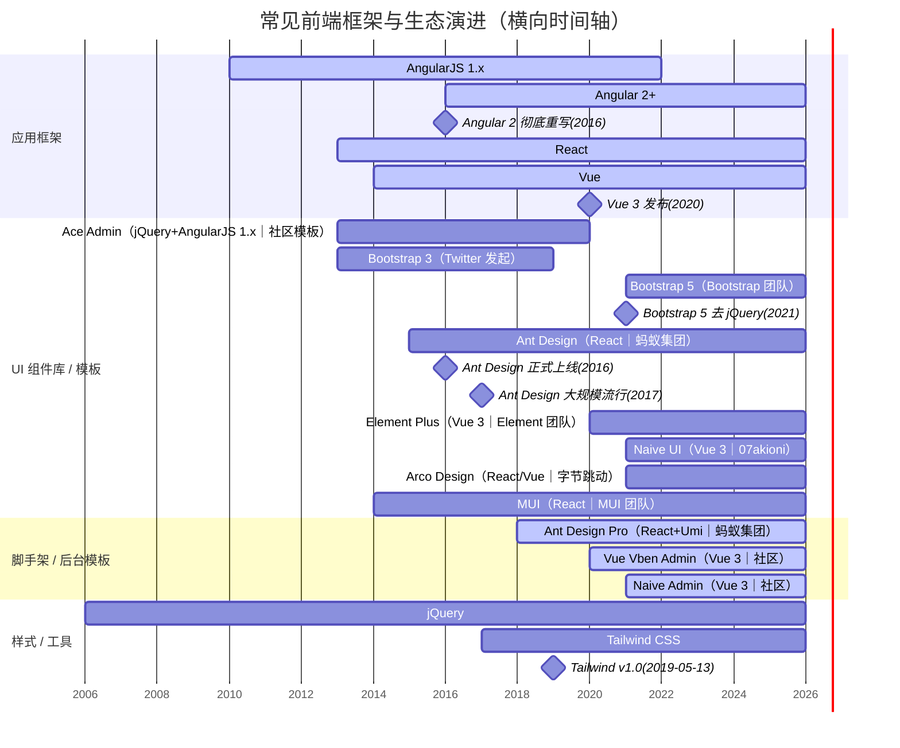

# Web

[[toc]]

下面用**横向时间轴**汇总常见前端框架与生态演进，按四类并行（应用框架 / UI 组件库·模板 / 脚手架 / 样式·工具），便于横向对比；各篇详细文章见左侧「Web」分组导航。

```mermaid
gantt
  title 常见前端框架与生态演进（横向时间轴）
  dateFormat YYYY
  axisFormat %Y
  %% 应用框架 + 脚手架统一用 :active（浅绿底）。Mermaid gantt 不支持 classDef（会解析报错：Expecting 'taskData', got ':'），默认又按任务顺序循环上色（task0-3 槽位），脚手架三条恰好落在同一异色槽、无法单独调成与别组一致；故这两组统一 :active 实现“一组一色”。浅绿底无法去除——要么接受差异色，要么用 :active 浅绿，二者只能选一。
  section 应用框架
  AngularJS 1.x :active, f1, 2010, 2022
  Angular 2+ :active, f4, 2016, 2026
  Angular 2 彻底重写(2016) :milestone, m2, 2016, 0d
  React :active, f2, 2013, 2026
  Vue :active, f3, 2014, 2026
  Vue 3 发布(2020) :milestone, m3, 2020, 0d
  section UI 组件库 / 模板
  Ace Admin（jQuery+AngularJS 1.x｜社区模板） :u1, 2013, 2020
  Bootstrap 3（Twitter 发起） :u2, 2013, 2019
  Bootstrap 5（Bootstrap 团队） :u3, 2021, 2026
  Bootstrap 5 去 jQuery(2021) :milestone, m4, 2021, 0d
  Ant Design（React｜蚂蚁集团） :u4, 2015, 2026
  Ant Design 正式上线(2016) :milestone, m5, 2016, 0d
  Ant Design 大规模流行(2017) :milestone, m6, 2017, 0d
  Element Plus（Vue 3｜Element 团队） :u5, 2020, 2026
  Naive UI（Vue 3｜07akioni） :u6, 2021, 2026
  Arco Design（React/Vue｜字节跳动） :u7, 2021, 2026
  MUI（React｜MUI 团队） :u8, 2014, 2026
  section 脚手架 / 后台模板
  Ant Design Pro（React+Umi｜蚂蚁集团） :active, s1, 2018, 2026
  Vue Vben Admin（Vue 3｜社区） :active, s2, 2020, 2026
  Naive Admin（Vue 3｜社区） :active, s3, 2021, 2026
  section 样式 / 工具
  jQuery :st1, 2006, 2026
  Tailwind CSS :st2, 2017, 2026
  Tailwind v1.0(2019-05-13) :milestone, m7, 2019, 0d
```

> **备注**：Ace Admin 于 2013 年首版发布，2020-04-20 维护者正式声明项目废弃。
